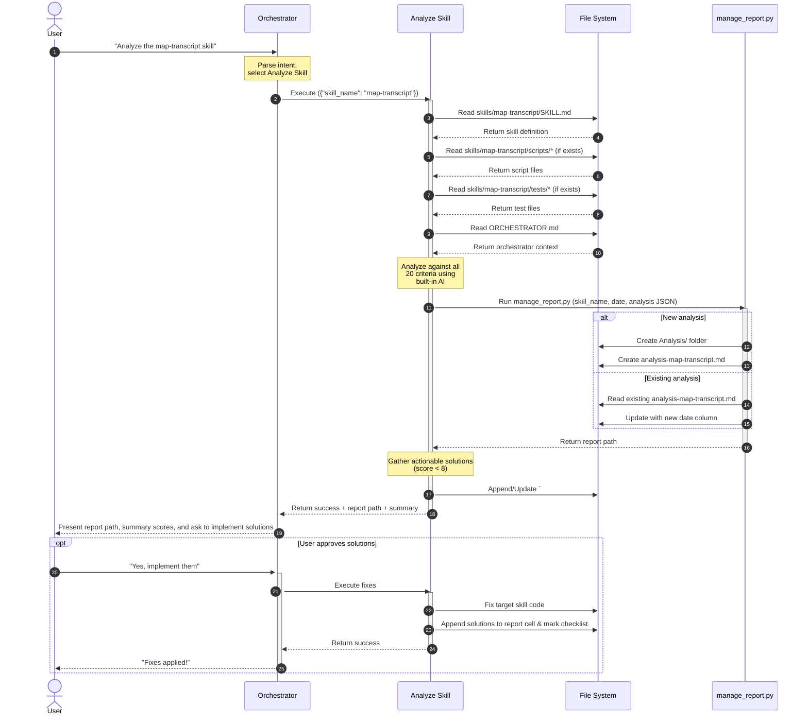

# Analyze Skill

## Description

This skill performs a comprehensive performance analysis of any sibling skill within the same orchestrator. It evaluates the target skill across 5 categories and 20 criteria, produces a scored markdown report, and provides actionable improvement solutions.

The orchestrator should trigger this skill when:
- The user wants to evaluate a skill's performance, quality, or readiness.
- The user wants a health check or audit of a skill.
- Keywords such as "analyze skill", "skill performance", "skill analysis", "performance report", "audit skill", "evaluate skill" are detected.

**Prerequisites:**
- The target skill must exist inside the same orchestrator's `skills/` directory.
- The target skill must have at least a `SKILL.md` file.

## Input

- **Type**: `dict`
- **Format**:
  - `skill_name` (string, **required**) — Name of the skill to analyze (must match the skill's folder name inside the orchestrator's `skills/` directory).
- **Location**: `request_body`
- **Input File(s)**:
  - `skills/<skill_name>/SKILL.md` — The target skill's definition file (required).
  - `skills/<skill_name>/scripts/*` — The target skill's execution scripts (optional, read if present).
  - `skills/<skill_name>/tests/*` — The target skill's unit tests (optional, read if present).
- **Examples**:

  **Example 1** — Analyze the map-transcript skill:
  ```json
  {
    "skill_name": "map-transcript"
  }
  ```

  **Example 2** — Analyze the map-transcript skill:
  ```json
  {
    "skill_name": "map-transcript"
  }
  ```

## Output

- **Type**: `dict`
- **Format**:
  - `status` (string) — `"success"` or `"error"`.
  - `report_file` (string) — Absolute path to the generated/updated `analysis-<skill_name>.md` file.
  - `summary` (dict) — Overall summary with average score per category.
- **Location**: `file_path` — The report is saved inside the `Analysis/` folder at the orchestrator level.
- **Output File(s)**:
  - `Analysis/analysis-<skill_name>.md` — The versioned performance analysis report.
- **Examples**:

  **Example 1** — Successful analysis:
  ```json
  {
    "status": "success",
    "report_file": "/Users/madebynham/Desktop/UX Agent/.agents/workflows/ux-transcribe/Analysis/analysis-map-transcript.md",
    "summary": {
      "execution_efficiency": 6.25,
      "output_quality": 7.5,
      "workflow_fit": 8.0,
      "reliability": 7.75,
      "cost_scalability": 6.0
    }
  }
  ```

- **Specific format output (Markdown template)**:

  Each criteria table cell follows the **2 bullet points format**:
  ```markdown
  • **<score>/10** — <analysis text>. • **Solution**: <improvement recommendation>.
  ```
  Or if no improvement is needed:
  ```markdown
  • **<score>/10** — <analysis text>. • No improvement needed.
  ```

  Full report structure:
  ```markdown
  # Skill Performance Analysis: <skill_name>

  > Last updated: <date>

  ---

  ## 1. ⚡ Execution Efficiency

  | Criteria | <date_1> | <date_2> |
  |----------|----------|----------|
  | Execution Time | • **7/10** — ... • **Solution**: ... | • **8/10** — ... • No improvement needed. |
  | API Call Count | • ... | • ... |
  | Token Usage | • ... | • ... |
  | Resource Consumption | • ... | • ... |

  ---

  ## 2. 🎯 Output Quality & Accuracy

  | Criteria | <date_1> | <date_2> |
  |----------|----------|----------|
  | Output Completeness | • ... | • ... |
  | Format Compliance | • ... | • ... |
  | Content Accuracy | • ... | • ... |
  | Human Approval Rate | • ... | • ... |

  ---

  ## 3. 🔗 Workflow Fit

  | Criteria | <date_1> | <date_2> |
  |----------|----------|----------|
  | I/O Contract Adherence | • ... | • ... |
  | Skip-Logic Compatibility | • ... | • ... |
  | Pipeline Passthrough Rate | • ... | • ... |
  | Idempotency | • ... | • ... |

  ---

  ## 4. 🛡️ Reliability & Error Handling

  | Criteria | <date_1> | <date_2> |
  |----------|----------|----------|
  | Error Rate | • ... | • ... |
  | Error Recoverability | • ... | • ... |
  | Retry Success Rate | • ... | • ... |
  | Known Bug Recurrence | • ... | • ... |

  ---

  ## 5. 💰 Cost & Scalability

  | Criteria | <date_1> | <date_2> |
  |----------|----------|----------|
  | Cost per Execution | • ... | • ... |
  | Scaling Behavior | • ... | • ... |
  | Unit Test Coverage & Pass Rate | • ... | • ... |
  ```


## Custom Instructions

- **Execution Method**: This skill is executed by the Antigravity AI agent. The agent follows these steps directly:

  1. **Resolve the target skill path** — Locate the skill folder at `.agents/workflows/ux-transcribe/skills/<skill_name>/`. Verify the `SKILL.md` file exists.
  2. **Read all target skill files**:
     a. Read `SKILL.md` — Extract description, input/output contracts, custom instructions, error handling table, known bugs table, sequence diagram, and API key configuration.
     b. Read all files in `scripts/` (if the directory exists) — Analyze code logic, API usage, error handling, resource management, and cleanup.
     c. Read all files in `tests/` (if the directory exists) — Analyze test coverage, assertions, and edge case handling.
  3. **Read the orchestrator's `ORCHESTRATOR.md`** — Understand the workflow context: sequential pipeline position, skip-logic rules, routing logic, and inter-skill dependencies.
  4. **Analyze against all 20 criteria** — For each criteria below, produce a score (1-10) and a brief analysis based on the evidence gathered. Also produce a solution if the score is below 8.

     **Category 1: ⚡ Execution Efficiency**
     - **Execution Time** — Evaluate: Does the skill process inputs efficiently? Are there unnecessary sequential operations that could be parallelized? Any redundant file reads/writes?
     - **API Call Count** — Evaluate: How many external API calls are made per run? Are there redundant or unnecessary calls (e.g., validation calls when work is skipped)? Is there batching?
     - **Token Usage** — Evaluate: For LLM-based skills, are prompts concise? Is there unnecessary context in prompts? Could token consumption be reduced without losing quality?
     - **Resource Consumption** — Evaluate: Does the skill create temporary files and clean them up? Does it handle large files (audio, images) memory-efficiently? Any risk of disk space issues?

     **Category 2: 🎯 Output Quality & Accuracy**
     - **Output Completeness** — Evaluate: Does the output schema in SKILL.md define all necessary fields? Are there edge cases where fields might be missing?
     - **Format Compliance** — Evaluate: Is the output format clearly specified? Does the skill enforce the format (e.g., exact filename patterns, Markdown structure)? Are there format-related bugs in Known Bugs?
     - **Content Accuracy** — Evaluate: Does the skill have instructions to prevent hallucination or fabrication? Are there validation steps? Does it handle edge cases (empty input, malformed data)?
     - **Human Approval Rate** — Evaluate: Based on Known Bugs history — how many bugs were related to output quality issues that would cause user rejection? Are there instructions for handling edge cases that typically cause rejections?

     **Category 3: 🔗 Workflow Fit**
     - **I/O Contract Adherence** — Evaluate: Does the skill's input match exactly what upstream skills produce? Does the output match exactly what downstream skills expect? Check filename patterns, data schemas, and field names.
     - **Skip-Logic Compatibility** — Evaluate: Does the orchestrator's skip-logic condition for this skill correctly detect completed work? Could the skill produce output that confuses skip-logic (e.g., partial files, wrong naming)?
     - **Pipeline Passthrough Rate** — Evaluate: Based on error handling table and Known Bugs — how likely is the skill to halt the pipeline? Are error codes properly defined? Does the orchestrator handle all error codes?
     - **Idempotency** — Evaluate: Would running the skill twice on the same input produce the same output? Does it overwrite or append? Are there side effects (e.g., duplicate API uploads)?

     **Category 4: 🛡️ Reliability & Error Handling**
     - **Error Rate** — Evaluate: How comprehensive is the error handling table? Are all failure modes covered? Are there code paths that could throw unhandled exceptions?
     - **Error Recoverability** — Evaluate: Does the skill clean up after failures (temp files, API resources)? Does it return clear error codes? Can the orchestrator recover from each error code?
     - **Retry Success Rate** — Evaluate: Does the skill implement retries for transient errors? Is the retry strategy appropriate (backoff, max attempts)? Are terminal errors distinguished from transient ones?
     - **Known Bug Recurrence** — Evaluate: Review the Known Bugs table — are there recurring patterns? Were fixes preventive (addressing root cause) or symptomatic? Are there tests to prevent regressions?

     **Category 5: 💰 Cost & Scalability**
     - **Cost per Execution** — Evaluate: Does the skill call paid APIs? What's the estimated cost per run? Are there optimizations to reduce cost (caching, batching, model selection)?
     - **Scaling Behavior** — Evaluate: How does the skill perform with increasing input size? Linear, quadratic, or worse? Are there bottlenecks (memory, API rate limits, sequential processing)?
     - **Unit Test Coverage & Pass Rate** — Evaluate: Does the skill have unit tests? What's the coverage (estimate from test file analysis)? Are edge cases tested? Are external APIs properly mocked?

  5. **Format the analysis as JSON** — Structure the results according to the JSON schema defined below, with each criteria containing `score`, `analysis`, and `solutions` fields.
  6. **Run the report management script** — Execute:
     ```bash
     python3 .agents/workflows/ux-transcribe/skills/analyze-skill/scripts/manage_report.py \
       --skill-name "<skill_name>" \
       --date "<YYYY-MM-DD>" \
       --analysis-json '<JSON string>' \
       --output-dir ".agents/workflows/ux-transcribe/Analysis"
     ```
  7. **Update the target skill's SKILL.md** — Take all the actionable solutions generated in the analysis (where score < 8) and append or update a `## Performance Improvement Solutions` section at the end of the target skill's `SKILL.md` file. Format them as a checklist (`- [ ]`) grouped by category so they can be easily tracked.
  8. **Report the result and Suggest Solutions** — Return the path to the created/updated report file and a summary of average scores per category. Crucially, you MUST present the actionable solutions to the user and explicitly ask if they would like you to implement those solutions to fix the target skill.
  9. **Implement and Update Report** — If the user approves the improvements, implement the fixes in the target skill's code. After successfully implementing the fixes, you MUST manually edit the `Analysis/analysis-<skill_name>.md` report to append ` • **Solution**: <description of fix>` to the corresponding criteria cells in the latest date column, and mark the checklist item in the target skill's `SKILL.md` as `[x]`.

- **Scoring Guidelines**:
  - **9-10**: Excellent — no improvements needed, best practices fully followed.
  - **7-8**: Good — minor improvements possible but not critical.
  - **5-6**: Adequate — notable gaps that should be addressed.
  - **3-4**: Poor — significant issues that risk workflow reliability.
  - **1-2**: Critical — fundamental problems that must be fixed immediately.

- **Solution Guidelines**:
  - Solutions must be **specific and actionable** — not generic advice.
  - Reference exact file names, line numbers, or code patterns where possible.
  - If a criteria scores 8 or above, write "No improvement needed." as the solution.

- **Analysis JSON Schema** (passed to `manage_report.py`):
  ```json
  {
    "execution_efficiency": {
      "execution_time": { "score": "7/10", "analysis": "Brief analysis...", "solutions": ["Solution 1"] },
      "api_call_count": { "score": "8/10", "analysis": "...", "solutions": [] },
      "token_usage": { "score": "6/10", "analysis": "...", "solutions": ["Solution 1"] },
      "resource_consumption": { "score": "7/10", "analysis": "...", "solutions": [] }
    },
    "output_quality": {
      "output_completeness": { "score": "8/10", "analysis": "...", "solutions": [] },
      "format_compliance": { "score": "7/10", "analysis": "...", "solutions": ["Solution 1"] },
      "content_accuracy": { "score": "9/10", "analysis": "...", "solutions": [] },
      "human_approval_rate": { "score": "6/10", "analysis": "...", "solutions": ["Solution 1"] }
    },
    "workflow_fit": {
      "io_contract_adherence": { "score": "9/10", "analysis": "...", "solutions": [] },
      "skip_logic_compatibility": { "score": "8/10", "analysis": "...", "solutions": [] },
      "pipeline_passthrough_rate": { "score": "7/10", "analysis": "...", "solutions": ["Solution 1"] },
      "idempotency": { "score": "8/10", "analysis": "...", "solutions": [] }
    },
    "reliability": {
      "error_rate": { "score": "8/10", "analysis": "...", "solutions": [] },
      "error_recoverability": { "score": "7/10", "analysis": "...", "solutions": ["Solution 1"] },
      "retry_success_rate": { "score": "8/10", "analysis": "...", "solutions": [] },
      "known_bug_recurrence": { "score": "6/10", "analysis": "...", "solutions": ["Solution 1"] }
    },
    "cost_scalability": {
      "cost_per_execution": { "score": "5/10", "analysis": "...", "solutions": ["Solution 1"] },
      "scaling_behavior": { "score": "6/10", "analysis": "...", "solutions": ["Solution 1"] },
      "unit_test_coverage": { "score": "7/10", "analysis": "...", "solutions": ["Solution 1"] }
    }
  }
  ```

- Clean up — Ensure that any temporary files created during processing (e.g., intermediate files, temporary copies) are deleted immediately after the skill completes its task.

## Sequence Diagram



## Error Handling & Fallbacks

| Error Code | Message | Fallback Behavior |
| --- | --- | --- |
| `INVALID_INPUT` | The skill name is missing or empty. | Return a clear validation error to the user. |
| `SKILL_NOT_FOUND` | No skill folder found at `skills/<skill_name>/`. | Return an error listing available skills in the orchestrator. |
| `MISSING_SKILL_MD` | The target skill's `SKILL.md` file does not exist. | Return an error asking the user to verify the skill structure. |
| `SCRIPT_ERROR` | The `manage_report.py` script failed to create/update the report. | Return the script's error output and suggest manual report creation. |
| `INVALID_JSON` | The analysis JSON is malformed. | Log the error and retry the JSON formatting step. |

## Known Bugs & Resolutions

<!-- List any past bugs or errors encountered during the development or execution of this skill, and explain how they were resolved. This acts as a knowledge base for future maintenance. -->
> **Agent Rule (Error Handling & Bug Documentation):** In the future, when this skill encounters an error during input receiving, processing, or output generation, the AI agent must first propose a solution to the user. If the user agrees, the AI agent will fix the error. If the error is successfully fixed, the AI agent must update this 'Known Bugs & Resolutions' section with the bug, cause, and resolution.

| Bug / Error | Cause | Resolution |
| --- | --- | --- |

## Performance Improvement Solutions

<!-- This section is automatically populated and updated by the analyze-skill. It contains a checklist of actionable solutions to improve this skill's performance across various criteria. -->
