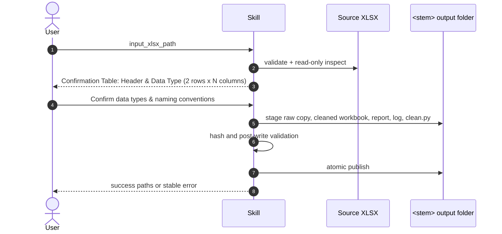

# Clean Data XLSX

## Description

Safely process an Excel workbook (`.xlsx`) using `openpyxl` and `pandas` without reading `.env`, calling external APIs, or modifying the source file. Only safe and deterministic transformations are applied: normalizing headers and whitespace, preserving identifiers (IDs, codes, phone numbers, leading zeroes) and formulas, and removing strictly identical duplicate data rows within the same sheet. Missing values are never imputed, outliers are flagged rather than altered or deleted, and no cross-sheet joins are performed.

## Input

- **Type**: `dict`
- **Format**: `{ "input_xlsx_path": "<path-to-one-file.xlsx>", "confirmed": true }`; `input_xlsx_path` is mandatory and `confirmed` must be `true` only after reviewing the inspection preview.
- **Location**: `file_path`
- **Input File(s)**:
  - `<filename>.xlsx` — Source Excel workbook; must be readable and unencrypted.
- **Examples**:

  **Example 1** — Standard input path:
  ```json
  { "input_xlsx_path": "/data/Customer Data.xlsx" }
  ```

Inspect first, then explicitly confirm before writing artifacts:

```text
python3 scripts/clean_data_xlsx.py "/data/Customer Data.xlsx" --inspect
python3 scripts/clean_data_xlsx.py "/data/Customer Data.xlsx" --confirm
```

## Output

- **Type**: `dict`
- **Format**: Returns `status`, output file paths, SHA-256 hashes of raw archive, cleaned workbook, replay script, and any `warnings`.
- **Location**: `file_path`
- **Output File(s)**: Where `<stem>` is the source filename without `.xlsx`, generated alongside the input file:
  - `<stem>/<stem>_cleaned.xlsx` — Cleaned workbook.
  - `<stem>/Scripts/clean.py` — Self-contained Python script snapshot that can be re-run without arguments to reproduce outputs from the raw archive.
  - `<stem>/Analysis/<original>.xlsx` — Byte-identical copy of the source workbook.
  - `<stem>/Analysis/data_quality_report.xlsx` — Summary, sheet stats, missing values, duplicates, type issues, outliers, merge issues, actions, and warnings.
  - `<stem>/Analysis/cleaning_log.json` — Rules applied, changes made, hashes, validation checks, and warnings.
- **Examples**:

  **Example 1** — Successful execution output:
  ```json
  {
    "status": "success",
    "cleaned_xlsx_path": "/data/Customer Data/Customer Data_cleaned.xlsx",
    "replay_script_path": "/data/Customer Data/Scripts/clean.py"
  }
  ```

## API Key

| Field | Value | Notes |
| --- | --- | --- |
| **Key** | None | No external API keys or LLM runtimes required. |
| **Model** | None | Uses local Python execution only. |

## Custom Instructions

- **Pre-cleaning User Confirmation Table**: After receiving the user's request and before starting data cleaning, the agent/system MUST inspect the dataset headers and display a 2-row table (with X columns corresponding to the data columns):
  - **Row 1 (Header)**: The column header names extracted from the dataset.
  - **Row 2 (Data Type)**: The inferred/detected data type for each column (e.g., integer, float, string, datetime, boolean, etc.).
  - **Confirmation Wait**: Wait for the user to confirm the data types and naming conventions before executing the actual data cleaning process.
- Validate file extension (`.xlsx`), workbook readability, and write permissions in parent folder before generating output.
- Copy source file byte-for-byte to `Analysis/` raw archive, verifying SHA-256 hashes before and after; never open source file for write operations.
- Process each worksheet independently; set `not_applicable` for relational join analysis.
- Only normalize headers when header text is non-empty, non-duplicate after normalization, and safe; preserve original headers when uncertain.
- Preserves strings with leading zeroes, identifier codes, phone numbers, zip codes, and all formulas; do not type-cast based on guesswork.
- **Blank Cell Handling (No Imputation Rule)**: Blank cells across all data types (`int`, `string`, `datetime`, `boolean`) MUST remain blank (`None` / empty cell) by default. Never impute missing values automatically. Track all blank cells in `data_quality_report.xlsx` (`Missing Values`) and `cleaning_log.json`. Custom fill values are only applied if explicitly specified by the user during confirmation.
- **Type conversion policy**: No type conversions or fill values are implemented by this skill. Keep source values (including `-`, blanks, and numeric IDs) unchanged; flag type issues for review instead.
- Only remove exact duplicate rows after safe normalization; skip row deduplication when the sheet contains formulas or merged cells to avoid structural corruption.
- Flag missing values, mixed data types, outliers, merged cells, and risky features rather than altering them automatically.
- Generate all derivative artifacts in staging and only publish when workbook, report, log, and script pass validation; clean up staging directory upon success or failure.
- If output folder exists, only refresh derivatives when raw archive, log, and SHA-256 match current input; otherwise raise an error instead of overwriting.

## Sequence Diagram



## Error Handling & Fallbacks

| Error Code | Message | Fallback Behavior |
| --- | --- | --- |
| `INPUT_PATH_REQUIRED` | Missing workbook path. | Request exactly one `.xlsx` path. |
| `INPUT_NOT_FOUND` | Source does not exist. | Stop without output. |
| `INPUT_NOT_FILE` | Input path is not a file. | Request exactly one `.xlsx` file. |
| `UNSUPPORTED_EXTENSION` | Input is not `.xlsx`. | Request an unlocked `.xlsx` file. |
| `INVALID_XLSX` | Workbook cannot be opened safely. | Preserve source and any prior output. |
| `CONFIRMATION_REQUIRED` | Cleaning was requested before the preview was confirmed. | Run `--inspect`, review the result, then rerun with `--confirm`. |
| `OUTPUT_PARENT_UNWRITABLE` | Parent folder cannot receive output artifacts. | Request a writable parent folder. |
| `OUTPUT_COLLISION_RAW_MISMATCH` | Existing output belongs to different source bytes. | Do not overwrite; request a renamed/moved target. |
| `OUTPUT_COLLISION_INVALID_STATE` | Existing output cannot be verified. | Preserve it for manual review. |
| `RAW_ARCHIVE_HASH_MISMATCH` | Raw archive differs from expected bytes. | Stop without refreshing derivatives. |
| `POST_WRITE_VALIDATION_FAILED` | Staged artifacts are incomplete or invalid. | Remove staging and preserve prior valid output. |
| `OUTPUT_WRITE_FAILED` | A transient workbook write failed after bounded retries. | Preserve source/staging cleanup and retry after resolving filesystem contention. |
| `REPLAY_RAW_INPUT_MISSING` | Replay archive or log is unavailable. | Restore the required `Analysis/` artifact or run a fresh clean. |
| `INTERNAL_ERROR` | Unexpected processing error. | Return sanitized diagnostic and preserve source. |

## Known Bugs & Resolutions

> **Agent Rule (Error Handling & Bug Documentation):** In the future, when this skill encounters an error during input receiving, processing, or output generation, the AI agent must first propose a solution to the user. If the user agrees, the AI agent will fix the error. If the error is successfully fixed, the AI agent must update this 'Known Bugs & Resolutions' section with the bug, cause, and resolution.

| Bug / Error | Cause | Resolution |
| --- | --- | --- |
| Replay manifest produced a path ending in `.xlsx.xlsx` | The source extension was appended to a filename that already contained it. | Record `../Analysis/<original-filename>` directly and cover replay in tests. |
| `NoneType` error while inspecting a sheet | A safely identified header row contained blank cells between populated columns; inspection attempted string normalization on `None`. | Preserve blank header cells, assign report-only `Column N` labels, and never call string normalization on `None`. |
| Blank values changed to `0` in special financial columns | Header-specific conversion code ran without an executable confirmation step, violating the no-imputation policy. | Added a non-mutating inspection preview and explicit confirmation requirement, then removed all automatic type conversions and added a blank-preservation regression test. |

## Performance Improvement Solutions

### ⚡ Execution Efficiency
- [x] **Execution Time**: Combine formula counting directly into the primary column inspection loop in `inspect_and_clean()` instead of performing a redundant full pass over all cells via `ws.iter_rows()`.

### 💰 Cost & Scalability
- [x] **Scaling Behavior**: Optimize row signature extraction in row deduplication by using batch row iterators (`ws.iter_rows`) instead of individual `ws.cell(row, col)` coordinate lookups.
- [x] **Unit Test Coverage & Pass Rate**: Add standard `unittest` compatibility / direct execution entry point in `test_clean_data_xlsx.py` so unit tests can run via standard `python3` without requiring `pytest` as an external dependency.

### ⚡ Execution Efficiency
- [ ] **Execution Time**: Combine profiling and duplicate-signature collection where safe, and add a large-workbook benchmark with an explicit performance budget.

### 🎯 Output Quality & Accuracy
- [x] **Format Compliance**: Added an explicit preview/confirmation contract and aligned `SKILL.md`, error codes, rules, and log entries with no automatic conversions.
- [x] **Content Accuracy**: Removed automatic header-name conversions and added regression coverage proving blanks stay blank by default.
- [x] **Human Approval Rate**: Added non-mutating preview output and explicit confirmation before any derivative artifacts are created.

### 🔗 Workflow Fit
- [x] **I/O Contract Adherence**: Added `confirmed` to the Python/CLI contract and `--inspect` to return the preview schema before cleaning.
- [x] **Pipeline Passthrough Rate**: Documented every emitted `CleanDataError` code and retained stable structured error output.
- [ ] **Idempotency**: Specify artifact-level idempotency semantics and test repeated runs, including hashes where determinism is promised.

### 🛡️ Reliability & Error Handling
- [x] **Error Rate**: Completed the documented `CleanDataError` contract; broader failure-path test coverage remains tracked below.
- [x] **Error Recoverability**: Hardened refresh rollback for newly promoted targets and validate the staged report and replay script before publication.
- [x] **Retry Success Rate**: Added bounded exponential-backoff retries for transient workbook write failures only.
- [x] **Known Bug Recurrence**: Recorded the conversion-contract regression and added focused confirmation/blank-preservation coverage.

### 💰 Cost & Scalability
- [ ] **Scaling Behavior**: Set supported workbook-size guidance, benchmark large sheets, and rebuild retained rows in one pass instead of repeatedly deleting rows.
- [ ] **Unit Test Coverage & Pass Rate**: Add tests for every error code, refresh rollback, and idempotency; preview and blank-preservation regressions are now covered.
