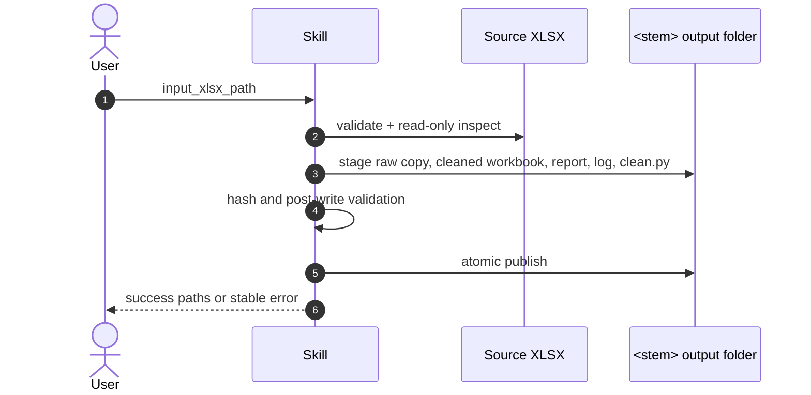

# Clean Data XLSX

## Description

Xử lý đúng một workbook `.xlsx` bằng `openpyxl` và `pandas`; không đọc `.env`, không gọi API và không sửa file nguồn. Chỉ áp dụng thay đổi an toàn: chuẩn hóa header/khoảng trắng, giữ ID và công thức, chỉ xóa hàng dữ liệu trùng khớp hoàn toàn trong cùng sheet. Không điền dữ liệu thiếu, không sửa/xóa outlier và không join giữa các sheet.

## Input

- **Type**: `dict`
- **Format**: `{ "input_xlsx_path": "<path-to-one-file.xlsx>" }`; `input_xlsx_path` là chuỗi bắt buộc, trỏ đến một file `.xlsx` tồn tại.
- **Location**: `file_path`
- **Input File(s)**:
  - `<filename>.xlsx` — một workbook Excel nguồn; file phải đọc được và không mã hóa.
- **Examples**:

  ```json
  { "input_xlsx_path": "/data/Customer Data.xlsx" }
  ```

Chạy helper bằng Python bundled của workspace:

```text
python3 scripts/clean_data_xlsx.py "/data/Customer Data.xlsx"
```

## Output

- **Type**: `dict`
- **Format**: `status`, các path output, SHA-256 của raw/cleaned/script và `warnings`.
- **Location**: `file_path`
- **Output File(s)**: Với `<stem>` là tên input không có `.xlsx`, tạo cạnh input:
  - `<stem>/<stem>_cleaned.xlsx` — workbook đã làm sạch.
  - `<stem>/Scripts/clean.py` — snapshot Python tự chứa, có thể chạy không đối số để tái chạy từ raw archive.
  - `<stem>/Analysis/<original>.xlsx` — raw archive có byte giống file nguồn.
  - `<stem>/Analysis/data_quality_report.xlsx` — Summary, thống kê sheet, missing values, duplicates, type issues, outliers, merge issues, actions và warnings.
  - `<stem>/Analysis/cleaning_log.json` — rules, changes, hashes, validation và warnings.
- **Examples**:

  ```json
  {
    "status": "success",
    "cleaned_xlsx_path": "/data/Customer Data/Customer Data_cleaned.xlsx",
    "replay_script_path": "/data/Customer Data/Scripts/clean.py"
  }
  ```

## API Key

| Field | Value | Notes |
| --- | --- | --- |
| **Key** | None | Không có API key, API ngoài hoặc runtime LLM. |
| **Model** | None | Chỉ dùng Python cục bộ. |

## Custom Instructions

- Xác thực extension, khả năng đọc workbook và quyền ghi ở parent folder trước khi tạo output.
- Copy file nguồn theo byte vào `Analysis/`, kiểm tra SHA-256 trước/sau; không mở file nguồn để ghi.
- Xử lý từng worksheet riêng; ghi `not_applicable` cho relational join analysis.
- Chỉ chuẩn hóa header khi header text không rỗng, không trùng sau chuẩn hóa và an toàn; giữ nguyên sheet có header không chắc chắn.
- Giữ string có leading zero, ID/code/phone/zip và mọi công thức; không type-cast dựa trên suy đoán.
- Chỉ xóa duplicate rows hoàn toàn sau chuẩn hóa an toàn; bỏ qua dedupe khi sheet có formula hoặc merged cells để tránh làm thay đổi cấu trúc.
- Gắn cờ missing values, mixed types, outliers, merged cells và features rủi ro thay vì tự sửa chúng.
- Tạo toàn bộ derivative artifacts trong staging và chỉ publish khi workbook/report/log/script đã qua validation; dọn staging khi thành công hoặc lỗi.
- Nếu output folder hiện hữu, chỉ refresh derivatives khi raw archive, log và SHA-256 khớp input hiện tại; nếu khác, trả lỗi thay vì overwrite.

## Sequence Diagram



## Error Handling & Fallbacks

| Error Code | Message | Fallback Behavior |
| --- | --- | --- |
| `INPUT_PATH_REQUIRED` | Missing workbook path. | Request exactly one `.xlsx` path. |
| `INPUT_NOT_FOUND` | Source does not exist. | Stop without output. |
| `UNSUPPORTED_EXTENSION` | Input is not `.xlsx`. | Request an unlocked `.xlsx` file. |
| `INVALID_XLSX` | Workbook cannot be opened safely. | Preserve source and any prior output. |
| `OUTPUT_COLLISION_RAW_MISMATCH` | Existing output belongs to different source bytes. | Do not overwrite; request a renamed/moved target. |
| `OUTPUT_COLLISION_INVALID_STATE` | Existing output cannot be verified. | Preserve it for manual review. |
| `RAW_ARCHIVE_HASH_MISMATCH` | Raw archive differs from expected bytes. | Stop without refreshing derivatives. |
| `POST_WRITE_VALIDATION_FAILED` | Staged artifacts are incomplete or invalid. | Remove staging and preserve prior valid output. |
| `INTERNAL_ERROR` | Unexpected processing error. | Return sanitized diagnostic and preserve source. |

## Known Bugs & Resolutions

| Bug / Error | Cause | Resolution |
| --- | --- | --- |
| Replay manifest produced a path ending in `.xlsx.xlsx` | The source extension was appended to a filename that already contained it. | Record `../Analysis/<original-filename>` directly and cover replay in tests. |

## Performance Improvement Solutions

- Profile and clean each sheet in source order; avoid cross-sheet materialization.
- Use `openpyxl` for round-trip writing so formulas/styles have the best available preservation path.
- Use deterministic summaries rather than logging unnecessary cell values.
- Skip high-risk transforms and surface review warnings rather than retrying unsafe conversion.
