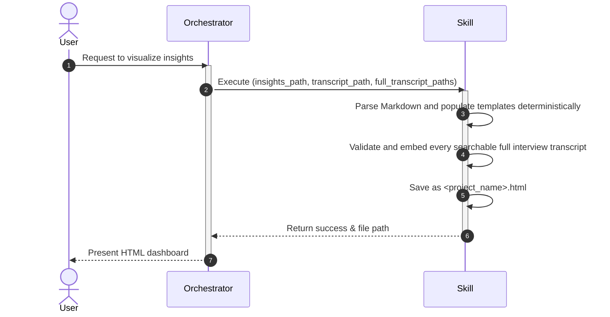

# visualize-insights

## Description

This skill converts user research insights (`insights.md`) and mapped transcripts (`mapped-transcript.md`) into a visual, interactive HTML dashboard (`<project name>.html`). It uses a specific predefined HTML template structure (split into modules for ease of management) and leverages deterministic Python parsing to accurately populate the layout.

In the complete research workflow, this skill is the terminal stage of
`ux-transcribe` → `ux-cjm` → `visualize-insights`. It consumes the transcript
and insight artifacts produced by `ux-transcribe`, plus the journey map
produced by `ux-cjm`, to visualize the final research findings. It may also be
invoked independently without a journey map.

## Input

- **Type**: `dict`
- **Format**:
  - `insights_path` (string, required): Path to the `insights.md` file.
  - `transcript_path` (string, required): Path to the `mapped-transcript.md` file.
  - `full_transcript_paths` (array of strings, required): Absolute paths to every interviewee's `transcript-*.md` file. The list must contain exactly one matching full transcript for each interviewee column in `mapped-transcript.md`.
  - `output_dir` (string, required): Directory to save the output HTML file.
  - `project_name` (string, required): Name of the project, used for the output filename.
  - `journey_path` (string, optional): Path to the `journey-map.md` file. If provided, the Journey Map section will be rendered in the dashboard.
- **Location**: `request_body`
- **Input File(s)**:
  - `insights.md` — The insights generated by earlier skills.
  - `mapped-transcript.md` — The transcript generated by earlier skills.
  - `transcript-<interviewee>.md` (required, one per interviewee) — Full interview transcripts supplied through `full_transcript_paths` and shown in the right-side drawer. The legacy `transcript_<interviewee>.md` filename remains accepted for existing datasets.
  - `journey-map.md` (optional) — The customer journey map generated by the `ux-cjm` orchestrator.

- **Examples**:
  ```json
  {
    "insights_path": "/path/to/insights.md",
    "transcript_path": "/path/to/mapped-transcript.md",
    "full_transcript_paths": [
      "/path/to/transcript-Nguyen-Thi-Dung.md",
      "/path/to/transcript-Tran-Van-An.md"
    ],
    "journey_path": "/path/to/journey-map.md",
    "output_dir": "/path/to/output",
    "project_name": "CTQT-Insights"
  }
  ```

## Output

- **Type**: `dict`
- **Format**:
  - `status` (string): 'success' or 'error'.
  - `output_file` (string): Absolute path to the generated HTML file.
- **Location**: `request_body`
- **Output File(s)**:
  - `<project_name>.html` — The compiled HTML dashboard.

- **Examples**:
  ```json
  {
    "status": "success",
    "output_file": "/path/to/output/CTQT-Insights.html"
  }
  ```

## Custom Instructions

- Read the base template `insights-template.html` and the modular templates `overview.html`, `saturation.html`, `transcript.html`, and `journey-map.html` from the `template/` and `template/modules/` directories.
- Extract the qualitative data, insights, data saturation matrices, mapped transcripts, and customer journey map from their respective markdown files.
- Populate the `overview.html` module with the summary statistics (e.g., total interviewees, total time, total insights).
- Populate the `insights-saturation.html` module with the detailed insights and exact quotes extracted from the markdown. Ensure the quote toggle functionality `toggleQuote(id)` works with unique IDs.
- Populate the `transcript.html` module with the structured transcript data.
- Require `full_transcript_paths` and validate that it contains exactly one existing `transcript-*.md` file for every interviewee column in `mapped-transcript.md`. Match filenames using Unicode-insensitive normalized names and fail before HTML generation when any interviewee is missing, duplicated, or unmatched.
- Render a footer row in the Transcript table with one enabled `Xem tất cả` button per interviewee. Open the matching full transcript in an accessible right-side drawer and support Escape-to-close and focus restoration.
- Place a search field directly below each full-transcript headline using the same UI treatment as the Transcript tab search. Scope matching to the active interviewee's transcript, highlight all matches without rewriting source markup, scroll to the first match, and provide a clear button that restores the original content.
- Escape full transcript source content before applying the supported Markdown presentation so embedded transcript text cannot inject executable HTML.
- Inject the populated modules into the `insights-template.html` to form a complete, single HTML file.
- Save the final file as `<project_name>.html` in the specified `output_dir`.
- Ensure that the final HTML strictly adheres to the provided Tailwind CSS styling and interactive layout.
- Automatically open the generated HTML file in the user's default web browser upon successful generation.

## Sequence Diagram



## Error Handling & Fallbacks

| Error Code | Message | Fallback Behavior |
| --- | --- | --- |
| `INVALID_INPUT` | Missing `insights_path`, `transcript_path`, `full_transcript_paths`, or `output_dir`. | Return an error identifying the required input contract. |
| `PARSING_ERROR` | Failed to parse Markdown structure. | Return error prompting the user to check markdown formatting. |
| `FULL_TRANSCRIPT_INVALID` | A full transcript is missing, duplicated, nonexistent, malformed, or does not match a mapped interviewee. | Stop before HTML generation and return the validation error. |

## Known Bugs & Resolutions

> **Agent Rule (Error Handling & Bug Documentation):** In the future, when this skill encounters an error during input receiving, processing, or output generation, the AI agent must first propose a solution to the user. If the user agrees, the AI agent will fix the error. If the error is successfully fixed, the AI agent must update this 'Known Bugs & Resolutions' section with the bug, cause, and resolution.

| Bug / Error | Cause | Resolution |
| --- | --- | --- |
| Insight Table Empty (Missing insights rows) | Parsing logic accidentally stripped the leading empty element from `line.split('|')` instead of using the stripped line, causing the column index check `cols[0].isdigit()` to fail and skip all valid data rows. | Fixed in `parse_insights_to_html` by ensuring `split('|')` is applied to `line_str` (the stripped line) so that index alignments are preserved correctly. |
| Saturation matrix displaying quotes instead of 🔵/🌐/⚪️ markers | `parse_insights_to_html()` found the first table header containing "Insight" (from per-interviewee `# Insights — Name` section with `# \| Insight \| Quotes` columns) instead of the Data Saturation Matrix section (`Insight \| User1 \| User2`). This caused: (1) column headers showed "Quotes" instead of interviewee names, (2) full quote text displayed instead of saturation markers, (3) multi-user saturation data was completely lost. | Refactored `parse_insights_to_html()` to target ONLY the `# Data Saturation Matrix` section. Created new `parse_interviewee_quotes()` function that builds a lookup dict from per-interviewee sections. Saturation markers are now rendered correctly with quote toggles linked via the lookup. |
| Chart labels showing "User 1" instead of interviewee names | `extract_chart_data()` had no fallback to saturation matrix header names when `audio_names` was empty, defaulting to generic "User 1", "User 2" labels. | Added saturation matrix header extraction as a secondary fallback in `extract_chart_data()` — now tries `audio_names` first, then saturation matrix headers, then generic labels. |
| 3 of 5 unit tests failing silently | After refactor to deterministic parsing, function signatures changed (returning tuples instead of strings) but tests were not updated. `test_get_folder_stats` also passed 2 args to a 1-arg function. | Rewrote all tests to unpack tuple returns correctly, fixed `test_get_folder_stats` arg count, and added 7 new tests covering `parse_interviewee_quotes()`, `extract_chart_data()`, single-user scenarios, and multi-user parsing. Test suite now 12/12 passing. |

## Performance Improvement Solutions

<!-- This section is automatically populated and updated by the analyze-skill. It contains a checklist of actionable solutions to improve this skill's performance across various criteria. -->

### Cost & Scalability
- [x] **Scaling Behavior**: Consider adding CSS rules (like `table-auto`) or Flexbox adjustments so that when there is only 1 interviewee, the column stretches to fill the space naturally, but when there are many, it enforces `min-w-[200px]`.

### Execution Efficiency
- [x] Consider splitting generation into smaller chunks if transcript is huge, or using a fast local generation script if possible.
- [x] Minify or extract only necessary sections of the mapped-transcript and insights before sending to AI to save tokens.
- [x] **Execution Time (7/10)**: Refactor `get_folder_stats` to use `asyncio.gather` and `asyncio.create_subprocess_exec` to run `ffprobe` concurrently for all media files to improve execution time.

### Output Quality & Accuracy
- [x] Use structured JSON output from AI first, then map it into the HTML template locally using a templating engine (like Jinja2) rather than asking AI to generate raw HTML.
- [x] Implement an HTML linter/validator post-generation to check for proper Tailwind classes or missing IDs for the quote toggle.
- [x] Ensure the prompt has strict instructions to copy exact quotes without modifying them.
- [x] Ensure strict parsing of Markdown rows and handle malformed rows so that all insights and transcript content bind exactly to the final HTML without omissions.
- [x] **Output Completeness (6/10)**: Fix `parse_insights_to_html()` to parse ONLY the Data Saturation Matrix section (after `# Data Saturation Matrix` heading) rather than the per-interviewee insights table. The current logic picks up the first `| # | Insight | Quotes |` header which is the wrong table for the saturation view.
- [x] **Output Completeness**: Add separate parsing logic for the per-interviewee insights sections to extract individual insight+quote pairs for the quote toggle UI.
- [x] **Output Completeness**: Ensure the function stops parsing at known section boundaries (e.g., `## Data Saturation Chart`, `## Summary of Discovered Insights`, `## New Insights`).
- [x] **Content Accuracy (5/10)**: Refactor `parse_insights_to_html()` to target the Data Saturation Matrix section specifically. Parse the saturation markers (🔵/🌐/⚪️) and render them as interactive buttons with quote lookups, or as static icons.
- [x] **Content Accuracy**: Create a separate function to parse per-interviewee insights sections for populating quote text that toggles when clicking saturation markers.
- [x] **Content Accuracy**: Fix `extract_chart_data()` to use interviewee names from the saturation matrix headers when `audio_names` is empty.
- [x] **Human Approval Rate (6/10)**: After fixing saturation matrix parsing, validate output by running the skill on real dataset and visually verifying all three sections (Overview, Saturation, Transcript).
- [x] **Content Accuracy (9/10)**: Implement a lightweight internal `render_inline_markdown` function instead of simple regex replacements to ensure bold, italic, and links in the transcript text render correctly as rich HTML.

### Workflow Fit
- [x] Implement retry logic inside visualize_insights.py for AI generation failures.
- [x] **I/O Contract Adherence (9/10)**: Update the main entrypoint to gracefully fallback to reading the JSON payload from standard input (`sys.stdin`) or a file path instead of just relying on command-line arguments, supporting extremely large projects safely.

### Reliability & Error Handling
- [x] Implement exponential backoff retries for the AI generation call in visualize_insights.py.
- [x] **Known Bug Recurrence (7/10)**: Fix `test_parse_transcript_to_html` to unpack the tuple return: `rows, thead = visualize_html.parse_transcript_to_html(...)` and assert against `rows` string.
- [x] **Known Bug Recurrence**: Fix `test_parse_insights_to_html` to unpack the tuple return: `rows, thead, headers = visualize_html.parse_insights_to_html(...)` and assert against `rows` string.
- [x] **Known Bug Recurrence**: Fix `test_get_folder_stats` to call with only 1 argument: `visualize_html.get_folder_stats('/path')`.
- [x] **Known Bug Recurrence**: Add new tests that validate parsing of the Data Saturation Matrix section specifically.
- [x] **Error Recoverability (7/10)**: Check `shutil.which('ffprobe')` before running the loop. If missing, print a descriptive warning to standard output/stderr so the user can install it.

### Cost & Scalability
- [x] Use caching if inputs haven't changed, or optimize prompt length.
- [x] Chunk the transcript processing instead of sending the entire file at once if it exceeds a certain token threshold.
- [x] Create a comprehensive suite of unit tests in tests/test_visualize_insights.py mocking the AI agent to ensure basic logic and error handling work.
- [x] Update tests/test_visualize_insights.py to remove deprecated AI tests and cover the new deterministic get_folder_stats and extract_summary_insights functions.
- [x] **Unit Test Coverage (3/10)**: Fix all 3 failing tests immediately to restore the test suite to a passing state.
- [x] **Unit Test Coverage**: Add test for `extract_chart_data()` validating label and data extraction from the saturation matrix.
- [x] **Unit Test Coverage**: Add integration test that runs the full template assembly and validates the output HTML contains expected elements.
- [x] **Unit Test Coverage**: Add test with multi-interviewee sample data to verify column handling scales correctly.

### 2026-07-22 Analysis

#### Execution Efficiency
- [ ] **Resource Consumption (7/10)**: Add an input-size budget and warning, and render embedded transcript payloads on demand so large studies do not inflate initial DOM and memory usage.

#### Output Quality & Accuracy
- [ ] **Output Completeness (7/10)**: Require `project_name`, reject empty interviewee, saturation, and transcript parse results, and fail when required template placeholders remain unresolved before writing output.
- [ ] **Format Compliance (6/10)**: Update the base template and loader to use the canonical module filenames, keep Persona directly below Insights and Journey Map directly below Persona, and remove all `Coming soon` or `Soon` UI.
- [ ] **Content Accuracy (5/10)**: Convert new-insight counts into a cumulative chart series and use its final value as total insights; escape all Markdown-derived table, quote, heading, and project fields before controlled inline formatting.
- [ ] **Human Approval Rate (7/10)**: Add a representative end-to-end HTML fixture plus browser-based visual and accessibility checks for navigation order, drawers, searches, empty states, and wide tables.

#### Workflow Fit
- [ ] **I/O Contract Adherence (7/10)**: Define a parent workflow that runs `ux-transcribe` → `ux-cjm` → `visualize-insights`, passes the canonical transcript, insight, full-transcript, and journey-map paths between stages, enforces the documented required fields, and resolves `output_file` to an absolute path inside `output_dir`.
- [ ] **Skip-Logic Compatibility (4/10)**: Add an input signature manifest covering Markdown, transcript, journey, and template files, then define orchestrator skip logic that accepts only a complete current output.
- [ ] **Pipeline Passthrough Rate (6/10)**: Use one guarded template-loading path and stable error codes for input read, parse, template, journey, browser, and output failures; document matching orchestrator handling for every code.
- [ ] **Idempotency (7/10)**: Make browser opening an explicit opt-in flag and replace implicit output-directory audio discovery with declared media inputs or a documented deterministic source.

#### Reliability & Error Handling
- [ ] **Error Rate (6/10)**: Refactor `main()` into validated stages, remove unreachable exception blocks, constrain the output filename to `output_dir`, and return schema-validated failures for malformed or empty inputs.
- [ ] **Error Recoverability (6/10)**: Write to a sibling temporary file and atomically replace the prior report only after validation; expose optional-section degradation in the structured result or fail according to the declared contract.
- [ ] **Known Bug Recurrence (7/10)**: Add regression tests for full `main()` success and each failure code, cumulative chart totals, atomic replacement, safe output paths, unresolved placeholders, and required navigation order.

#### Cost & Scalability
- [ ] **Scaling Behavior (6/10)**: Store escaped transcript content in inert serialized payloads and hydrate only the active drawer, add large-study warnings, and test performance with 20 or more interviewees and long transcripts.
- [ ] **Unit Test Coverage & Pass Rate (7/10)**: Add success-path and failure-path integration tests around `main()` with browser and `ffprobe` mocked, plus assertions for generated structure, safe escaping, chart math, and output containment.
