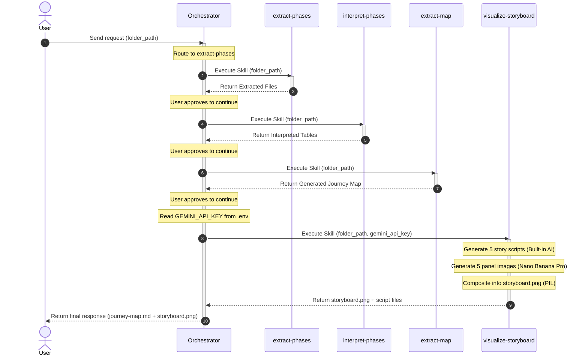

# UX CJM Orchestrator

## Description

The UX CJM Orchestrator manages the workflow automation for extracting and organizing customer journey phases from raw transcript data, assembling them into a final journey map, and generating a visual comic storyboard. It parses mapped transcripts, routes the data to appropriate extraction skills to build detailed phase-based documentation (Awareness, Consideration, Decision Making, Usage, Advocacy), maps them into a unified customer journey map, and finally visualizes the journey as a 5-panel comic storyboard.

## Routing Logic & Execution Flow

0. **Dependency Verification**: Before executing the first skill, the orchestrator runs the package validation script `.agents/scripts/check_libraries.py` to ensure all required external packages (e.g. `pytest`, `matplotlib`) are installed and up to date.
1. **Phase Extraction**: When a mapped transcript is provided, the orchestrator routes the request to the `extract-phases` skill, which sequentially parses the "Theme" column and generates individual markdown files for each phase.
2. **Phase Interpretation**: The orchestrator routes the request to the `interpret-phases` skill, which uses the built-in AI to sequentially interpret each extracted phase document into a formatted table containing the phase's goal, touchpoints, actions, pain points, emotion, and opportunities.
3. **Phase Mapping**: Once the phases are interpreted, the orchestrator triggers the `extract-map` skill to deterministically compile these interpreted files into a final `journey-map.md` using a programmatic Python script, ensuring 100% accuracy and zero AI hallucination.
4. **Storyboard Visualization**: After the journey map is generated, the orchestrator routes the request to the `visualize-storyboard` skill with the `folder_path` and `GEMINI_API_KEY` (read from `.env`). This skill generates 5 story scripts using the built-in AI, then creates 5 comic-style illustration panels via Nano Banana Pro (`gemini-3-pro-image-preview`), and composites them into a single `storyboard.png`.

**Execution Rule:** When a skill in its flow completes its task and generates an output, the orchestrator MUST pause and ask the user for approval. If the user approves and no changes are needed, the orchestrator then executes the next skill in the sequence.


## Available Skills

This orchestrator manages and routes requests to the following skills:

- **[extract-phases](./skills/extract-phases/SKILL.md)**: Extracts rows from a mapped transcript into 5 separate phase files based on the "Theme" column.
- **[interpret-phases](./skills/interpret-phases/SKILL.md)**: Interprets extracted phase documents sequentially using built-in AI and creates formatted Markdown tables for each phase.
- **[extract-map](./skills/extract-map/SKILL.md)**: Maps the individually interpreted phase files deterministically into a final `journey-map.md` template using a Python script without AI.
- **[visualize-storyboard](./skills/visualize-storyboard/SKILL.md)**: Generates a 5-panel comic-style storyboard visualization from `journey-map.md` using story scripts (built-in AI) and Nano Banana Pro image generation, outputting `storyboard.png`.

## Input

- **Type**: `dict`
- **Format**: Requires a `folder_path` pointing to the directory containing the `mapped-transcript.md`.
- **Location**: `request_body`
- **Examples**:

  **Example 1** — Standard user request:
  ```json
  {
    "folder_path": "/path/to/project_folder/"
  }
  ```

## Output

- **Type**: `dict`
- **Format**: Returns the status and paths to the extracted phase files.
- **Location**: `response_body`
- **Examples**:

  **Example 1** — Successful orchestration:
  ```json
  {
    "status": "success",
    "message": "Extracted 5 phases, mapped to journey-map.md, and generated storyboard successfully.",
    "data": {
      "skill_executed": "visualize-storyboard",
      "result_paths": [
        "/path/to/project_folder/Journey Map/journey-map.md",
        "/path/to/project_folder/Journey Map/storyboard.png"
      ]
    }
  }
  ```

## Environment Access (.env)

- **Allowed to access `father-orchestrator/.env`**: `true` (reads `GEMINI_API_KEY` to pass to the `visualize-storyboard` skill)

## Sequence Diagram



## Error Handling & Fallbacks

| Error Scenario | Message | Fallback Behavior |
| --- | --- | --- |
| `UNKNOWN_INTENT` | Could not determine which skill to use. | Ask the user for clarification or provide a list of available capabilities. |
| `SKILL_FAILURE` | The invoked skill returned an error. | Catch the error, log it, and return a graceful failure message to the user, potentially suggesting a retry. |
| `INVALID_INPUT` | The incoming request is malformed. | Return a validation error specifying the required format. |
