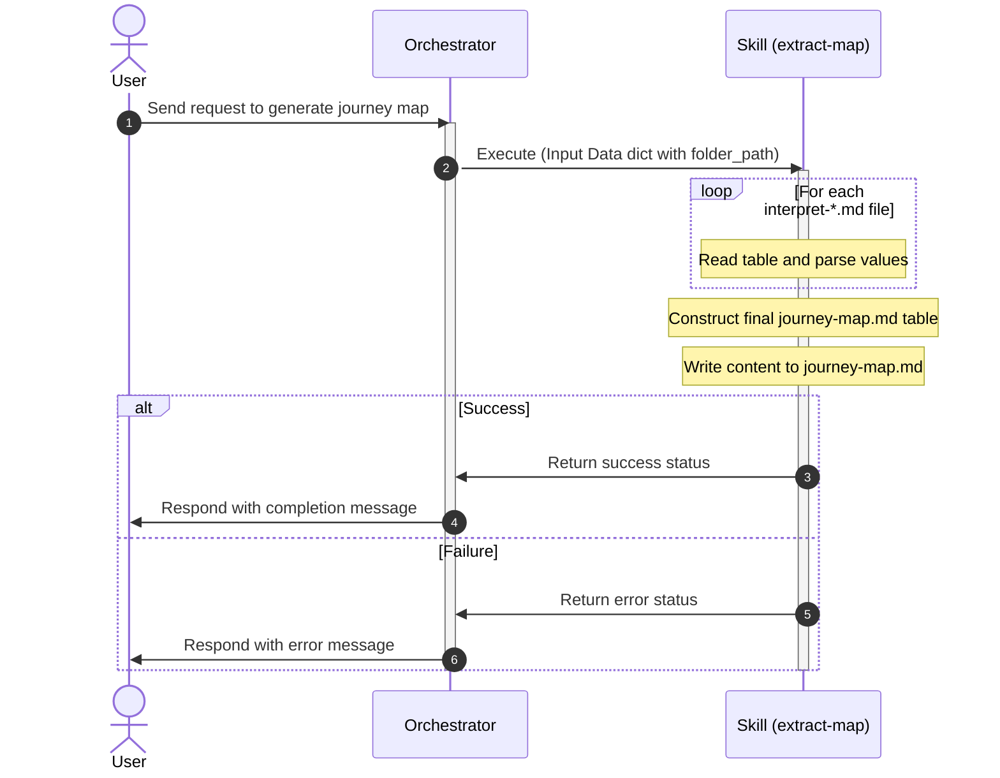

# extract-map

## Description

This skill iteratively reads all `interpret-<phase>.md` files inside the `Journey Map` folder of a given directory, and parses their structured Markdown tables. It then programmatically maps their contents one by one into the columns of a final `journey-map.md` table. This approach guarantees 100% deterministic correctness and entirely eliminates the risk of AI hallucinations.

## Input

- **Type**: `dict`
- **Format**: 
  - `folder_path` (string, required): The path pointing to the project root directory or directly to the nested `Journey Map` folder.
- **Location**: `request_body`
- **Input File(s)**:
  - `interpret-<phase>.md` — The highly structured markdown files containing the formatted table for a specific phase, generated by the `interpret-phases` skill.
- **Examples**:

  **Example 1**:
  ```json
  {
    "folder_path": "/Users/user/Desktop/Project"
  }
  ```

  **Example 2**:
  ```json
  {
    "folder_path": "/Users/user/Desktop/Project/Journey Map"
  }
  ```

## Output

- **Type**: `dict`
- **Format**: 
  - `status` (string): "success" or "error".
  - `message` (string): Description of the execution result.
- **Location**: `response_body`
- **Output File(s)**:
  - `journey-map.md` — The final assembled customer journey map inside the `<folder_path>/Journey Map` folder.
- **Examples**:

  **Example 1**:
  ```json
  {
    "status": "success",
    "message": "Successfully mapped all interpreted phases into journey-map.md"
  }
  ```

## Custom Instructions

- Check for the existence of `journey-map.md` inside `<folder_path>/Journey Map/`. If it exists and is complete, skip execution.
- Find all files matching the pattern `interpret-*.md` in `<folder_path>/Journey Map/`.
- Process each interpreted phase file:
  - Parse the Markdown table to extract the exact text for Goal, Touchpoints, Actions, Pain Points, Emotion, and Opportunities.
- Construct the final `journey-map.md` using Python string replacement or string building, matching the 5 standard phases (Awareness, Consideration, Decision Making, Usage, Advocacy) to Stage 1 through Stage 5.
- Overwrite `journey-map.md` with the newly generated table.

## Sequence Diagram



## Error Handling & Fallbacks

| Error Code | Message | Fallback Behavior |
| --- | --- | --- |
| `INVALID_INPUT` | `folder_path` is missing or invalid. | Return a validation error. |
| `FILES_NOT_FOUND` | No `interpret-*.md` files found in the Journey Map folder. | Return an error indicating there is no data to map. |
| `PARSING_ERROR` | A file could not be parsed properly. | Log the error, skip the problematic phase, and return a partial success or retry message. |

## Known Bugs & Resolutions

> **Agent Rule (Error Handling & Bug Documentation):** In the future, when this skill encounters an error during input receiving, processing, or output generation, the AI agent must first propose a solution to the user. If the user agrees, the AI agent will fix the error. If the error is successfully fixed, the AI agent must update this 'Known Bugs & Resolutions' section with the bug, cause, and resolution.

| Bug / Error | Cause | Resolution |
| --- | --- | --- |

## Performance Improvement Solutions

### ⚡ Execution Efficiency
- [x] **Execution Time:** The AI dependency was completely removed, making execution practically instantaneous.
- [x] **API Call Count:** Reduced API calls to 0.
- [x] **Token Usage:** Reduced token usage to 0.
- [x] Use asynchronous file and globbing methods (e.g., via aiofiles or running in a thread pool using asyncio.to_thread) to prevent blocking the event loop.

### 🎯 Output Quality & Accuracy
- [x] Verify if all 5 standard stages are present and issue a warning or error if any stage is missing or has empty fields, rather than silently writing a blank column.
- [x] Sanitize cell values in `extract_map.py` by escaping pipe (`|`) characters (replacing with `\|`) and converting raw newlines (`\n`) to HTML `<br>` tags to prevent breaking the generated markdown table structure.

### 🔗 Workflow Fit
- [x] **Idempotency:** Implemented a check to skip generation if output exists and is already complete or unchanged.
- [x] Improve the skip-logic / idempotency check by comparing the modification times of the source `interpret-*.md` files with that of `journey-map.md`, or check if the compiled output would differ from the existing `journey-map.md` content.

### 🛡️ Reliability & Error Handling
- [x] Wrap the final file write operation in a try-except block to catch `OSError` or `PermissionError` and return a structured error status instead of crashing.

### 💰 Cost & Scalability
- [x] **Cost per Execution:** Cost is $0 as it uses local deterministic parsing.
- [x] Expand the test suite in `test_extract_map.py` to include tests for edge cases such as malformed markdown tables, missing keys in input files, and file write permission errors.


