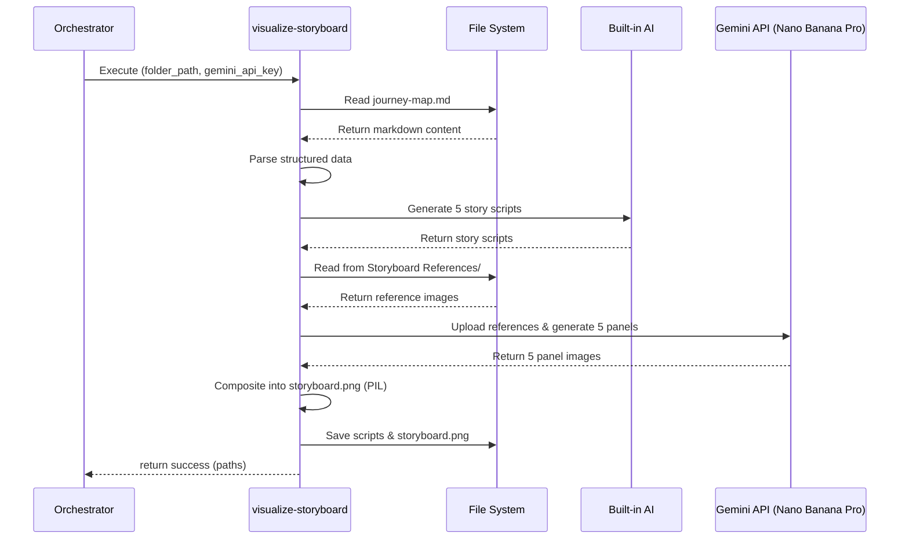

# visualize-storyboard

## Description
Generates a comic-style storyboard visualization from the journey-map.md, producing 5 story scripts and a composite storyboard image using Nano Banana Pro image generation.

## Input
- `folder_path` (string, required) — Path to the project folder containing `Journey Map/journey-map.md`
- `gemini_api_key` (string, required) — Gemini API key passed by the orchestrator (from `.env`)

## Output
- `status` (string) — "success" or "error"
- `output_file` (string) — Absolute path to `<folder_path>/Journey Map/storyboard.png`
- `script_files` (list[string]) — Paths to the 5 generated story script .md files
- `message` (string) — Human-readable result message

**Output Files:**
- `awareness-script.md`, `consideration-script.md`, `decision-making-script.md`, `usage-script.md`, `advocacy-script.md` — Story scripts in `<folder_path>/Journey Map/`
- `storyboard.png` — Final composite storyboard image in `<folder_path>/Journey Map/`

## API Key
| Field | Value | Notes |
| --- | --- | --- |
| Key | GEMINI_API_KEY | Passed by orchestrator, NOT read from .env |
| Model (image gen) | gemini-3-pro-image-preview | Nano Banana Pro for high-fidelity illustration |
| Model (script gen) | Built-in Antigravity AI | For generating story scripts from journey-map data |

## Custom Instructions
1. Parse `journey-map.md` from `<folder_path>/Journey Map/` into structured data (5 stages × 6 dimensions)
2. Generate 5 story scripts in a single batch AI call using the built-in Antigravity AI. Each phase script MUST strictly follow the exact template format below:
   ```markdown
   [ Stage: <Phase Name> ]
   Background: <Location, setting details, color wash, camera framing>
   Character(s): <Description, appearance, expression, posture/gesture, outfit>
   Object(s): <Touchpoints, key props, floating iconography>
   Action(s): <User steps and behaviors>
   Dialogue/Thinking: <Speech bubbles, internal thoughts, or narrative caption>
   ```
3. Load ALL reference images from the skill's `Storyboard References/` folder (using local `.cache.json` to prevent duplicate uploads) and upload them via Gemini Files API
4. Generate the 5 comic panel illustrations via Gemini Image API / Nano Banana Pro (`gemini-3-pro-image-preview`) using the scripts + full art style guide + reference images
5. Composite 5 panels into a single storyboard grid (3 top + 2 bottom centered) using PIL/Pillow with:
   - White canvas ~3600×2400px
   - Thin black panel borders with 20px white gutters
   - Stage title labels above panels
   - Stage goal captions below panels  
   - Emotion badges with colored indicators
6. Save as `storyboard.png` in `<folder_path>/Journey Map/`

The full art style guide that must be embedded covers: Format & Layout (rigid comic grid), Line Art & Color (clean vector lines, dual-tone color wash, zero shading), Character Design (semi-realistic, consistent), Composition (varied shot types, floating iconography), Typography (speech bubbles, caption boxes), and Narrative Tone (UX explainer aesthetic).

## Sequence Diagram


## Error Handling & Fallbacks
- INVALID_INPUT: Missing folder_path or gemini_api_key
- JOURNEY_MAP_NOT_FOUND: journey-map.md not found at expected path
- SCRIPT_GENERATION_FAILED: Built-in AI failed to generate story scripts
- IMAGE_GENERATION_FAILED: Gemini API failed to generate panel images
- COMPOSITION_FAILED: PIL failed to composite the final storyboard
- NO_REFERENCE_IMAGES: Storyboard References folder is empty (warning, not error)

## Known Bugs & Resolutions

## Performance Improvement Solutions
