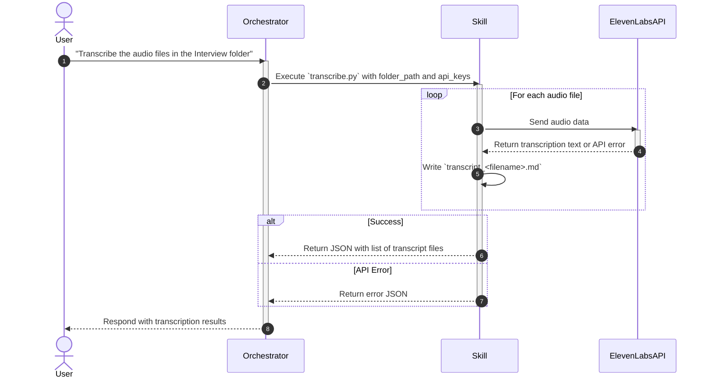

# Transcribe Audios

## Description

The `transcribe-audios` skill transcribes interview audio and video files into Markdown with speaker diarization, timestamps, and ElevenLabs audio-event tags. It uses **ElevenLabs Speech to Text** through the current `speech_to_text.convert` API with Scribe v2. It searches `Interview/` first and otherwise the direct input folder; when `Interview/` exists, it writes handoff transcripts there even if an audio source was discovered in the parent folder. `ELEVENLABS_API_KEY` is required; a provider failure is returned as a per-file error after the configured ElevenLabs retry policy is exhausted.

The orchestrator should trigger this skill when the user requests audio transcription, converting speech to text, or generating interview transcripts.

## Input

- **Type**: `dict`
- **Format**:
  - `folder_path` (string, required): The absolute path to the directory containing audio files.
  - `language_code` (string): Always `vi` for this workflow (Vietnamese, ISO-639-1). The transcription command passes `vi` by default.
  - `num_speakers` (integer, optional): Expected maximum speaker count from 1 to 32; use only for single-channel diarization.
  - `diarization_threshold` (number, optional): ElevenLabs diarization threshold from `0.1` to `0.4`.
  - `tag_audio_events` (boolean, optional): Include events such as laughter or applause; defaults to `true`.
  - `timestamps_granularity` (string, optional): `none`, `word` (default), or `character`.
  - `use_multi_channel` (boolean, optional): Use channel-based separation for recordings with one speaker per channel.
  - `multichannel_output_style` (string, optional): `separate` or `combined`; the skill defaults to `combined` so the Markdown formatter receives one time-sorted stream.
  - `max_workers` (integer, optional): Maximum concurrent uploads; defaults to 5.
  - `max_file_size_mb` (integer, optional): Per-file upload limit; defaults to 3072 MB as a conservative product-guide limit. The live API reference is authoritative if ElevenLabs changes this limit.
  - `max_inflight_mb` (integer, optional): Aggregate size of files allowed in active upload/transcription work; defaults to 4096 MB. A single valid file larger than this budget runs alone.
  - `max_retries` (integer, optional): Retries for transient API failures; defaults to 3.
  - `requests_per_minute` (integer, optional): Local cap for ElevenLabs requests. Omit to use the account quota without a local rate cap.
  - `source_fingerprint` (string, optional): `stat` (default, size plus nanosecond mtime) or `sha256`. A valid transcript is skipped only when this fingerprint matches its metadata sidecar.
  - `pricing_json_file` (string, optional): Absolute path to orchestrator-supplied JSON pricing data with `providers.elevenlabs.usd_per_minute`, never a hard-coded rate in the skill. It enables duration and estimated-cost metadata.
  - `max_estimated_cost_usd` (number, optional): Conservative batch budget. Requires `pricing_json_file` and `ffprobe` to determine duration; the run halts before API calls when the estimate exceeds the limit.
- **Environment**: The calling orchestrator passes `ELEVENLABS_API_KEY` to
  `ux-interview`, which injects that key into this skill process. The skill
  never reads `.env` directly.
- **Location**: `request_body`
- **Input File(s)**:
  - `Interview/*` with an ElevenLabs-supported audio/video extension (or directly in `folder_path` when `Interview/` has no supported audio): AAC, AIFF, OGG, MP3, OPUS, WAV, FLAC, M4A, WebM, MP4, AVI, MKV, MOV, WMV, FLV, MPEG, 3GPP, and QuickTime variants.
- **Examples**:

  **Example 1** — Transcription request:
  ```json
  {
    "folder_path": "/Users/madebynham/Desktop/interviews/round-1",
    "api_key": "YOUR_ELEVENLABS_API_KEY"
  }
  ```

## Output

- **Type**: `dict`
- **Format**:
  - Success: `status: "success"` and `data` containing `transcripts` (sorted list) and `total`. Each successful or skipped transcript includes `audio_file`, `output_file`, `metadata_file`, `provider: "elevenlabs"`, `model`, `attempts`, `quality`, `warnings`, `audio_duration_seconds`, `estimated_cost_usd`, and `pricing_version` where available.
  - Failure: `status: "error"`, `error_code`, `message`, `errors` (per-file code and message), and `successful_transcripts` when applicable.
- **Location**: `file_path` — The generated files are saved in `Interview/` whenever it exists; otherwise they are saved directly in `folder_path`.
- **Output File(s)**:
  - `Interview/transcript_<audio_name>.md` — The generated markdown transcript files.
  - `Interview/transcript_<audio_name>.meta.json` — Temporary sidecar metadata file used during execution. The skill automatically cleans up and removes all `.meta.json` metadata files when its transcription jobs finish.
- **Examples**:

  **Example 1** — Successful execution:
  ```json
  {
    "status": "success",
    "data": {
      "transcripts": [
        {
          "audio_file": "interview-john.mp3",
          "output_file": "/Users/madebynham/Desktop/transcripts/Interview/transcript_interview-john.md",
          "metadata_file": "/Users/madebynham/Desktop/transcripts/Interview/transcript_interview-john.meta.json",
          "provider": "elevenlabs",
          "model": "scribe_v2",
          "attempts": {"elevenlabs": 1},
          "quality": "structured",
          "warnings": []
        }
      ],
      "total": 1
    }
  }
  ```

- **Specific format output (e.g., Markdown template)**:
  ```markdown
  # INTERVIEW TRANSCRIPT: [AUDIO FILE NAME]
  **[00:00] [Host]** <br>
  Transcription content
  **[00:25] [Interviewee Name]** <br>
  Transcription content
  ```

## API Key

| Field | Value | Notes |
| --- | --- | --- |
| **Key** | `ELEVENLABS_API_KEY` | Required transcription provider. Supplied by the calling orchestrator, delegated to `ux-interview`, and injected into this skill process. |

> **Note**: `ELEVENLABS_API_KEY` must be provided. Skills MUST NOT read API keys directly from `.env`. Only
> The calling orchestrator reads the workspace `.env`; `ux-interview` receives
> the required key and injects it into this skill process. Never hardcode, log, or write the
> key to output files.

## Custom Instructions

- **Live documentation requirement**: Before every transcription run, the orchestrator must run `python3 .agents/workflows/ux-interview/skills/transcribe-audios/scripts/check_elevenlabs_docs.py --strict`. The checker fetches the official Speech to Text overview, quickstart/tutorial, batch how-to guides, realtime event reference, and Create transcript API reference. If a page is unavailable or its API markers changed, stop and review the live documentation before changing or running the ElevenLabs path.
- **Execution Method**: The orchestrator supplies `ELEVENLABS_API_KEY`, then runs: `python3 .agents/workflows/ux-interview/skills/transcribe-audios/scripts/transcribe.py <folder_path> [--language-code vi] [--num-speakers 2] [--timestamps-granularity word] [--max-workers 5] [--max-file-size-mb 3072] [--max-inflight-mb 4096] [--max-retries 3] [--requests-per-minute 60] [--source-fingerprint stat] [--pricing-json-file <path> --max-estimated-cost-usd <limit>]`. Audio-event tagging is enabled by default; use `--no-tag-audio-events` only when explicitly requested.
- **ElevenLabs request contract**: Keep `model_id="scribe_v2"`, `language_code="vi"`, `diarize=true` for normal interview recordings, `timestamps_granularity="word"`, `tag_audio_events=true`, and `no_verbatim=false` by default so filler words and false starts remain available for UX-research evidence. For multichannel recordings, use `use_multi_channel=true`, disable diarization/`num_speakers`, and use `multichannel_output_style="combined"` unless a caller explicitly needs separate channel responses.
- **Feature boundaries**: This skill handles prerecorded batch files. ElevenLabs realtime WebSocket and webhook workflows are documentation references only and are not silently substituted into this local-file pipeline.
- The script automatically writes the `transcript_<filename>.md` file in the shared mapping workspace: `Interview/` whenever it exists, otherwise the direct input folder. This ensures an audio discovered at the folder root is still handed off to `map-transcript` under the normal workflow layout.

### Official ElevenLabs Speech to Text sources

These are the live sources of truth and must be rechecked whenever ElevenLabs changes its SDK, API parameters, limits, response shape, supported formats, or feature behavior:

- [Speech to Text overview](https://elevenlabs.io/docs/overview/capabilities/speech-to-text)
- [Speech to Text quickstart/tutorial](https://elevenlabs.io/docs/eleven-api/guides/cookbooks/speech-to-text)
- [Create transcript API reference](https://elevenlabs.io/docs/api-reference/speech-to-text/convert)
- [Keyterm prompting how-to](https://elevenlabs.io/docs/eleven-api/guides/how-to/speech-to-text/batch/keyterm-prompting)
- [Multichannel transcription how-to](https://elevenlabs.io/docs/eleven-api/guides/how-to/speech-to-text/batch/multichannel-transcription)
- [Asynchronous Speech to Text/webhooks how-to](https://elevenlabs.io/docs/eleven-api/guides/how-to/speech-to-text/batch/webhooks)
- [Client-side realtime streaming how-to](https://elevenlabs.io/docs/eleven-api/guides/how-to/speech-to-text/realtime/client-side-streaming)
- [Realtime event reference](https://elevenlabs.io/docs/eleven-api/guides/how-to/speech-to-text/realtime/event-reference)

## Sequence Diagram



## Error Handling

| Error Code | Message | Handling |
| --- | --- | --- |
| `NO_AUDIO_FILES` | No supported audio files found in the specified folder. | Inform the user that the folder is empty or contains no supported audio files. |
| `MISSING_API_KEY` | `ELEVENLABS_API_KEY` was not injected by `ux-interview`. | Halt and ask the parent workflow to load that key from `.env` and pass it through the authorized chain. |
| `INVALID_INPUT` | The supplied folder does not exist. | Return the validation error without calling the API. |
| `INPUT_TOO_LARGE` | An audio file exceeds `--max-file-size-mb`. | Increase the configured limit only when the API account supports the upload. |
| `EMPTY_TRANSCRIPT` | The API response contains no usable text. | Return a per-file failure and do not create a transcript. |
| `MISSING_DEPENDENCY` | The `elevenlabs` package is unavailable. | Install the package in the workflow runtime before retrying. |
| `DURATION_PROBE_FAILED` | `ffprobe` could not determine duration while a cost budget is requested. | Install `ffprobe` or remove the budget guard. |
| `COST_BUDGET_EXCEEDED` | Estimated ElevenLabs batch cost exceeds the configured budget. | Halt before API calls; adjust the supplied pricing or explicit budget. |
| `API_REQUEST_ERROR` | The API rejected a terminal request, such as invalid credentials. | Do not retry; return the per-file error. |
| `API_RETRYABLE_ERROR` | A network, rate-limit, or server failure persisted through retries. | Retry with exponential backoff, jitter, and `Retry-After` where available. |
| `FUTURE_ERROR` / `FILE_PROCESSING_ERROR` | Unexpected worker or local file-processing failure. | Return the affected file and continue the remaining batch. |
| `PARTIAL_FAILURE` / `TRANSCRIPTION_FAILED` | One or all files failed. | Return successful transcripts alongside detailed errors. |

## Known Bugs & Resolutions

> **Agent Rule (Error Handling & Bug Documentation):** In the future, when this skill encounters an error during input receiving, processing, or output generation, the AI agent must first propose a solution to the user. If the user agrees, the AI agent will fix the error. If the error is successfully fixed, the AI agent must update this 'Known Bugs & Resolutions' section with the bug, cause, and resolution.

| Bug / Error | Cause | Resolution |
| --- | --- | --- |
| `TypeError: convert() got an unexpected keyword argument 'tag_audio_events'` | An older ElevenLabs Python SDK did not expose a parameter documented by the current Speech to Text API. | The current implementation follows the live API reference and passes `tag_audio_events`; update the `elevenlabs` dependency before running if the installed SDK rejects the documented parameter. |
| Words joined without spaces (e.g., `helloworld`) | ElevenLabs STT `word.text` does not include trailing spaces, causing simple string concatenation to mash words together. | Updated the concatenation logic to prepend a space: `current_text += " " + word.text.strip()`. |
| API 400 Bad Request error for empty keyterms | Passing an empty string `--keyterms ""` resulted in an array `[""]` being sent to the API, which may be invalid. | Added empty string filtering during parsing: `[k.strip() for k in args.keyterms.split(',') if k.strip()]`. |
| Invalid or partially written transcripts were skipped on a rerun | Skip logic checked only for file existence, so a failed write could prevent recovery. | Validate the transcript structure and write through a temporary sibling file before atomically replacing the final file. |
| Skill validation rejected the metadata name | The frontmatter used the display label `ElevenLabs Transcribe`, which was not lowercase hyphen-case. | Changed the metadata name to `elevenlabs-transcribe` and retained the readable Markdown heading. |
| `NO_AUDIO_FILES` when audio is in `folder_path` directly | Script strictly expected an `Interview` subfolder, failing if audio files were placed directly in `folder_path`. | Updated `get_audio_files` and `process_file` to fall back to searching and writing directly in `folder_path` if no `Interview` subfolder is found. |
| API supported more formats than the local scanner | The scanner only matched `.mp3`, `.m4a`, and `.qta`, while the Speech to Text documentation lists broader audio/video support. | Replaced glob-only matching with a case-insensitive supported-extension set covering the documented audio/video formats. |
| Audio-event and advanced STT options were not forwarded | The local request only sent model, diarization, and keyterms, so documented event tagging, language hints, speaker limits, timestamps, and multichannel options were unavailable. | Added documented batch parameters with interview-safe defaults and normalized multichannel responses before Markdown rendering. |
| Vietnamese language detection could vary between recordings | The request left `language_code` unset, allowing automatic language detection to choose a different language or variant. | The workflow now defaults to and documents `language_code="vi"` for Vietnamese interviews. |
| Header-only transcript was treated as current | The skip check accepted a matching title without requiring a completed speaker segment. | `is_valid_transcript` now requires the exact source-name title and at least one timestamped speaker block with content; regression test added. |
| Replaced audio reused an old transcript | Skip state contained no input provenance, so same-named changed audio could be treated as current. | The metadata sidecar stores a `stat` or `sha256` source fingerprint and the skill retranscribes when it changes; regression test added. |
| Several large files could enter upload together | Worker count bounded tasks but not total active input bytes. | Bounded submission enforces `--max-inflight-mb`; a concurrency regression test proves the byte cap is respected. |
| Batch cost was not visible before submission | No duration or orchestrator-provided price information was retained. | Optional `ffprobe` duration, non-secret cost metadata, and `--max-estimated-cost-usd` preflight guard were added; regression test added. |
| Root-level audio was transcribed beside its source even though `Interview/` existed | The output path followed the audio file rather than the workflow handoff directory, so map-transcript could not discover the generated transcript. | `process_file` now emits the transcript and metadata sidecar into `Interview/` whenever it exists; direct-folder output remains only when no `Interview/` directory exists. |
| Metadata sidecar files (.meta.json) remained in output directory | Metadata files persisted after execution, cluttering output folders. | Added `cleanup_metadata_files` to delete all `.meta.json` sidecar files when transcribe jobs complete, and updated skip checks to work without requiring leftover metadata files. |

## Performance Improvement Solutions

**⚡ Execution Efficiency**
- [x] Use `concurrent.futures.ThreadPoolExecutor` to process multiple audio files in parallel.
- [x] Consider streaming audio files if the ElevenLabs API supports it, or implement chunking for very large files.
- [x] Add an aggregate in-flight byte budget and a regression test proving large files cannot all enter upload concurrently. *(2026-08-09 — Resource Consumption: 7/10)*
- [x] Make the transcription worker count and rate-limit cap configurable, with conservative defaults for large files.

**🎯 Output Quality & Accuracy**
- [x] Align the documented JSON output contract with the CLI's `data` envelope and partial-failure fields.
- [x] Reject empty transcription text before writing a completed transcript.
- [x] Require every completed transcript to contain a named header and at least one timestamped speaker segment; reject header-only or malformed existing outputs before a skip. *(2026-08-09 — Content Accuracy: 7/10)*

**🔗 Workflow Fit**
- [x] Align API-key documentation with the ElevenLabs-only environment-variable contract.
- [x] Validate existing transcripts before skipping them, use atomic writes, and return results in filename order.
- [x] Require at least one timestamped speaker block after the transcript header and add regression tests for header-only and malformed files. *(2026-08-09 — Skip-Logic Compatibility: 6/10)*
- [x] Persist and compare an audio source fingerprint (size plus mtime or SHA-256) before skipping so changed audio invalidates a same-named transcript. *(2026-08-09 — Skip-Logic Compatibility: 6/10)*

**🛡️ Reliability & Error Handling**
- [x] Catch transcription exceptions per file and continue processing the remaining files instead of exiting immediately.
- [x] Implement an exponential backoff retry mechanism around the ElevenLabs API call for robustness.
- [x] Classify retryable API failures, honor `Retry-After` where available, add jitter, and do not retry invalid credentials or requests.
- [x] Catch unexpected future-result failures and return documented per-file error codes.
- [x] Add regression tests for documented word-spacing and empty-keyterms bugs.
- [x] Validate `diarization_threshold` within `0.1`–`0.4` before submitting work and add the emitted `MISSING_DEPENDENCY` code to the error-handling table. *(2026-08-09 — Error Rate: 7/10)*

**💰 Cost & Scalability**
- [x] Implement concurrent execution to improve scaling behavior when processing multiple audio files.
- [x] Add unit tests covering ElevenLabs API failure scenarios and edge cases (e.g. empty files).
- [x] Add tests for keyterms parsing, timestamps, diarized-word output, and empty transcription content.
- [x] Add a dedicated regression test for unexpected future-result failures.
- [x] Return per-file ElevenLabs provider, attempt count, and audio duration or billed-unit metadata; add an optional preflight budget guard supplied with current pricing by the orchestrator instead of hard-coding rates. *(2026-08-09 — Cost per Execution: 6/10)*
- [x] Introduce bounded task submission plus size-aware and quota-aware concurrency, reusing the aggregate in-flight byte budget from Execution Efficiency. *(2026-08-09 — Scaling Behavior: 7/10)*
