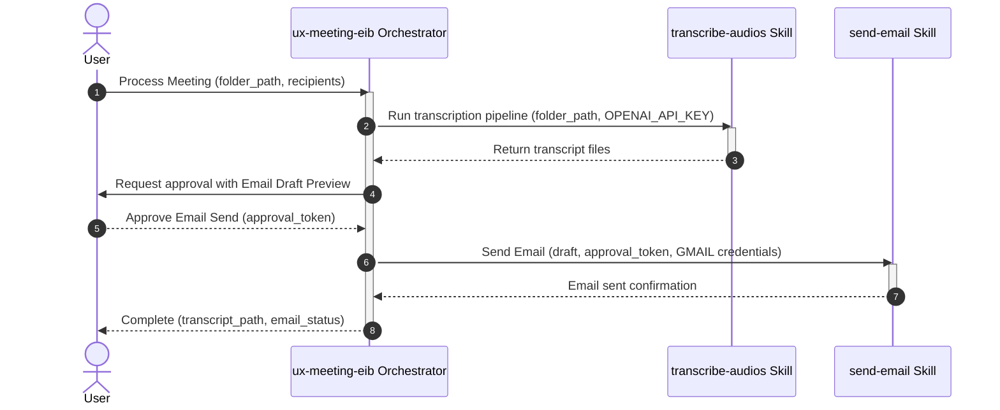

# UX Meeting EIB Orchestrator

## Description

The `ux-meeting-eib` orchestrator coordinates meeting audio transcriptions and email delivery for EIB meeting workflows. It sequentially invokes:
1. **`transcribe-audios`**: Processes all meeting audio files in the target project folder, generating full transcripts mapped against the meeting agenda/questionnaire.
2. **`send-email`**: Prepares an email draft containing the transcription output/summary and dispatches it via Gmail SMTP upon receiving explicit user approval.

## Routing Logic & Execution Flow

1. **Audio Transcription Step**:
   - Accepts project folder path containing meeting audio files.
   - Executes `transcribe-audios` to produce transcript markdown files.
2. **User Approval Step**:
   - When transcription finishes, the orchestrator pauses and requests user approval with an email draft preview.
3. **Email Dispatch Step**:
   - If approved by the user, the orchestrator invokes `send-email` to deliver the output to target recipients.

**Execution Rule:** When `transcribe-audios` completes, the orchestrator MUST pause and ask the user for approval before executing `send-email`.

## Available Skills

This orchestrator manages and routes requests to the following skills:

- **[transcribe-audios](./skills/transcribe-audios/SKILL.md)**: Transcribes meeting audio files into structured markdown transcripts.
- **[send-email](./skills/send-email/SKILL.md)**: Prepares and sends formatted email drafts via SMTP following user approval.

## Input

- **Type**: `dict`
- **Format**: Project folder path, optional recipient list, and meeting metadata.
- **Location**: `command_line` / `request_body`
- **Examples**:

  **Example 1** — Standard meeting transcription and email request:
  ```json
  {
    "folder_path": "/path/to/meeting-project",
    "recipients": [
      "hai.nl01@eximbank.com.vn",
      "dung.ntp07@eximbank.com.vn",
      "quan.pm03@eximbank.com.vn",
      "ngoc.lth02@eximbank.com.vn",
      "anh.ht14@eximbank.com.vn",
      "linh.htt02@eximbank.com.vn",
      "huyen.nk02@eximbank.com.vn",
      "huy.nt08@eximbank.com.vn"
    ],
    "sender": "nguyenlamhai89@gmail.com",
    "meeting_title": "EIB Weekly Sync"
  }
  ```

## Output

- **Type**: `dict`
- **Format**: Execution status, generated transcript paths, and email dispatch status.
- **Location**: `response_body` / `console_output`
- **Examples**:

  **Example 1** — Successful orchestration:
  ```json
  {
    "status": "success",
    "transcript_path": "/path/to/meeting-project/Meeting/transcript_combined.md",
    "email_status": {
      "sent": true,
      "sender": "nguyenlamhai89@gmail.com",
      "recipient_count": 1
    }
  }
  ```

## Environment Access (.env)

- **Allowed to access `father-orchestrator/.env`**: `true`

The orchestrator is the **only** component allowed to read the `.env` file directly. It retrieves API keys and explicitly passes them to child skills:

| Key Name | Purpose | Passed to Skills |
| --- | --- | --- |
| `OPENAI_API_KEY` | Audio transcription API access | `transcribe-audios` |
| `GMAIL_APP_USERNAME` | SMTP authentication username | `send-email` |
| `GMAIL_APP_PASSWORD` | SMTP app password | `send-email` |

## Sequence Diagram



## Error Handling & Fallbacks

| Error Scenario | Message | Fallback Behavior |
| --- | --- | --- |
| `MISSING_AUDIO_FILES` | No audio files found in meeting folder. | Halt execution and prompt user to upload `.mp3`/`.m4a`/`.wav` files. |
| `EMAIL_NOT_APPROVED` | User rejected or cancelled email send. | Retain generated transcripts and cancel email dispatch cleanly. |
| `SMTP_FAILURE` | Failed to authenticate or connect to SMTP. | Save email draft locally and notify user to verify `GMAIL_APP_PASSWORD`. |
