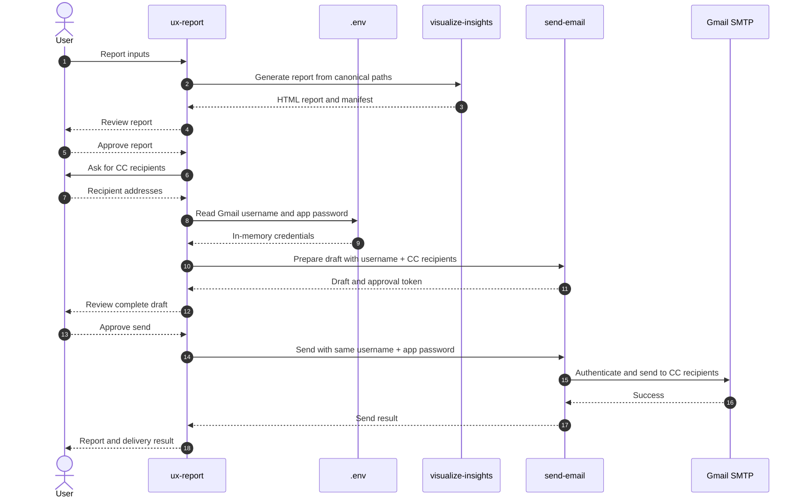

# UX Report

## Description

`ux-report` turns canonical UX-research artifacts into an interactive HTML
report, then delivers that report through Gmail after explicit user approval.
It owns the workflow-local `visualize-insights` and `send-email` skills. The
skills are intentionally kept inside this workflow so report generation and
delivery follow one explicit, approval-gated sequence.

This workflow is the only component permitted to read the workspace-root
`.env` for report delivery. It reads only `GMAIL_APP_USERNAME` and
`GMAIL_APP_PASSWORD`, keeps both values in memory, never logs or writes them to
artifacts, and passes them only to `send-email`. Neither shared skill reads
`.env` directly.

## Routing Logic & Execution Flow

Route requests here when the user wants to generate an HTML UX report, send an
existing UX report, or perform both steps together.

0. **Dependency verification** — Run `python3 .agents/scripts/check_libraries.py`.
   Warn about missing or outdated packages; halt only when the next required
   capability is unavailable.
1. **Generate report** — Call `visualize-insights` with the canonical absolute
   input paths. If `output_dir` is omitted, use
   `<folder_path>/Interview/Research Report`.
2. **Validate freshness and pause** — Accept `status: skipped` only when the
   visualization manifest verifies both the current input signature and output
   hash. Present the HTML report and stop. Do not collect recipients, read
   Gmail credentials, prepare a draft, or send email until the user explicitly
   approves the generated report.
3. **Collect recipients after report approval** — Ask the user who should receive the
   report. Collect at least one valid email address and pass every address in
   `cc_recipients`. Never reuse, infer, or hard-code recipients; To and BCC
   remain empty.
4. **Load Gmail credentials** — Read only `GMAIL_APP_USERNAME` and
   `GMAIL_APP_PASSWORD` from the workspace-root `.env`. If either is missing,
   halt before drafting and ask the user to add it to `.env`.
5. **Prepare the email draft** — Call `send-email.prepare_email_draft()` with
   the exact `visualization_result`, absolute `folder_path`, runtime
   `cc_recipients`, and `gmail_app_username`. Keep `gmail_app_password` in
   memory; do not include it in the draft or display it to the user.
6. **Show the complete draft and pause** — Show From, empty To and BCC, all CC
   recipients, subject, body, attachment, and approval token. If any recipient
   or attachment changes, return to step 3 and create a new draft.
7. **Send once after approval** — On an affirmative confirmation or exact
   approval token, call `send-email.send_approved_email()` with the unchanged
   draft, the same `gmail_app_username`, and `gmail_app_password`. Never retry
   a timeout or uncertain SMTP outcome.

## Available Skills

- **[visualize-insights](skills/visualize-insights/SKILL.md)** — Produces
  the interactive HTML report and integrity manifest.
- **[send-email](skills/send-email/SKILL.md)** — Collects runtime CC
  recipients, prepares the approval-gated draft, and sends the exact HTML file.

The local `skills/` folder contains the source files, scripts, templates, and
tests for both workflow stages.

## Input

- **Type**: `dict`
- **Location**: `request_body`
- **Format**:
  - `folder_path` (string, required) — Absolute research-project folder.
  - `insights_path` (string, required) — Absolute path to `insights.md`.
  - `transcript_path` (string, required) — Absolute path to
    `mapped-transcript.md`.
  - `full_transcript_paths` (array of strings, required) — One absolute full
    transcript path for every mapped interviewee.
  - `project_name` (string, required) — Safe report filename stem.
  - `journey_path` (string, optional) — Absolute `journey-map.md` path.
  - `media_paths` (array of strings, optional) — Absolute media paths used for
    duration statistics.
  - `output_dir` (string, optional) — Absolute report directory; defaults to
    `<folder_path>/Interview/Research Report`.
  - `max_input_bytes` (integer, optional) — Maximum visualization text-input
    size; defaults to `52428800`.
  - `open_browser` (boolean, optional, default `false`) — Open the report after
    generation.
  - `force_visualization` (boolean, optional, default `false`) — Rebuild even
    when the visualization manifest is current.

The workflow asks for `cc_recipients` separately on every run; recipients are
not accepted as a preconfigured default input.

## Output

- **Type**: `dict`
- **Location**: `response_body`
- **Format**:
  - `status`: `success`, `skipped`, `awaiting_approval`, `cancelled`, or `error`.
  - `output_file`: Absolute HTML report path.
  - `manifest_file`: Absolute visualization-manifest path.
  - `visualization`: Complete result from `visualize-insights`.
  - `email`: Draft, send success, cancellation, or safe error result from
    `send-email`.

## Environment Access (.env)

- **Allowed to access the workspace-root `.env`**: `true`
- **Scope**: Gmail report-delivery credentials only.
- **Delegation rule**: Keep values in memory and pass them only through the
  documented `send-email` function inputs. Never log, render, persist, or
  return the values.

| Key Name | Purpose | Passed to |
| --- | --- | --- |
| `GMAIL_APP_USERNAME` | Gmail From address and SMTP account | `prepare_email_draft()` and `send_approved_email()` |
| `GMAIL_APP_PASSWORD` | Gmail SMTP authentication | `send_approved_email()` after user approval only |

## Sequence Diagram

## Error Handling & Fallbacks

| Error Code | Handling |
| --- | --- |
| `INVALID_INPUT`, `INPUT_READ_ERROR`, `PARSING_ERROR`, `FULL_TRANSCRIPT_INVALID`, `JOURNEY_ERROR` | Halt before report generation and identify the invalid artifact. |
| `TEMPLATE_ERROR`, `OUTPUT_PATH_INVALID`, `OUTPUT_WRITE_ERROR` | Preserve the last-known-good report and return the visualization error. |
| `INVALID_RECIPIENTS` | Ask again for runtime CC recipients; never substitute a saved or BCC list. |
| `GMAIL_CONFIG_MISSING` | Halt before drafting and ask the user to configure `GMAIL_APP_USERNAME` and `GMAIL_APP_PASSWORD` in the workspace-root `.env`. |
| `GMAIL_SENDER_MISMATCH` | Prepare a new draft using the same Gmail username that will be used for SMTP. |
| `NOT_APPROVED` | Return `cancelled`; never invoke Gmail SMTP. |
| `SMTP_AUTH_FAILED`, `SMTP_SEND_FAILED` | Preserve the report and return the safe email error. |
| `SEND_TIMEOUT` | Do not retry automatically; preserve the report and ask the user to check the Gmail Sent folder. |
