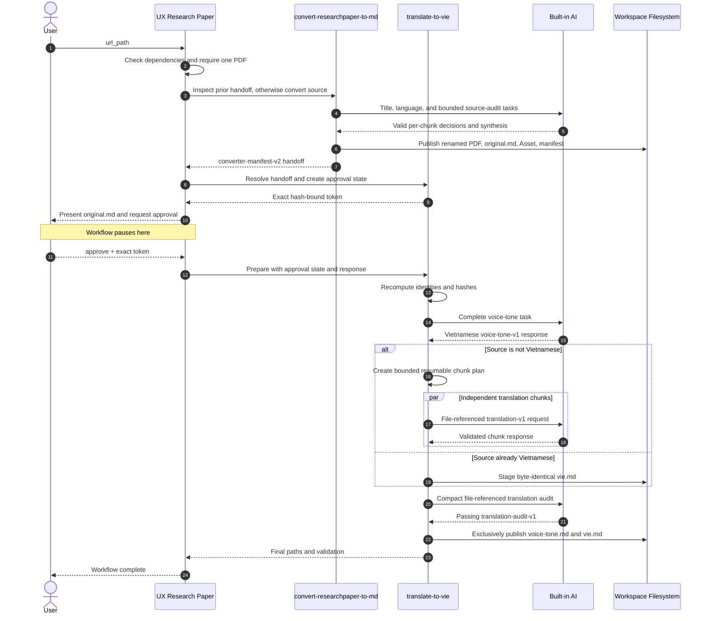

# UX Research Paper

## Description

Coordinate a strict two-stage research-paper workflow:

`convert-researchpaper-to-md` → user approval → `translate-to-vie`

Process exactly one paper per run. The converter produces the renamed PDF, complete source-language `original.md`, extracted visual assets, and an authoritative `converter-manifest-v2`. The orchestrator validates and presents those artifacts, creates an approval token bound to their current hashes and paths, and stops. On a later affirmative response containing the exact token, it revalidates the handoff and invokes the translator to create Vietnamese `voice-tone.md` and `vie.md`.

The workflow uses Built-in AI only. It never reads `.env`, receives API keys, or delegates secrets.

## Routing Logic & Execution Flow

Route requests here when the user asks to convert and/or translate a research-paper PDF while preserving document structure, tables, figures, formulas, references, and academic voice.

1. **Dependency check** — Run `python3 .agents/scripts/check_libraries.py`. Warn about missing/outdated packages; halt only if the dependency required by the next step is unavailable.
2. **Validate input and budgets** — Require `url_path`. It may be an absolute local/file PDF or directory, direct public HTTP(S) PDF, or public collection page. Validate optional positive conversion/translation budgets.
3. **Inspect prior handoff first** — When `prior_handoff` is supplied and conversion is not forced, pass it to converter `inspect-handoff`. If all identities, paths, and hashes match, skip discovery, Docling, and converter AI.
4. **Discover exactly one paper** — Only when no valid prior handoff exists. If zero PDFs resolve, stop. If more than one resolves, request one exact PDF URL/path and mutate nothing.
5. **Run converter** — Invoke `convert-researchpaper-to-md` with `url_path`, optional `force_conversion`, resource budgets, and any prior handoff. Preserve title, Docling, OCR, asset, bounded source-audit, completeness, cleanup, retry, and publication gates.
6. **Validate handoff** — Require exactly one successful result and `converter-manifest-v2`. Verify the renamed PDF, `original.md`, `Asset/`, manifest, source identity, status, paths, and hashes.
7. **Create approval state** — Invoke `translate-to-vie resolve` and `create-approval`. Bind the token to `url_path`, source PDF hash, `original.md` hash, manifest hash, renamed PDF path, paper-folder path, and `original.md` path.
8. **Present and pause** — Show the absolute renamed PDF, `original.md`, `Asset/`, manifest, expected `voice-tone.md`/`vie.md`, and exact approval token. Return `awaiting_approval`. Do not translate in the same stage.
9. **Resume only after approval** — Require a later affirmative response containing the exact current token, for example `approve APPROVE-TRANSLATE-TO-VIE:<sha256>`.
10. **Revalidate approval** — Recompute all hashes, identities, and paths. If anything changed, invalidate/delete the approval state and return `APPROVAL_INVALID`.
11. **Run translator** — Invoke `prepare`, file-referenced Built-in-AI voice analysis, bounded independent translation chunks, deterministic reassembly, compact file-referenced audit, and `publish`.
12. **Retry only safe AI phases** — For a retryable schema/coverage/parity/audit error, keep the unchanged approval and validated prior phases, feed exact validation details into the next prompt, and retry only the failing phase up to `max_ai_attempts`. Hash/path/output errors are terminal.
13. **Validate final result** — Require both new output files and passing voice coverage, structural parity, protected-token parity, and audit status.
14. **Return final paths** — Return all converter and translator artifacts plus validation status.

**Execution Rule:** After converter success, the orchestrator MUST pause and ask for approval. It MUST NOT invoke `translate-to-vie` until a later user response is affirmative and contains the exact current token.

## Available Skills

This orchestrator owns and routes to:

- **[convert-researchpaper-to-md](./skills/convert-researchpaper-to-md/SKILL.md)** — First stage. Convert one PDF into renamed source PDF, `original.md`, `Asset/`, and a validated manifest.
- **[translate-to-vie](./skills/translate-to-vie/SKILL.md)** — Second stage. After exact approval, create Vietnamese `voice-tone.md` and structurally matched `vie.md`.

## Input

- **Type**: `dict`
- **Location**: `request_body`
- **Format**:

  | Field | Type | Required | Rules |
  | --- | --- | --- | --- |
  | `url_path` | `str` | Yes on initial run | Exact local/file/HTTP(S) PDF or folder/page source. Exactly one paper must resolve. |
  | `force_conversion` | `bool` | No | Rebuild converter-owned artifacts only; defaults to `false`. |
  | `prior_handoff` | `dict` or absolute JSON path | No | Prior converter result/manifest for the same `url_path`; inspected before discovery when conversion is not forced. |
  | `conversion_budget` | `dict` | No | PDF-byte, page, staging-disk, source-audit chunk limits. |
  | `translation_budget` | `dict` | No | Source/block/chunk/context and bounded AI-attempt limits. |
  | `approval_state` | absolute JSON path | Yes on resume | Exact state returned by the initial stage. |
  | `approval_response` | `str` | Yes on resume | Affirmative response containing the exact current token. |

Initial example:

```json
{
  "url_path": "/absolute/workspace/path/paper.pdf",
  "force_conversion": false
}
```

Resume example:

```json
{
  "approval_state": "/absolute/workspace/path/.agents/scratch/ux-research-paper/<run-id>/approval.json",
  "approval_response": "approve APPROVE-TRANSLATE-TO-VIE:<sha256>"
}
```

## Output

- **Type**: `dict`
- **Location**: `response_body`
- **Format**:

Awaiting approval:

```json
{
  "status": "awaiting_approval",
  "approval_token": "APPROVE-TRANSLATE-TO-VIE:<sha256>",
  "approval_state": "/workspace/.agents/scratch/ux-research-paper/<run-id>/approval.json",
  "renamed_pdf": "/parent/Validated Paper Title.pdf",
  "original_md": "/parent/Validated Paper Title/original.md",
  "asset_dir": "/parent/Validated Paper Title/Asset",
  "manifest": "/parent/Validated Paper Title/.conversion-manifest.json",
  "expected_outputs": [
    "/parent/Validated Paper Title/voice-tone.md",
    "/parent/Validated Paper Title/vie.md"
  ]
}
```

Final success:

```json
{
  "status": "success",
  "renamed_pdf": "/parent/Validated Paper Title.pdf",
  "original_md": "/parent/Validated Paper Title/original.md",
  "voice_tone_md": "/parent/Validated Paper Title/voice-tone.md",
  "vie_md": "/parent/Validated Paper Title/vie.md",
  "asset_dir": "/parent/Validated Paper Title/Asset",
  "manifest": "/parent/Validated Paper Title/.conversion-manifest.json",
  "validation": {
    "voice_tone": "passed",
    "coverage": "passed",
    "structure_parity": "passed",
    "audit": "passed"
  }
}
```

## Environment Access (.env)

- **Allowed to access workspace-root `.env`**: `false`
- **API keys required**: none
- **Delegation**: none

The orchestrator and both child skills use only the host Built-in AI. They must never read `.env`, request an API key, log secrets, or import an external LLM SDK.

## Sequence Diagram



## Error Handling & Fallbacks

| Error Scenario | Message | Fallback Behavior |
| --- | --- | --- |
| `INVALID_INPUT`, `NO_PDFS_DISCOVERED` | No valid exact paper input. | Request the correct URL/path. |
| `MULTIPLE_PDFS_DISCOVERED` | More than one paper resolved. | Ask the user to select one exact PDF; mutate nothing. |
| Converter dependency, title, Docling, OCR, asset, or audit failure | Source conversion is incomplete. | Halt before approval and translation. |
| `HANDOFF_NOT_FOUND`, `HANDOFF_SCHEMA_INVALID`, `CONVERSION_NOT_SUCCESSFUL` | Converter handoff cannot authorize translation. | Re-run converter. |
| `NOT_APPROVED` | Response is not affirmative or lacks the exact token. | Remain paused; do not run translation. |
| `APPROVAL_INVALID`, `SOURCE_HASH_MISMATCH`, `SOURCE_IDENTITY_MISMATCH` | Approved content changed. | Delete stale approval state and require fresh conversion/approval. |
| `OUTPUT_EXISTS` | A translator output already exists. | Deny replacement; preserve existing files. |
| `RESOURCE_REVIEW_REQUIRED` | Configured conversion or translation limits would be exceeded. | Report exact measured/configured limits and wait for an explicit adjustment. |
| Retryable voice, translation, parity, or audit failure | Built-in-AI response is incomplete or unsafe while approved inputs remain unchanged. | Preserve validated phases and retry only the failing phase within the attempt budget; publish neither output meanwhile. |
| Retry exhaustion or terminal validation failure | The phase remained invalid or source identity changed. | Clean owned state, publish neither translator output, and require fresh approval when identity changed. |
| `PUBLICATION_FAILED`, `ROLLBACK_FAILED`, `CLEANUP_FAILED` | Transaction/cleanup could not complete safely. | Preserve pre-existing files and report exact owned paths. |

## Known Bugs & Resolutions

| Bug / Error | Cause | Resolution |
| --- | --- | --- |
| None recorded | — | — |

## Performance Improvement Solutions

- [x] Inspect a supplied prior converter handoff before discovery/title preflight and immediately return it when every path and hash remains valid.
- [x] Enforce configurable page, block, token, memory, and disk budgets before expensive conversion or translation phases.
- [x] Coordinate bounded, resumable translation chunks and retry only the failed Built-in-AI phase while approval-bound inputs remain unchanged.

Representative redistributable real-paper fixtures remain optional future validation; they were not an actionable recommendation in the two 2026-08-02 Analyze Skill reports.

## Analysis Reports

- [convert-researchpaper-to-md performance analysis](./Analysis/analysis-convert-researchpaper-to-md.md)
- [translate-to-vie performance analysis](./Analysis/analysis-translate-to-vie.md)
