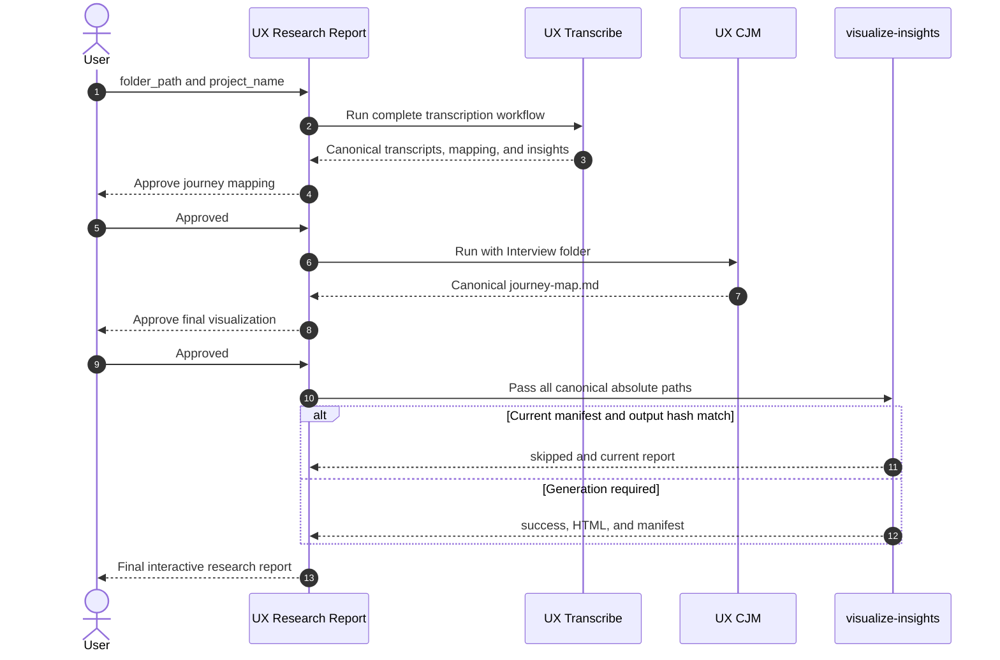

# UX Research Report

## Description

This parent workflow coordinates the complete research sequence:
`ux-transcribe` → `ux-cjm` → `visualize-insights`. It preserves each child
workflow's approval gates, passes only canonical successful outputs to the next
stage, and finishes with an atomic, freshness-aware HTML research report.

The parent orchestrator owns coordination only. It calls the sibling
`ux-transcribe` and `ux-cjm` workflows and then invokes the shared
`visualize-insights` workspace skill. It never reads API keys inside a skill.

## Routing Logic & Execution Flow

Route complete UX research requests here when the user wants transcription,
mapping, insight saturation, a journey map, and the final visualization in one
pipeline. Isolated requests remain routed to the relevant child workflow or
shared skill.

0. **Dependency verification** — Run
   `python3 .agents/scripts/check_libraries.py`. Warn about missing or outdated
   packages, but halt only when the dependency required by the next step is
   unavailable.
1. **Run `ux-transcribe`** — Pass the absolute `folder_path`, obtain any
   required keyterms, and preserve all approval gates. Continue only after the
   child workflow reports a complete current canonical mapping and successful
   insight publication.
2. **Validate the transcription handoff** — Require these absolute files:
   - `<folder_path>/Interview/mapped-transcript.md`
   - `<folder_path>/Interview/insights.md`
   - exactly one matching `<folder_path>/Interview/transcript-*.md` or legacy
     `transcript_*.md` file for each mapped interviewee.
3. **Ask for approval** — Present the canonical mapped transcript and insight
   paths. Stop until the user approves the `ux-cjm` stage.
4. **Run `ux-cjm`** — Pass `<folder_path>/Interview` as its `folder_path` so it
   consumes the canonical mapped transcript and writes
   `<folder_path>/Interview/Journey Map/journey-map.md`. Preserve all child
   approval gates.
5. **Validate and approve the journey handoff** — Require a successful journey
   map, present its absolute path, and stop until the user approves final report
   generation.
6. **Run `visualize-insights`** — Pass the canonical paths explicitly:
   ```json
   {
     "insights_path": "<folder_path>/Interview/insights.md",
     "transcript_path": "<folder_path>/Interview/mapped-transcript.md",
     "full_transcript_paths": ["<absolute matching transcript paths>"],
     "journey_path": "<folder_path>/Interview/Journey Map/journey-map.md",
     "media_paths": ["<absolute media paths declared or resolved by the parent>"],
     "output_dir": "<folder_path>/Interview/Research Report",
     "project_name": "<project_name>",
     "open_browser": false
   }
   ```
7. **Freshness and skip rule** — Accept `status: skipped` only when the
   visualization manifest reports `status: success`, its input signature covers
   the canonical insights, mapped transcript, full transcripts, journey map,
   media metadata, and all HTML templates, and the recorded output hash matches
   the current HTML file. File existence alone is never a valid skip signal.
8. **Return the final result** — Return the absolute HTML and manifest paths,
   the child workflow artifacts, input signature, and any structured warnings.

**Execution Rule:** When a child workflow completes and generates an output,
the orchestrator MUST pause and ask the user for approval before entering the
next stage. A partial or stale child result halts the pipeline.

## Available Workflows and Skills

- **[UX Transcribe](../ux-transcribe/ORCHESTRATOR.md)** — Produces canonical
  full transcripts, `mapped-transcript.md`, and `insights.md`.
- **[UX CJM](../ux-cjm/ORCHESTRATOR.md)** — Produces the canonical
  `Journey Map/journey-map.md` from the mapped transcript.
- **[visualize-insights](../../skills/visualize-insights/SKILL.md)** — Produces
  the final interactive HTML report and freshness manifest.

The required local `skills/` directory is retained for skills owned directly by
this parent workflow. It is currently empty because this orchestrator composes
sibling workflows and one shared workspace skill.

## Input

- **Type**: `dict`
- **Location**: `request_body`
- **Format**:
  - `folder_path` (string, required) — Absolute research project folder.
  - `project_name` (string, required) — Safe 1-120 character output name.
  - `media_paths` (array of strings, optional) — Explicit absolute interview
    media paths used for duration statistics.
  - `open_browser` (boolean, optional, default `false`) — Open the final report.
  - `max_input_bytes` (integer, optional, default `52428800`) — Maximum total
    size of text inputs passed to visualization.
  - `force_visualization` (boolean, optional, default `false`) — Ignore a
    current visualization manifest and rebuild.

## Output

- **Type**: `dict`
- **Location**: `response_body`
- **Format**:
  - `status`: `success`, `skipped`, or `error`.
  - `output_file`: Absolute final HTML path.
  - `manifest_file`: Absolute visualization manifest path.
  - `input_signature`: Final visualization signature.
  - `artifacts`: Canonical mapped transcript, insights, full transcripts, and
    journey map paths.
  - `warnings`: Structured non-fatal warning objects.

## Environment Access (.env)

- **Allowed to access `father-orchestrator/.env`**: `true`

| Key Name | Purpose | Passed to Skills |
| --- | --- | --- |
| `ELEVENLABS_API_KEY` | Interview audio transcription | Passed only to `ux-transcribe`, which injects it into `elevenlabs-transcribe`; never exposed to downstream skills. |

## Sequence Diagram



## Error Handling & Fallbacks

| Error Code | Fallback Behavior |
| --- | --- |
| `MISSING_API_KEY` | Ask the user for the ElevenLabs key and store it only through the authorized parent environment flow. |
| `PARTIAL_MAPPING`, `UPSTREAM_MAPPING_NOT_SUCCESS`, `UPSTREAM_SIGNATURE_MISMATCH` | Halt before insights and preserve the last-known-good canonical mapping. |
| `PARTIAL_EXTRACTION`, `PARTIAL_CONSOLIDATION`, `EXTRACTION_VALIDATION_FAILED`, `CONSOLIDATION_VALIDATION_FAILED` | Halt before journey mapping and preserve prior insight outputs. |
| `SKILL_FAILURE`, `INVALID_INPUT` from `ux-cjm` | Halt before visualization and present the failing journey stage. |
| `INPUT_READ_ERROR`, `FULL_TRANSCRIPT_INVALID`, `PARSING_ERROR`, `JOURNEY_ERROR` | Halt visualization and identify the exact handoff artifact to repair. |
| `INPUT_TOO_LARGE` | Ask the user to reduce inputs or intentionally raise `max_input_bytes`. |
| `TEMPLATE_ERROR`, `OUTPUT_PATH_INVALID`, `OUTPUT_WRITE_ERROR` | Preserve the last-known-good report and manifest; do not treat file existence as success. |
| `BROWSER_OPEN_ERROR` | Return success with a structured warning because the report itself remains valid. |
| `INTERNAL_ERROR` | Halt and return the stable code without exposing a stack trace. |

## Known Bugs & Resolutions

| Bug / Error | Cause | Resolution |
| --- | --- | --- |

