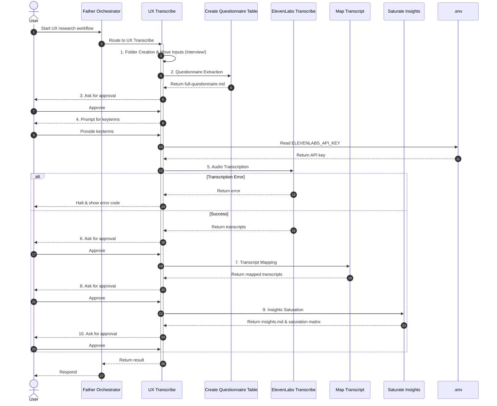

# UX Transcribe

## Description
The UX Transcribe orchestrates UX research tasks, delegating user requests to the appropriate skills. Its core capabilities include:
1. **Questionnaire Table Extraction**: Reading a question table from an image to produce a structured `full-questionnaire.md`.
2. **Audio Transcription**: Converting interview audio into Markdown transcripts using ElevenLabs.
3. **Transcript Mapping**: Mapping interviewee responses from transcripts to the questionnaire structure.
4. **Insights Saturation**: Synthesizing responses into a structured `insights.md` and saturation matrix.

Routes requests here when the user mentions UX research, transcription, questionnaire tables, transcript mapping, or insights synthesis.

## Routing Logic & Execution Flow
The orchestrator follows a sequential flow. **Incremental Execution**: Before any step, check for existing output files. If valid outputs exist, skip the step and its approval.
The orchestrator creates an `Interview` folder inside the provided `folder_path` and instructs all skills to place their outputs inside this `Interview` folder.

**Sequential Pipeline**:
0. **Dependency Verification**: Run the package validation script `.agents/scripts/check_libraries.py` to ensure all external dependencies (`elevenlabs`, `matplotlib`, `pytest`) are installed and up to date. Show warning/suggestions if needed.
1. **Folder Creation & Data Preparation**: Create a folder named `Interview` inside the provided `folder_path`. Move all input files (e.g., images and audio files) from `folder_path` into this `Interview` folder. All subsequent skills MUST read their inputs from and place their outputs inside this `Interview` folder.
2. **Questionnaire Extraction** (`create-questionnaire-table`): Extracts table from image to `full-questionnaire.md`.
3. **Approval**: **[CRITICAL] STOP** and wait for user approval. Do NOT proceed until the user replies.
4. **Keyterms Prompting**: Ask user for specific keyterms for transcription. **[CRITICAL] STOP** and wait for the user to provide keyterms. Do NOT execute step 5 automatically.
5. **Audio Transcription** (`elevenlabs-transcribe`): Transcribes audio using `ELEVENLABS_API_KEY` and keyterms. **Halts workflow and returns error code on failure.**
6. **Approval**: **[CRITICAL] STOP** and wait for user approval. Do NOT proceed until the user replies.
7. **Transcript Mapping** (`map-transcript`): Maps transcripts to the questionnaire structure.
8. **Approval**: **[CRITICAL] STOP** and wait for user approval. Do NOT proceed until the user replies.
9. **Insights Saturation** (`saturate-insights`): Runs `saturate_insights.py` which uses the Antigravity SDK to extract insights per-interviewee via Built-in AI, consolidates them, and deterministically generates `all-insights-*.md` and `insights.md`.
10. **Approval**: **[CRITICAL] STOP** and wait for user approval. Workflow complete.

**Isolated Requests (Keyword-based)**:
| Intent | Keywords | Routed to Skill |
| --- | --- | --- |
| Audio Transcription | "transcribe", "audio", "interview transcript" | `elevenlabs-transcribe` |
| Questionnaire Extraction | "questionnaire", "extract table" | `create-questionnaire-table` |
| Transcript Mapping | "map transcript", "mapped transcript" | `map-transcript` |
| Insights Saturation | "saturation", "saturate insights" | `saturate-insights` |

## Available Skills
- **[ElevenLabs Transcribe](./skills/elevenlabs-transcribe/SKILL.md)**
- **[Create Questionnaire Table](./skills/create-questionnaire-table/SKILL.md)**
- **[Map Transcript](./skills/map-transcript/SKILL.md)**
- **[Saturate Insights](./skills/saturate-insights/SKILL.md)**

## Input & Output
**Input**: Natural language request + folder path.
**Output**: Skill execution result (e.g., status, generated file paths).

## Environment Access (.env)
- **Allowed to access `father-orchestrator/.env`**: `true`
- **ELEVENLABS_API_KEY**: Passed to `elevenlabs-transcribe`.

## Sequence Diagram

## Error Handling
| Error Scenario | Fallback Behavior |
| --- | --- |
| `UNKNOWN_INTENT` | Ask for clarification or list capabilities. |
| `SKILL_FAILURE` | Log and return graceful failure message. |
| `INVALID_INPUT` | Return validation error for missing folder/format. |
| `MISSING_API_KEY` | Ask user to configure `.env`. |
