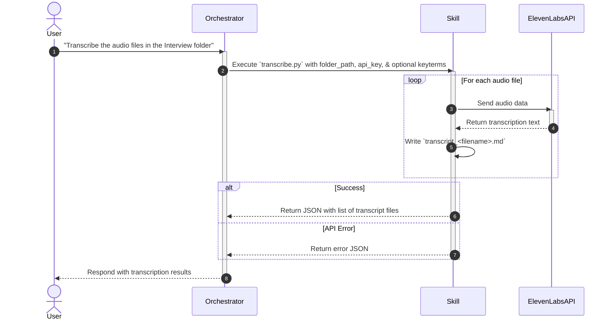

# ElevenLabs Transcribe

## Description

The `elevenlabs-transcribe` skill is a Python script wrapper around the ElevenLabs Python SDK. It traverses the `Interview` subfolder of an input folder for audio files (e.g., `.mp3`, `.wav`, `.m4a`, `.qta`), uses the ElevenLabs `speech_to_text.convert` API to generate text transcripts with speaker diarization, and outputs the result into corresponding `.md` files within the same `Interview` folder.

The orchestrator should trigger this skill when the user requests audio transcription, converting speech to text, or generating interview transcripts.

## Input

- **Type**: `dict`
- **Format**:
  - `folder_path` (string, required): The absolute path to the directory containing audio files.
  - `api_key` (string, required): The ElevenLabs API key.
  - `keyterms` (list of strings, optional): Specific keywords or vocabulary to prioritize during transcription.
- **Location**: `request_body`
- **Input File(s)**:
  - `Interview/*.mp3`, `Interview/*.wav`, `Interview/*.m4a`, `Interview/*.qta` — Raw audio files containing interviews or recordings in the `Interview` subfolder.
- **Examples**:

  **Example 1** — Transcription request:
  ```json
  {
    "folder_path": "/Users/madebynham/Desktop/interviews/round-1",
    "api_key": "YOUR_ELEVENLABS_API_KEY",
    "keyterms": ["ux research", "wireframes", "prototyping"]
  }
  ```

## Output

- **Type**: `dict`
- **Format**: 
  - `status` (string): 'success' or 'error'.
  - `transcripts` (list of objects): Each object contains `audio_file` (name of the file) and `output_file` (path to the generated Markdown file).
  - `total` (integer): Total number of files transcribed.
- **Location**: `file_path` — The generated files are saved to an `Interview` subfolder within the provided folder.
- **Output File(s)**:
  - `Interview/transcript_<audio_name>.md` — The generated markdown transcript files.
- **Examples**:

  **Example 1** — Successful execution:
  ```json
  {
    "status": "success",
    "data": {
      "transcripts": [
        {
          "audio_file": "interview-john.mp3",
          "output_file": "/Users/madebynham/Desktop/transcripts/Interview/transcript_interview-john.md"
        }
      ],
      "total": 1
    }
  }
  ```

- **Specific format output (e.g., Markdown template)**:
  ```markdown
  # INTERVIEW TRANSCRIPT: [AUDIO FILE NAME]
  **[00:00] [Host]** <br>
  Transcription content
  **[00:25] [Interviewee Name]** <br>
  Transcription content
  ```

## API Key

| Field | Value | Notes |
| --- | --- | --- |
| **Key** | `ELEVENLABS_API_KEY` | Must match the variable name defined in the orchestrator's environment. |

> **Note**: Skills MUST NOT read API keys directly from the `.env` file. The orchestrator is responsible for reading the `.env` file and passing the necessary API key into this skill as an input parameter. Never hardcode keys in skill files.
>
> If the orchestrator does not provide an API key for this skill, **use the built-in Antigravity AI** to process the task instead.

## Custom Instructions

- **Execution Method**: To execute this skill, you MUST load the API key as an environment variable and run the script without passing the key in the CLI: `source .env && python3 .agents/workflows/ux-transcribe/skills/elevenlabs-transcribe/scripts/transcribe.py <folder_path> [--keyterms "term1,term2"]`.
- The script automatically writes the `transcript_<filename>.md` file in the same `Interview` directory as the input audio file.

## Sequence Diagram



## Error Handling & Fallbacks

| Error Code | Message | Fallback Behavior |
| --- | --- | --- |
| `NO_AUDIO_FILES` | No supported audio files found in the specified folder. | Inform the user that the folder is empty or contains no supported audio files. |
| `API_ERROR` | The ElevenLabs API returned an error (e.g. invalid key). | Return the API error message to the orchestrator to display to the user. |

## Known Bugs & Resolutions

> **Agent Rule (Error Handling & Bug Documentation):** In the future, when this skill encounters an error during input receiving, processing, or output generation, the AI agent must first propose a solution to the user. If the user agrees, the AI agent will fix the error. If the error is successfully fixed, the AI agent must update this 'Known Bugs & Resolutions' section with the bug, cause, and resolution.

| Bug / Error | Cause | Resolution |
| --- | --- | --- |
| `TypeError: convert() got an unexpected keyword argument 'tag_audio_events'` | The ElevenLabs Python SDK `speech_to_text.convert` method does not accept the parameter `tag_audio_events`. | Removed the `tag_audio_events=True` parameter from the API call. |
| Words joined without spaces (e.g., `helloworld`) | ElevenLabs STT `word.text` does not include trailing spaces, causing simple string concatenation to mash words together. | Updated the concatenation logic to prepend a space: `current_text += " " + word.text.strip()`. |
| API 400 Bad Request error for empty keyterms | Passing an empty string `--keyterms ""` resulted in an array `[""]` being sent to the API, which may be invalid. | Added empty string filtering during parsing: `[k.strip() for k in args.keyterms.split(',') if k.strip()]`. |

## Performance Improvement Solutions

**⚡ Execution Efficiency**
- [x] Use `concurrent.futures.ThreadPoolExecutor` to process multiple audio files in parallel.
- [x] Consider streaming audio files if the ElevenLabs API supports it, or implement chunking for very large files.
- [ ] Implement streaming or chunked file reading for audio files larger than a configurable threshold (e.g., 100MB) to reduce peak memory usage when processing multiple large files concurrently with `ThreadPoolExecutor`.
- [ ] Make the transcription worker count and rate-limit cap configurable, with conservative defaults for large files.

**🎯 Output Quality & Accuracy**
- [ ] Align the documented JSON output contract with the CLI's `data` envelope and partial-failure fields.
- [ ] Reject empty transcription text before writing a completed transcript.

**🔗 Workflow Fit**
- [ ] Align API-key documentation with the actual environment-variable contract; remove or implement the stated built-in-AI fallback.
- [ ] Validate existing transcripts before skipping them, use atomic writes, and return results in filename order.

**🛡️ Reliability & Error Handling**
- [x] Catch transcription exceptions per file and continue processing the remaining files instead of exiting immediately.
- [x] Implement an exponential backoff retry mechanism around the ElevenLabs API call for robustness.
- [ ] Classify retryable API failures, honor `Retry-After` where available, add jitter, and do not retry invalid credentials or requests.
- [ ] Catch unexpected future-result failures and return documented per-file error codes.
- [ ] Add regression tests for documented word-spacing and empty-keyterms bugs.

**💰 Cost & Scalability**
- [x] Implement concurrent execution to improve scaling behavior when processing multiple audio files.
- [x] Add unit tests covering ElevenLabs API failure scenarios and edge cases (e.g. empty files).
- [ ] Add tests for keyterms parsing, timestamps, diarized-word output, empty transcription content, and future-result failures.
