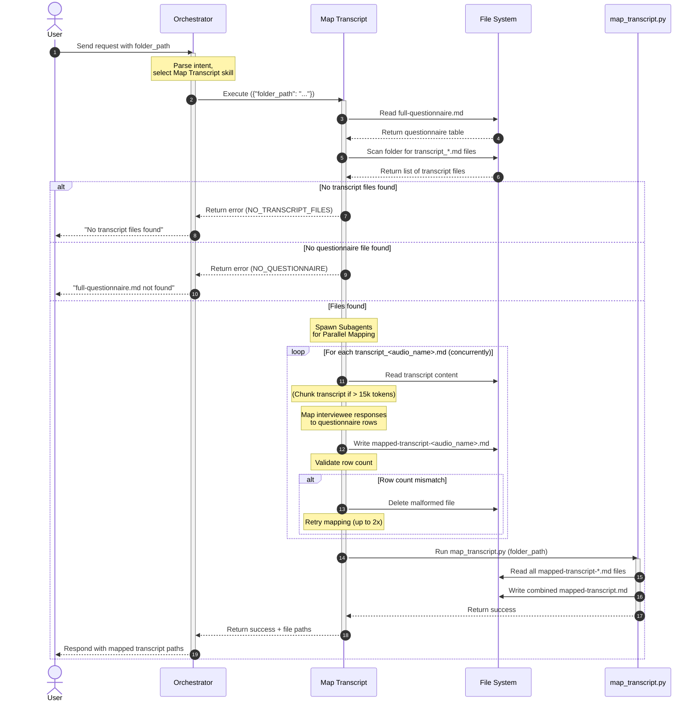

# Map Transcript

## Description

This skill maps interviewee responses from individual `transcript_<audio_name>.md` files to the corresponding questions and observed variables in the `full-questionnaire.md` table. It produces two types of output:

1. **Per-interviewee mapped transcripts** — One file per transcript (`mapped-transcript-<audio_name>.md`), containing the questionnaire table structure with an added column for that interviewee's responses.
2. **Combined mapped transcript** — A single file (`mapped-transcript.md`) that merges all interviewee columns side-by-side.

The orchestrator should trigger this skill when:
- The user wants to map transcript responses to the questionnaire structure.
- The user wants to create a mapped transcript table from interview transcripts.
- Keywords such as "map transcript", "map responses", "mapped transcript", "mapping" are detected.

**Prerequisites:**
- The input folder must contain a `full-questionnaire.md` file (generated by the `create-questionnaire-table` skill).
- The input folder must contain at least one `transcript_<audio_name>.md` file (assumed to be generated beforehand).

## Input

- **Type**: `dict`
- **Format**:
  - `folder_path` (string, **required**) — Absolute path to a local directory containing `full-questionnaire.md` and `transcript_<audio_name>.md` files.
- **Location**: `request_body`
- **Input File(s)**:
  - `Interview/full-questionnaire.md` — The structured questionnaire table generated by the `create-questionnaire-table` skill.
  - `Interview/transcript_<audio_name>.md` — Transcript files for the interviewees.
- **Examples**:

  **Example 1** — Folder with questionnaire and transcripts (which are inside the Interview subfolder):
  ```json
  {
    "folder_path": "/Users/madebynham/Desktop/interviews/round-1"
  }
  ```

## Output

- **Type**: `dict`
- **Format**:
  - `status` (string) — `"success"` or `"error"`.
  - `mapped_files` (list of objects) — One entry per transcript:
    - `transcript_file` (string) — Original transcript filename.
    - `output_file` (string) — Path to the generated `mapped-transcript-<audio_name>.md` file.
  - `combined_file` (string) — Path to the final `mapped-transcript.md` file.
  - `total` (integer) — Number of transcripts mapped.
- **Location**: `file_path` — All output files are saved in the `Interview` subfolder of the provided directory.
- **Output File(s)**:
  - `Interview/mapped-transcript-<audio_name>.md` — Per-interviewee mapped transcript with questionnaire structure plus one interviewee column.
  - `Interview/mapped-transcript.md` — Combined mapped transcript with all interviewee columns side-by-side.
- **Examples**:

  **Example 1** — Successful mapping:
  ```json
  {
    "status": "success",
    "mapped_files": [
      {
        "transcript_file": "transcript_HR_Leanbase.md",
        "output_file": "/Users/madebynham/Desktop/interviews/round-1/Interview/mapped-transcript-HR_Leanbase.md"
      },
      {
        "transcript_file": "transcript_Nguyen_Thi_Dung.md",
        "output_file": "/Users/madebynham/Desktop/interviews/round-1/Interview/mapped-transcript-Nguyen_Thi_Dung.md"
      }
    ],
    "combined_file": "/Users/madebynham/Desktop/interviews/round-1/Interview/mapped-transcript.md",
    "total": 2
  }
  ```

- **Specific format output (Markdown template)**:

  **Per-interviewee file** (`mapped-transcript-<audio_name>.md`):
  ```markdown
  # Mapped Transcript

  | # | Theme | Question | Observed Variable | <audio_name> |
  |---|-------|----------|-------------------|--------------|
  | 1 | Warm-up | Question text... | Variable name | Interviewee's response or N/A |
  ```

  **Combined file** (`mapped-transcript.md`):
  ```markdown
  # Mapped Transcript

  | # | Theme | Question | Observed Variable | <interviewee_1> | <interviewee_2> | ... |
  |---|-------|----------|-------------------|-----------------|-----------------|-----|
  | 1 | Warm-up | Question text... | Variable name | Response or N/A | Response or N/A | ... |
  ```

> **Note**: The table structure always starts with the 4 base columns (`#`, `Theme`, `Question`, `Observed Variable`) from `full-questionnaire.md`. Interviewee columns are appended to the right in the order the transcript files are processed.
>
> **Important**: The `#` column is the **question's order number**. All rows with the same question content MUST share the same `#` value, matching the original `full-questionnaire.md` structure exactly.


## Custom Instructions

- **Execution Method**: This skill is executed by the Antigravity AI agent. The agent  1. **Scan the folder** at `<folder_path>/Interview` for `full-questionnaire.md`. Verify it exists.
  2. **Context Caching**: **Read `Interview/full-questionnaire.md` ONCE** to understand the questionnaire table structure (all questions, topics, and observed variables). Keep this structure in your context for all subsequent mapping operations. Do not re-read it for each transcript.
  3. **Identify all `transcript_<audio_name>.md` files** in the `Interview` folder. Extract the `<audio_name>` from each filename by removing the `transcript_` prefix and `.md` extension.
  3b. **Staleness Check**: For each identified transcript file, check if a corresponding `Interview/mapped-transcript-<audio_name>.md` already exists. If it does, compare the modification timestamps: if the transcript file is **newer** than the mapped file, delete the stale mapped file so it will be regenerated. This ensures mapping always reflects the latest transcript content. Use `python3 <skill_path>/scripts/check_staleness.py <folder_path>` to automate this check.
  4. **Parallel Execution**: If there are multiple transcript files, use the `invoke_subagent` tool to spawn subagents and map the transcripts **concurrently**. For each transcript file, perform the following:
     a. **Extract a concise Alias** (max 2-3 words, e.g., "Anh A CEO" or "Nguyen Van A") from the `<audio_name>` to use as the column header (`<interviewee_alias>`) instead of using the raw, long filename.
     b. Read the transcript content. **Chunking Strategy**: Estimate the transcript length. If the file is extremely long (e.g., > 15,000 tokens) and risks hitting context limits, divide it into logical segments. **CRITICAL**: When processing in chunks, you must carry the mapping context forward across chunks to ensure all information is mapped correctly and no context or data is lost.
     c. For each row in the questionnaire table (each question + observed variable pair), carefully search the transcript (or chunk) for the section corresponding to that specific question.
     d. **Map the entire conversational thread** — extract the full exchange between the interviewer and interviewee. This includes the main question from the questionnaire, all of the interviewee's responses, AND any follow-up questions from the interviewer (even if they are not in the questionnaire). Continue capturing this full thread into the cell until the interviewer asks the NEXT main question found in the `full-questionnaire.md`.
     d1. **Out-of-order questions** — If the interviewer asks questions in a different order than the questionnaire, map each response to the CORRECT questionnaire row by matching the question content, not by sequential position in the transcript. Always use the questionnaire structure as the ground truth for row placement.
     d2. **Revisited answers** — If the interviewee revisits or adds to a previously answered question later in the transcript, APPEND the additional response to the same cell with a `<br><br>` separator and include the new timestamp (e.g., `[32:15] Additional context: ...`).
     d3. **Off-script follow-ups** — Off-script follow-up questions from the interviewer that do NOT correspond to any question in the questionnaire should be included in the cell of the PRECEDING main question, as part of the conversational thread, rather than being dropped or mapped to the next question.
     e. **Do NOT summarize or paraphrase**; copy the relevant conversational content (both questions and answers) faithfully.
     f. **ABSOLUTELY do not make assumptions or fabricate information** that is not in the transcript.
     g. If a question is not addressed or the interviewee does not answer it during the interview, clearly mark it as **`N/A`** in the cell.
     h. Write the result to `Interview/mapped-transcript-<audio_name>.md` in the provided folder. The file must contain:
        - A level-1 heading: `# Mapped Transcript`
        - A Markdown table with columns: `#`, `Theme`, `Question`, `Observed Variable`, `<interviewee_alias>`
        - The table rows must match the `full-questionnaire.md` structure exactly (same number of rows, same order).
        - **Mapping Summary** (appended after the table): Include a brief summary line: `> **Mapping Summary**: Total questions: X | Answered: Y | N/A: Z | Transcript coverage: [HH:MM] to [HH:MM]`. This helps users quickly assess mapping completeness without reading every cell.
     i. **Programmatic Validation & Retry**: After writing, you MUST run the validation script: `python3 <skill_path>/scripts/validate_mapping.py <folder_path>/Interview/full-questionnaire.md <folder_path>/Interview/mapped-transcript-<audio_name>.md`. Do not attempt to count the rows manually. If the script returns `VALIDATION_FAILED`, you must **immediately delete** the partially-written/malformed file to prevent downstream errors. Then, retry the mapping up to 2 times.
     j. **Post-mapping Verification**: After the mapping is complete and validated, cross-check each cell against the transcript timestamps to ensure no segment of the interview was skipped or double-counted. Verify that the timestamp range in the mapping summary covers the full interview duration (start to end of transcript).
  5. **Merge**: **After ALL individual mapped files are created** (wait for all subagents to finish), run the merge script: `python3 <skill_path>/scripts/map_transcript.py <folder_path>` to combine all `Interview/mapped-transcript-<audio_name>.md` files into a single `Interview/mapped-transcript.md`.

- If the transcript contains text in Vietnamese, preserve the original Vietnamese text in the output.
- Do not add any extra content to the mapped transcript files beyond the heading and the table itself.
- Do not wrap the table in code fences.
- **Table Cell Formatting**: You MUST use HTML `<br>` or `<br><br>` tags for any newlines or paragraph breaks within the table cells. NEVER use actual newline characters (`\n`) inside the table rows, as this will break the Markdown table structure.
- The response content in each cell should be the interviewee's actual words from the transcript, not a summary or interpretation.
- **Timestamping**: You MUST include the exact timestamp from the transcript (e.g., `[05:22]`) at the beginning or end of the quoted response in each cell, so users can easily cross-reference the audio file.
- **Highlighting**: In each response cell of the `mapped-transcript-<audio_name>.md` file, you MUST identify the *main response* or *core insight* of the interviewee's answer and highlight it in bold with a bright yellow background. Use Markdown/HTML to format it like this: `**<mark style="background-color: yellow;">main response text</mark>**`.
- Clean up — Ensure that any temporary files created during processing (e.g., intermediate files, temporary copies) are deleted immediately after the skill completes its task.

## Sequence Diagram



## Error Handling & Fallbacks

| Error Code | Message | Fallback Behavior |
| --- | --- | --- |
| `INVALID_INPUT` | The input folder path is missing or does not exist. | Return a clear validation error to the user. |
| `NO_QUESTIONNAIRE` | No `full-questionnaire.md` file found in the specified folder. | Return an informative message asking the user to run the `create-questionnaire-table` skill first. |
| `NO_TRANSCRIPT_FILES` | No `transcript_<audio_name>.md` files found in the specified folder. | Return an informative message asking the user to provide transcript files first. |
| `MAPPING_ERROR` | Failed to map a transcript to the questionnaire structure. | Retry mapping up to 2 times. If it still fails, log the error, skip the problematic transcript, continue with remaining files. |
| `MERGE_ERROR` | The merge script failed to combine individual mapped transcripts. | Return a friendly error message and suggest running the merge manually. |

## Known Bugs & Resolutions

<!-- List any past bugs or errors encountered during the development or execution of this skill, and explain how they were resolved. This acts as a knowledge base for future maintenance. -->

> **Agent Rule (Error Handling & Bug Documentation):** In the future, when this skill encounters an error during input receiving, processing, or output generation, the AI agent must first propose a solution to the user. If the user agrees, the AI agent will fix the error. If the error is successfully fixed, the AI agent must update this 'Known Bugs & Resolutions' section with the bug, cause, and resolution.

| Bug / Error | Cause | Resolution |
| --- | --- | --- |

## Performance Improvement Solutions

<!-- This section is automatically populated and updated by the analyze-skill. It contains a checklist of actionable solutions to improve this skill's performance across various criteria. -->

**Category 1: ⚡ Execution Efficiency**
- [x] Instruct the orchestrator to parallelize transcript mapping by invoking multiple AI mapping tasks concurrently (e.g., via subagents or async patterns). *(Execution Time: 7/10)*
- [x] Implement a chunking strategy: instruct the AI to process large transcripts in segments (e.g., question-by-question or by topic blocks) to avoid token limit issues. *(Token Usage: 6/10)*
- [x] Add a pre-processing step that estimates transcript token count and triggers chunked processing if it exceeds a configurable threshold. *(Token Usage: 6/10)*

**Category 2: 🎯 Output Quality & Accuracy**
- [x] Explicitly instruct the AI to use HTML `<br>` tags for newlines within table cells to prevent breaking the Markdown table structure.
- [x] Add an instruction in SKILL.md to escape or replace any literal pipe characters (`|`) in transcript content with HTML entity `&#124;` to prevent table corruption. *(Format Compliance: 8/10 — edge case)*

**Category 4: 🛡️ Reliability & Error Handling**
- [x] Add explicit instructions for the AI to retry mapping up to 2 times if a `MAPPING_ERROR` or formatting error occurs.
- [x] Consider adding a wrapper script or orchestrator-level retry mechanism that programmatically retries the AI mapping call on failure, rather than relying solely on AI instruction compliance. *(Retry Success Rate: 7/10)*

**Category 5: 💰 Cost & Scalability**
- [x] Implement parallel processing for multiple transcripts to reduce wall-clock time from O(N) to O(1) with sufficient concurrency. *(Scaling Behavior: 7/10)*
- [x] Add transcript length validation with automatic chunking for transcripts exceeding a configurable token threshold. *(Scaling Behavior: 7/10)*

---

### 2026-07-14 Analysis — Mapping Exactness Focus

**Category 1: ⚡ Execution Efficiency**
- [x] Add a pre-processing Python script that deterministically splits transcripts by topic/question boundaries (using questionnaire structure as anchors) rather than relying on AI to chunk logically. This ensures no mapping data is lost at chunk boundaries and directly improves mapping exactness. *(Token Usage: 7/10)*

**Category 2: 🎯 Output Quality & Accuracy (Mapping Exactness)**
- [x] Add explicit instruction: "If the interviewer asks questions out of order compared to the questionnaire, map the response to the CORRECT questionnaire row by matching the question content, not by sequential position in the transcript." *(Content Accuracy: 7/10)*
- [x] Add explicit instruction: "If the interviewee revisits or adds to a previously answered question later in the transcript, APPEND the additional response to the same cell with a `<br><br>` separator and include the new timestamp." *(Content Accuracy: 7/10)*
- [x] Add explicit instruction: "Off-script follow-up questions from the interviewer that do NOT correspond to any question in the questionnaire should be included in the cell of the PRECEDING main question, as part of the conversational thread, rather than being dropped or mapped to the next question." *(Content Accuracy: 7/10)*
- [x] Add a post-mapping verification step: "After completing the mapping, cross-check each cell against the transcript timestamps to ensure no segment of the interview was skipped or double-counted." *(Content Accuracy: 7/10)*
- [x] Add a mapping summary at the end of each `mapped-transcript-<audio_name>.md` showing: total questions, answered count, N/A count, and timestamp coverage (e.g., `[00:00] to [45:22] — 85% of transcript mapped`). This helps users quickly assess mapping completeness without reading every cell. *(Human Approval Rate: 7/10)*

**Category 3: 🔗 Workflow Fit**
- [x] Add a staleness check: before skipping, compare the modification timestamp of `transcript_<audio_name>.md` against `mapped-transcript-<audio_name>.md`. If the transcript is newer, delete the stale mapped file and re-map. This ensures mapping always reflects the latest, most accurate transcript. *(Skip-Logic Compatibility: 7/10)*

**Category 4: 🛡️ Reliability & Error Handling**
- [x] Implement atomic writes in `map_transcript.py`: write to a temporary file first, then rename to `mapped-transcript.md` only on success. This prevents corrupted output files from downstream consumption. *(Error Recoverability: 7/10)*

### 2026-07-14 Analysis — Cleanup and Robustness

**Category 1: ⚡ Execution Efficiency**
- [x] Add a cleanup script or explicitly ensure the AI deletes the `.chunks_{transcript_basename}` directory after successful mapping. *(Resource Consumption: 7/10)*

**Category 4: 🛡️ Reliability & Error Handling**
- [x] Implement a wrapper script or orchestrator hook to enforce retries programmatically rather than relying purely on LLM instruction following. *(Retry Success Rate: 7/10)*

---

### 2026-07-22 Analysis

**Category 1: ⚡ Execution Efficiency**
- [ ] Replace the undeclared `invoke_subagent` step in `SKILL.md` with the orchestrator's actual bounded-concurrency mechanism and record per-transcript completion before the merge barrier. *(Execution Time: 7/10)*
- [ ] Invoke `scripts/chunk_transcript.py` before AI mapping for transcripts over the configured limit, pass only the relevant questionnaire rows plus a compact cross-chunk mapping ledger, and document how chunk results are reconciled. *(Token Usage: 6/10)*
- [ ] Put chunk-directory cleanup in a `finally` path that runs even when mapping or merging fails, and avoid loading every full file with `read()` or `readlines()` where streaming is sufficient. *(Resource Consumption: 7/10)*

**Category 2: 🎯 Output Quality & Accuracy**
- [ ] Extend `scripts/validate_mapping.py` to validate the exact five-column header, every questionnaire row key and order, response-cell presence, and Mapping Summary totals instead of checking row count alone. *(Output Completeness: 7/10)*
- [ ] Resolve the contradictory Mapping Summary/no-extra-content rules in `SKILL.md`, require literal pipes in transcript content to be encoded as `&#124;`, and make validation reject malformed row widths before merge. *(Format Compliance: 5/10)*
- [ ] Remove the positional fallback in `scripts/map_transcript.py`; fail validation when questionnaire row keys do not match exactly so a response cannot be silently attached to the wrong question. *(Content Accuracy: 7/10)*
- [ ] Generate a review manifest with answered/N/A totals plus unmapped and overlapping timestamp ranges so the approval gate can verify coverage without manually auditing every table cell. *(Human Approval Rate: 7/10)*

**Category 3: 🔗 Workflow Fit**
- [ ] Move transcript-set and modification-time validation into `ORCHESTRATOR.md` before incremental skip decisions, and rebuild the combined file whenever a source transcript is added, changed, or removed. *(Skip-Logic Compatibility: 5/10)*
- [ ] Fail closed or return an explicit `partial` result when any expected transcript is missing or malformed; do not silently merge a subset that downstream insight generation can mistake for complete data. *(Pipeline Passthrough Rate: 5/10)*

**Category 4: 🛡️ Reliability & Error Handling**
- [ ] Add preflight and merge checks for malformed headers, uneven row widths, duplicate aliases/row keys, raw pipe characters, unreadable encodings, and permission failures, with stable documented error codes. *(Error Rate: 6/10)*
- [ ] Preserve the last valid per-interviewee output until a replacement has been written atomically and validated, and clean chunk artifacts in `finally` blocks on every exit path. *(Error Recoverability: 7/10)*
- [ ] Implement a real retry controller: retry transient AI/tool failures with bounded exponential backoff, retry validation failures with the validator diagnostics, and never retry terminal input/schema errors. *(Retry Success Rate: 5/10)*
- [ ] Reopen completed checklist items whose mechanisms are absent, especially pipe escaping and programmatic retry enforcement, and require a regression test or implementation reference before marking future items complete. *(Known Bug Recurrence: 5/10)*

**Category 5: 💰 Cost & Scalability**
- [ ] Replace the repeated normalized-prefix reconstruction in `scripts/chunk_transcript.py` with a one-pass normalized-to-original offset map, and cap concurrent mapping workers to prevent memory and rate-limit spikes. *(Scaling Behavior: 5/10)*
- [ ] Add direct tests for `validate_mapping.py`, malformed/partial mapped files, pipe-containing responses, duplicate row keys, atomic failure cleanup, and stale combined outputs; expand the workflow E2E test to start from source transcripts rather than pre-mapped fixtures. *(Unit Test Coverage & Pass Rate: 7/10)*
