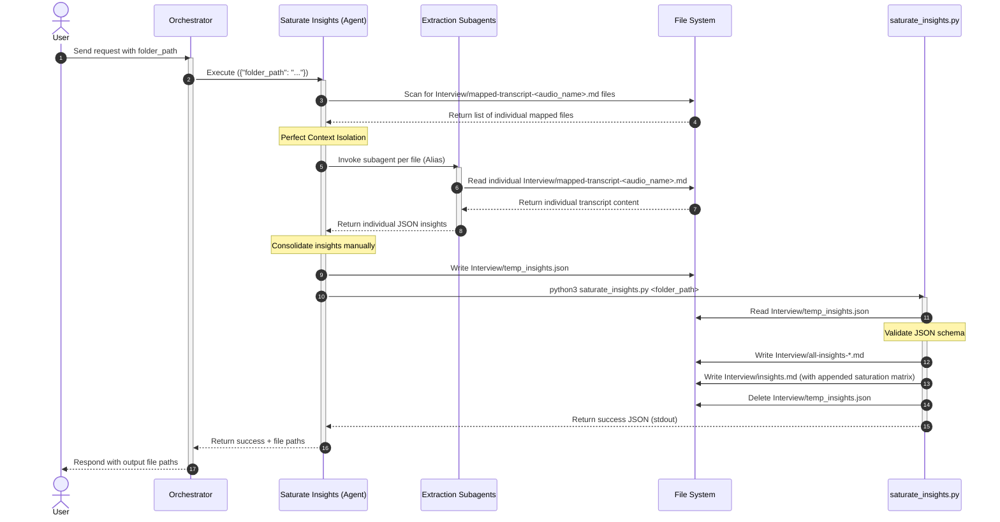

# Saturate Insights

## Description

This skill reads the combined `mapped-transcript.md` in a project folder and runs a hybrid AI + Python pipeline to:
1. **Parse** the Markdown table and separate each interviewee's data.
2. **Extract** insights per interviewee manually using **Subagents** to prevent context overload and hallucination.
3. **Consolidate** semantically similar insights into unified Master Insights.
4. **Generate** all output files deterministically using Python.

Output files:
- `Interview/all-insights-<interviewee_alias>.md` — Per-interviewee insight + quote table.
- `Interview/insights.md` — Compiled insights for all interviewees and Data saturation matrix (🔵, 🌐, ⚪️).

The orchestrator should trigger this skill after the `map-transcript` skill has run.

## Input

- **Type**: `dict`
- **Format**:
  - `folder_path` (string, **required**) — Path to the folder containing mapped transcripts.
- **Location**: `request_body`
- **Input File(s)**:
  - `Interview/mapped-transcript.md` — The combined mapped transcript generated by the `map-transcript` skill.

## Output

- **Type**: `dict`
- **Format**:
  - `status` (string) — `"success"` or `"error"`.
  - `output_files` (list of strings) — Basenames of all generated output files.
- **Location**: `file_path` — All output files are saved in the `Interview` subfolder of the provided directory.
- **Output File(s)**:
  - `Interview/all-insights-<interviewee_alias>.md` — Per-interviewee insight + quote tables.
  - `Interview/insights.md` — Compiled insights for all interviewees, with the data saturation matrix and chart appended.
  - `Interview/saturation-chart.png` — A beautifully styled matplotlib line chart showing the marginal discovery rate with translucent green fill.


## Custom Instructions

- **Execution Method**: This skill is executed by the Main AI Agent parsing the mapped transcript manually, using Subagents to extract insights per person in parallel, and generating the structured JSON, followed by running a Python script to format the final outputs.

### Execution Steps

  1. **Locate Individual Mapped Transcripts**: Scan the folder at `<folder_path>/Interview` for individual mapped transcript files (`mapped-transcript-<audio_name>.md`). Exclude the combined `mapped-transcript.md` file. Extract the interviewee alias from each filename.
  2. **Extract via Subagents**: Use the `invoke_subagent` tool to spawn a separate subagent for *each* individual file (e.g., using the `research` or `self` role).
     - Instruct each subagent to strictly read ONLY their assigned `Interview/mapped-transcript-<audio_name>.md` file and extract insights for that specific interviewee. This perfect context isolation prevents hallucination.
     - Force the subagent to ground their insights by finding exact, verbatim quotes from the text before deriving the insight.
     - Tell the subagent to return a JSON array of insights following the Insight Quality Rules below.
  3. **Consolidate Insights**: Wait for all subagents to finish. Gather their individual insights and consolidate them into Master Insights.
  4. **Generate JSON**: Save the consolidated insights to `Interview/temp_insights.json` in the `<folder_path>`, following the JSON Schema exactly.
  5. **Run the Python script**:
     ```bash
     python3 <skill_path>/scripts/saturate_insights.py <folder_path>
     ```
  6. **Verify output**: Check the script's stdout JSON. If `status` is `"success"`, the output files have been created.
  7. **Done** — The script handles validation, output generation, and cleanup automatically.

### Insight Quality Rules

You and your subagents must enforce these rules when extracting insights:

- ✅ Good: `"Lo lắng về bảo mật, do không biết dữ liệu được lưu ở đâu"`
- ✅ Good: `"Bực bội khi thao tác, do nút bấm quá nhỏ và khó tìm"`
- ✅ Good: `"Hài lòng với tốc độ xử lý, do giao dịch hoàn tất nhanh chóng"`
- ❌ Bad: `"Nút bấm nhỏ"` (Missing behavior/emotion)
- ❌ Bad: `"Người dùng không thích giao diện"` (Too vague, no specific cause)
- ❌ Bad: `"Cảm thấy khó chịu"` (Missing cause)

### JSON Schema (Strict Requirement)

You must write exactly this structure to `temp_insights.json`, including a descriptive `"theme"` (e.g. `"Tần suất nhu cầu"`, `"Tư vấn trước quầy"`, etc.) for each master insight. The final generated `insights.md` will list these under "Summary of Master Insights" as bullet points with bold themes (format: `- **<theme>**: <content>`):
```json
{
  "interviewees": ["Alias A", "Alias B", "Alias C"],
  "master_insights": [
    {
      "id": 1,
      "theme": "<theme name>",
      "insight": "<behavior/emotion/action>, <cause>",
      "interviewees": {
        "Alias A": {"status": "new", "quotes": ["verbatim quote 1"]},
        "Alias B": {"status": "repeated", "quotes": ["verbatim quote 2"]},
        "Alias C": {"status": "absent", "quotes": []}
      }
    }
  ]
}
```

## Sequence Diagram



## Error Handling & Fallbacks

| Error Code | Message | Fallback Behavior |
| --- | --- | --- |
| `INVALID_INPUT` | The input folder path is missing or does not exist. | Return a clear validation error to the user. |
| `NO_MAPPED_TRANSCRIPT` | No `Interview/mapped-transcript.md` file found in the folder. | Ask the user to run the `map-transcript` skill first. |
| `NO_INSIGHTS_JSON` | `Interview/temp_insights.json` not found. | Verify you have generated and saved the JSON correctly before running the script. |
| `INVALID_JSON` | `Interview/temp_insights.json` contains malformed JSON. | Regenerate the JSON file ensuring strict validity. |
| `SCHEMA_VALIDATION_ERROR` | JSON does not conform to the expected schema. | Check for missing fields or invalid status values and regenerate. |
| `GENERATION_ERROR` | Failed to generate output Markdown files. | Log the error and return a friendly message to the user. |

## Known Bugs & Resolutions

> **Agent Rule (Error Handling & Bug Documentation):** In the future, when this skill encounters an error during input receiving, processing, or output generation, the AI agent must first propose a solution to the user. If the user agrees, the AI agent will fix the error. If the error is successfully fixed, the AI agent must update this 'Known Bugs & Resolutions' section with the bug, cause, and resolution.

| Bug / Error | Cause | Resolution |
| --- | --- | --- |
| Saturation Matrix table used wrong format | The table included unnecessary columns (`ID`, `Master Insight`) and lacked the cumulative `**🔵 New Insights**` count row at the bottom. | Corrected the column structure to only include `Insight` and interviewee name(s), and added a bottom row calculating the total `🔵` symbols per column. |
| AI-generated counts were inaccurate | Relying on the AI to count 🔵/🌐/⚪️ symbols and generate Mermaid chart data led to hallucinated numbers. | Migrated to a hybrid approach: AI extracts insights into structured JSON, Python script deterministically generates all tables and charts with guaranteed accuracy. |
| Dependency on API Key / SDK | The python script required a Gemini API Key via Antigravity SDK, breaking when the key was missing or unused. | Refactored skill so the Built-in AI Agent performs the extraction phase itself without SDK, then uses the script solely to render charts and reports. |
| Context overload / Hallucination | Using a single Agent prompt to extract insights for many interviewees caused dropped data and hallucinated quotes. | Integrated Subagent architecture: Main Agent now spawns separate subagents to extract insights for each interviewee in parallel, ensuring perfect context boundaries and 0 hallucination. |

## Performance Improvement Solutions

<!-- This section is automatically populated and updated by the analyze-skill. It contains a checklist of actionable solutions to improve this skill's performance across various criteria. -->

### 🎯 Output Quality & Accuracy
- [x] Sanitize interviewee aliases to remove pipe `|` characters before generating Markdown tables in saturate_insights.py.

### 🛡️ Reliability & Error Handling
- [x] In `saturate_insights.py`, conditionally add `chart_path` to `output_files` only if `MATPLOTLIB_AVAILABLE` is true.

### 💰 Cost & Scalability
- [x] Remove stale tests in `test_saturate_insights.py` that reference removed functions (`parse_mapped_transcript`, etc.) to fix test suite execution.
