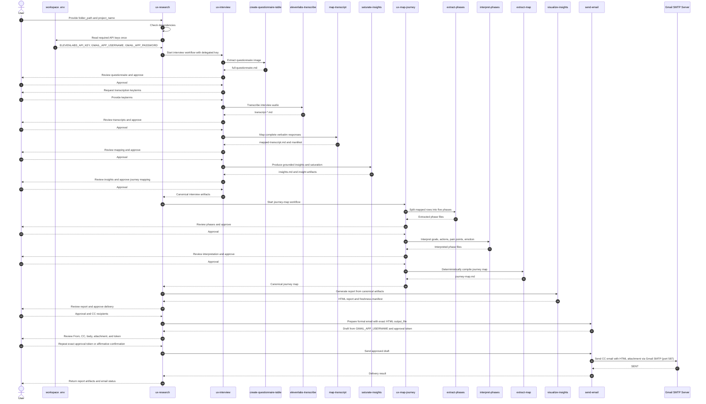

# UX Agent

UX Agent is an agentic workspace for turning UX interview material into a
traceable research report. It extracts a questionnaire, transcribes and maps
interviews, synthesizes grounded insights, builds a customer journey map, and
produces an interactive HTML report that can be sent through Gmail SMTP after
explicit approval.

The workflow favors canonical artifacts, deterministic validation, and
user-controlled approval gates. A file merely existing is not treated as proof
that it is current.

## End-to-end workflow

[`ux-research`](.agents/workflows/ux-research/ORCHESTRATOR.md) is the parent
workflow:

```text
ux-interview → ux-map-journey → visualize-insights → send-email
```



The parent preserves approval gates between major stages. A partial mapping,
stale canonical artifact, or invalid handoff stops downstream processing rather
than producing a report from incomplete data.

## Workflows and skills

### UX Interview

[`ux-interview`](.agents/workflows/ux-interview/ORCHESTRATOR.md) prepares the
research evidence inside `<folder_path>/Interview/`.

- [`create-questionnaire-table`](.agents/workflows/ux-interview/skills/create-questionnaire-table/SKILL.md)
  converts questionnaire-table images into `full-questionnaire.md`.
- [`elevenlabs-transcribe`](.agents/workflows/ux-interview/skills/elevenlabs-transcribe/SKILL.md)
  creates Markdown transcripts with the ElevenLabs Speech-to-Text API.
- [`map-transcript`](.agents/workflows/ux-interview/skills/map-transcript/SKILL.md)
  maps complete verbatim transcript turns to questionnaire rows and publishes a
  canonical `mapped-transcript.md` only after validation.
- [`saturate-insights`](.agents/workflows/ux-interview/skills/saturate-insights/SKILL.md)
  produces grounded `insights.md`, a saturation matrix, and auditable manifests.

### UX Map Journey

[`ux-map-journey`](.agents/workflows/ux-map-journey/ORCHESTRATOR.md) consumes
the canonical mapped transcript and writes `<folder_path>/Journey Map/journey-map.md`.

- [`extract-phases`](.agents/workflows/ux-map-journey/skills/extract-phases/SKILL.md)
  separates data into Awareness, Consideration, Decision Making, Usage, and
  Advocacy.
- [`interpret-phases`](.agents/workflows/ux-map-journey/skills/interpret-phases/SKILL.md)
  interprets each phase into goals, touchpoints, actions, pain points, emotion,
  and opportunities.
- [`extract-map`](.agents/workflows/ux-map-journey/skills/extract-map/SKILL.md)
  deterministically compiles the phase artifacts into `journey-map.md`.

### UX Research report and delivery

[`ux-research`](.agents/workflows/ux-research/ORCHESTRATOR.md) coordinates the
complete pipeline and owns its final delivery skills.

- [`visualize-insights`](.agents/workflows/ux-research/skills/visualize-insights/SKILL.md)
  compiles insights, the mapped transcript, all full transcripts, and an
  optional journey map into an accessible interactive HTML dashboard. It writes
  `<project_name>.html` and a freshness manifest to
  `<folder_path>/Interview/Research Report/`.
- [`send-email`](.agents/workflows/ux-research/skills/send-email/SKILL.md)
  creates a formal Vietnamese CC email, attaches the exact HTML
  `output_file` returned by `visualize-insights`, and sends through Gmail SMTP (`smtp.gmail.com:587`)
  only after the user supplies the content-bound approval token or affirmative confirmation.
  The sender email and Gmail App Password are configured in `.env` (`GMAIL_APP_USERNAME` and `GMAIL_APP_PASSWORD`).

### Global skill

[`analyze-skill`](.agents/skills/analyze-skill/SKILL.md) is the only global
skill. It evaluates sibling skills and produces performance-analysis reports.

## Workspace structure

```text
.agents/
├── scripts/
│   └── check_libraries.py
├── skills/
│   └── analyze-skill/                     # Global quality-analysis skill
└── workflows/
    ├── ux-interview/
    │   ├── ORCHESTRATOR.md
    │   ├── skills/
    │   │   ├── create-questionnaire-table/
    │   │   ├── elevenlabs-transcribe/
    │   │   ├── map-transcript/
    │   │   └── saturate-insights/
    │   └── tests/
    ├── ux-map-journey/
    │   ├── ORCHESTRATOR.md
    │   ├── skills/
    │   │   ├── extract-phases/
    │   │   ├── interpret-phases/
    │   │   └── extract-map/
    │   └── tests/
    └── ux-research/
        ├── ORCHESTRATOR.md
        ├── skills/
        │   ├── visualize-insights/
        │   │   ├── scripts/
        │   │   ├── template/
        │   │   └── tests/
        │   └── send-email/
        │       ├── scripts/
        │       └── tests/
        └── tests/
```

Workflow-specific skills remain within their owning workflow. Do not copy them
to `.agents/skills/`; only reusable cross-workflow capabilities belong there.

## Runtime requirements

- Python 3
- `elevenlabs`, `matplotlib`, and `pytest`
- `ffprobe` (optional; used for media-duration statistics in reports)
- An `ELEVENLABS_API_KEY` in the workspace `.env` when transcription is used
- Gmail credentials (`GMAIL_APP_USERNAME` and `GMAIL_APP_PASSWORD`) in `.env` for email delivery via Gmail SMTP (`smtp.gmail.com:587`)

Check installed dependencies before running a workflow:

```bash
python3 .agents/scripts/check_libraries.py
```

Configure keys and credentials in `.env`:

```env
ELEVENLABS_API_KEY=your_key_here
GMAIL_APP_USERNAME=your_gmail_address@gmail.com
GMAIL_APP_PASSWORD=your_gmail_app_password
```

Only the parent `ux-research` orchestrator reads `.env`. It passes each child
orchestrator or skill only the keys required for that step. `ux-interview` then injects
the delegated `ELEVENLABS_API_KEY` only into `elevenlabs-transcribe`; child
orchestrators and skills never read `.env` directly.

## How to Get Started (Bắt đầu sử dụng)

Các bước đơn giản dành cho người dùng mới để bắt đầu chạy UX Agent:

- **Bước 1: Tạo thư mục dự án (Project Folder)**
  - Tạo một thư mục riêng đặt tên theo dự án của bạn (Ví dụ: `Chuyển tiền quốc tế` hoặc `/Users/madebynham/Desktop/Chuyển tiền quốc tế`).

- **Bước 2: Chuẩn bị các file đầu vào (Input Materials)**
  - **File âm thanh phỏng vấn**: Cho tất cả các file audio/video phỏng vấn (`.m4a`, `.mp3`, `.wav`, `.mp4`) vào trong thư mục dự án.
  - **File bảng câu hỏi**:
    - File Excel được tải từ template mẫu (`.xlsx` chứa tab `"2. Questionnaire"`), **HOẶC**
    - Link Google Sheet công khai (Public Google Sheet URL).

- **Bước 3: Kích hoạt Agent (Run the Agent)**
  - Trong ô chat với AI Agent, gõ câu lệnh:
    ```text
    ux-research <đường_dẫn_thư_mục_dự_án>
    ```
  - *Ví dụ:*
    ```text
    ux-research /Users/madebynham/Desktop/Chuyển tiền quốc tế
    ```

---

## How to Use UX Agent

Follow these bulleted steps to set up and run a research project with UX Agent:

- **1. Setup & Environment Configuration**:
  - Clone the repository: `git clone https://github.com/nguyenlamhai89/UX-Agent.git`
  - Verify required Python dependencies: `python3 .agents/scripts/check_libraries.py`
  - Create a `.env` file in the workspace root with your API keys and credentials:
    ```env
    ELEVENLABS_API_KEY=your_elevenlabs_api_key
    GMAIL_APP_USERNAME=your_gmail_address@gmail.com
    GMAIL_APP_PASSWORD=your_gmail_app_password
    ```

- **2. Prepare Research Materials**:
  - Create a project folder (e.g., `/path/to/my-project`).
  - Place your questionnaire template (`.xlsx`) or public Google Sheet link, and interview audio/media file(s) inside the project folder.

- **3. Execute the End-to-End Workflow**:
  - Ask the AI Assistant to run the parent [`ux-research`](.agents/workflows/ux-research/ORCHESTRATOR.md) workflow by specifying the absolute `folder_path` and a safe `project_name`.
  - Alternatively, trigger specific child workflows independently:
    - [`ux-interview`](.agents/workflows/ux-interview/ORCHESTRATOR.md): Questionnaire extraction, audio transcription, mapping, and grounded insights.
    - [`ux-map-journey`](.agents/workflows/ux-map-journey/ORCHESTRATOR.md): Customer journey map synthesis across 5 phases (Awareness, Consideration, Decision Making, Usage, Advocacy).
    - [`visualize-insights`](.agents/workflows/ux-research/skills/visualize-insights/SKILL.md): Interactive HTML dashboard generation.
    - [`send-email`](.agents/workflows/ux-research/skills/send-email/SKILL.md): Formal Vietnamese email draft and SMTP delivery.

- **4. Review Approval Gates**:
  - Review and approve each stage output when prompted by the AI Assistant:
    - **Gate 1**: Questionnaire Extraction (`full-questionnaire.md`).
    - **Gate 2**: Audio Transcripts (`transcript-*.md`).
    - **Gate 3**: Verbatim Mapping (`mapped-transcript.md`).
    - **Gate 4**: Grounded Insights & Saturation (`insights.md`).
    - **Gate 5**: Customer Journey Map (`journey-map.md`).
    - **Gate 6**: Interactive HTML Visualization (`<project_name>.html`).

- **5. Review & Deliver Email Report**:
  - Supply the recipient email address(es) to CC when prompted.
  - Review the complete draft payload (From address, CC recipients, formal Vietnamese body, and attached HTML report file).
  - Confirm sending by typing an affirmative keyword (`ok`, `yes`, `gửi`, `approved`) or repeating the approval token (`APPROVE-SEND-EMAIL:<sha256>`).
  - The report attachment can be downloaded by recipients and opened in any modern browser (Chrome, Edge, Safari).

## Testing

Run the relevant skill and workflow tests after a behavior change:

```bash
python3 -m pytest .agents/workflows/ux-interview/tests/test_e2e_pipeline.py -q
python3 -m pytest .agents/workflows/ux-map-journey/tests/test_e2e_pipeline.py -q
python3 -m pytest .agents/workflows/ux-research/skills/send-email/tests -q
python3 -m pytest .agents/workflows/ux-research/tests/test_e2e_pipeline.py -q
python3 -m pytest .agents/workflows/ux-research/skills/visualize-insights/tests -q
```

The `send-email` tests mock Gmail SMTP (`smtplib.SMTP`); they never send a real message.

## Repository conventions

- [`AGENTS.md`](AGENTS.md) defines workspace behavior, safety, test, and Git
  synchronization rules.
- Generated caches such as `.pytest_cache/`, `.ruff_cache/`, `__pycache__/`,
  and `.DS_Store` are disposable and ignored by Git.
- Workspace code, workflows, templates, and temporary development artifacts
  belong under this repository so the project stays portable.
