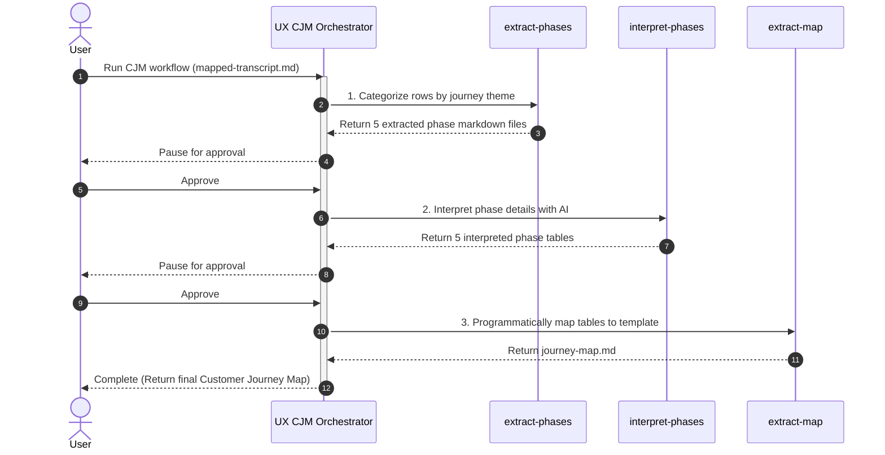

# UX Agent

UX Agent is an intelligent agentic workspace built on the **Google Antigravity SDK**. It automates complex UX research workflows, from transcribing raw interview audio and extracting questionnaires to mapping transcripts, synthesizing insights, and generating interactive visualization dashboards and Customer Journey Maps (CJMs).

---

## 🚀 Workflows

The workspace is organized into two primary agentic workflows under `.agents/workflows/`:

### 1. UX Interview (`ux-interview`)
Orchestrates raw user research transcription, response mapping, and quantitative insights synthesis.
- **Dependency Check**: Verifies workspace environment dependencies using `check_libraries.py`.
- **Questionnaire Extraction (`create-questionnaire-table`)**: Programmatically extracts question tables from images (e.g., screenshots or forms) and structures them into `full-questionnaire.md`.
- **Audio Transcription (`elevenlabs-transcribe`)**: Converts audio recordings into markdown interview transcripts using ElevenLabs' speech-to-text API, tailored with custom keyterms.
- **Transcript Mapping (`map-transcript`)**: Maps raw transcript responses onto the structured questionnaire.
- **Insights Saturation (`saturate-insights`)**: Analyzes mapped interview response datasets with built-in AI, consolidates them, and computes a **Data Saturation Matrix** along with `insights.md`.

### 2. UX Customer Journey Map (`ux-cjm`)
Automates the analysis of user experience phases to compile a comprehensive Customer Journey Map.
- **Phase Extraction (`extract-phases`)**: Programmatically categorizes transcript answers into 5 journey phases (Awareness, Consideration, Decision Making, Usage, Advocacy).
- **Phase Interpretation (`interpret-phases`)**: Leverages built-in AI to summarize goals, actions, touchpoints, pain points, emotion ratings (1-5), and opportunities for each journey phase.
- **Phase Mapping (`extract-map`)**: Programmatically builds the final `journey-map.md` markdown report.

### 📊 Workflow Sequence Diagrams

#### UX Interview Flow


#### UX CJM Flow


---

## 🎨 Visualization Tool: Visualize Insights (`visualize-insights`)
A specialized utility skill that programmatically parses `insights.md`, `mapped-transcript.md`, and `journey-map.md` (optional) to generate a premium, single-page interactive HTML dashboard.
- Features dynamic charts detailing insight frequency.
- Interactive **Data Saturation Matrix** tables showing interviewee responses on click.
- Interactive, responsive **Customer Journey Map** featuring custom emotion-rating badges.
- Automatically opens in your default browser upon generation.

---

## 📁 Workspace Structure

The project is structured logically around the `.agents/` environment:

* 📂 **`.agents/`** — Core agent configurations and tools
  * 📂 **`scripts/`** — Script utilities
    * 📄 `check_libraries.py` — Verifies external library dependencies (`elevenlabs`, `matplotlib`, `pytest`).
  * 📂 **`skills/`** — Global utility skills
    * 📂 `analyze-skill/` — Quality assurance suite to score skills against various criteria.
    * 📂 `visualize-insights/` — Skill to compile Markdown results into an interactive HTML dashboard.
  * 📂 **`workflows/`** — Domain-specific orchestration pipelines
    * 📂 **`ux-interview/`** — Transcribes user audios and maps responses
      * 📄 `ORCHESTRATOR.md` — Defines transcription pipeline routing logic and rules.
      * 📂 `skills/` — Skills specific to the transcription pipeline:
        * 📂 `create-questionnaire-table/` — Extracts question formats from images.
        * 📂 `elevenlabs-transcribe/` — Speech-to-text transcriber using ElevenLabs API.
        * 📂 `map-transcript/` — Programmatically aligns responses with questionnaire tables.
        * 📂 `saturate-insights/` — Extracts insights and computes user saturation matrices.
      * 📂 `tests/` — Pipeline end-to-end integration tests.
    * 📂 **`ux-cjm/`** — Generates Customer Journey Maps
      * 📄 `ORCHESTRATOR.md` — Defines CJM pipeline routing logic and rules.
      * 📂 `skills/` — Skills specific to the CJM pipeline:
        * 📂 `extract-phases/` — Segregates transcript answers by journey theme.
        * 📂 `interpret-phases/` — Evaluates user emotions, actions, and pain points per phase.
        * 📂 `extract-map/` — Compiles phase tables into a unified journey matrix.
      * 📂 `tests/` — Pipeline end-to-end integration tests.

* 📄 **`AGENTS.md`** — Defines global agent constraints, behavior rules, testing criteria, and Git synchronization.
* 📄 **`generate_demo.py`** — Generates a mocked 6-user data visualization to preview dashboard layouts locally.

---

## ⚙️ Installation & Usage

Follow these step-by-step instructions to set up and run the UX Agent workflows in your local environment.

### 🛠️ Step 1: Clone the Repository
Clone the repository and navigate to the project root directory:
```bash
git clone https://github.com/nguyenlamhai89/UX-Agent.git
cd UX-Agent
```

### 🐍 Step 2: Setup Python Virtual Environment (Recommended)
Create and activate a virtual environment to manage dependencies safely:
```bash
# Create virtual environment
python3 -m venv venv

# Activate environment (macOS/Linux)
source venv/bin/activate

# Activate environment (Windows)
venv\Scripts\activate
```

### 📦 Step 3: Install Dependencies
Install python packages required for transcription, charts generation, and testing:
```bash
pip install -r requirements.txt  # If requirements.txt is available
# Or install directly:
pip install elevenlabs matplotlib pytest
```
*Note: Make sure `ffprobe` is installed on your system (e.g., via `brew install ffmpeg` on macOS or `choco install ffmpeg` on Windows) if you want the visualization dashboard to display audio track durations.*

### 🔑 Step 4: Configure API Keys
Create a `.env` file in the root folder of the project:
```env
ELEVENLABS_API_KEY=your_actual_elevenlabs_api_key_here
```
> 💡 **Pro Tip**: The UX Agent follows an automatic API key fallback protocol. If the `.env` file is missing or the key is not defined, the agent will prompt you to enter the API key directly in the CLI and will write it to the `.env` file for you automatically.

---

## 🏃 Running the Workflows

### Scenario A: Raw User Interview Transcription & Synthesis (`ux-interview`)
Use this workflow when you have a folder of interview audio files and a screenshot image of the questionnaire structure.

1. Create a workspace folder (e.g., `my_ux_project/`) and place the interview audios and questionnaire image inside it.
2. Trigger the `ux-interview` orchestrator:
   - The orchestrator will create an `Interview/` folder and organize your inputs.
   - It will run `create-questionnaire-table` to extract the table layout to `full-questionnaire.md`.
   - **Pause for Approval**: Review the extracted table and approve to proceed.
   - **Transcription Terms**: Provide optional keyterms (e.g. product names, slang) to guide the transcriber.
   - The orchestrator will transcribe audios via ElevenLabs, map answers to the questionnaire in `mapped-transcript.md`, and compute insights saturation in `insights.md`.
   - **Visualization Prompt**: Finally, the agent will ask if you want to run `visualize-insights` to compile the interactive HTML dashboard.

### Scenario B: Generating a Customer Journey Map (`ux-cjm`)
Use this workflow when you have a completed `mapped-transcript.md` file and want to map it to user journey phases.

1. Trigger the `ux-cjm` orchestrator, pointing it to the folder containing your `mapped-transcript.md`.
2. The orchestrator will:
   - Parse themes into separate markdown files for each phase (Awareness, Consideration, Decision Making, Usage, Advocacy).
   - Interpret touchpoints, goals, actions, pain points, and opportunities with Built-in AI.
   - Map them deterministically into `journey-map.md`.
   - Ask if you want to generate the interactive HTML dashboard featuring the Customer Journey map.

---

## 🧪 Running E2E & Unit Tests
To verify all pipelines and skills are functioning correctly:
```bash
# Run CJM pipeline end-to-end tests
pytest .agents/workflows/ux-cjm/tests/test_e2e_pipeline.py

# Run Interview pipeline end-to-end tests
pytest .agents/workflows/ux-interview/tests/test_e2e_pipeline.py

# Run all tests in the workspace (including individual skill unit tests)
pytest
```

### 🔄 Automatic Git Sync
Per the workspace rules, whenever changes are made during development, the agent automatically syncs files back to GitHub:
```bash
git add .
git commit -m "update: [changes summary]"
git push origin main
```

