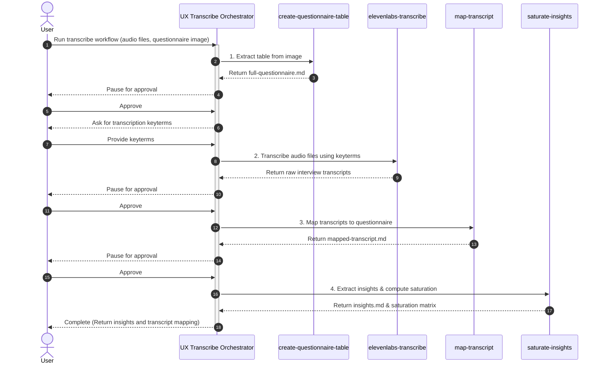
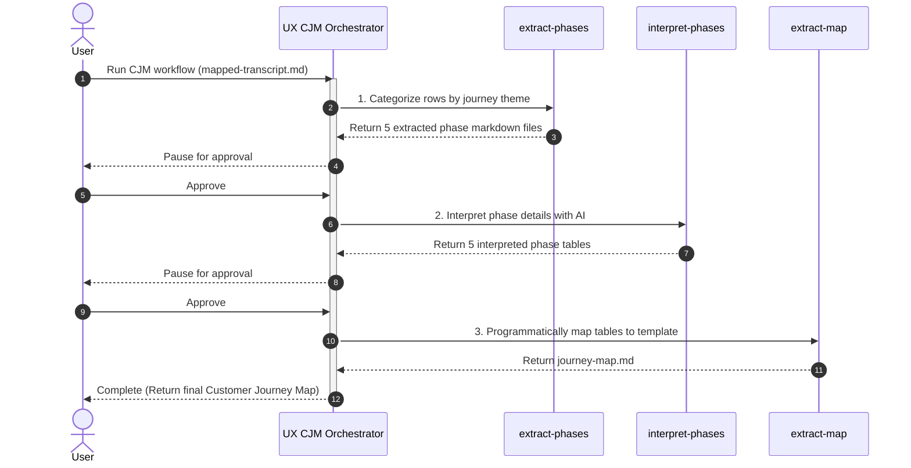

# UX Agent

UX Agent is an intelligent agentic workspace built on the **Google Antigravity SDK**. It automates complex UX research workflows, from transcribing raw interview audio and extracting questionnaires to mapping transcripts, synthesizing insights, and generating interactive visualization dashboards and Customer Journey Maps (CJMs).

---

## 🚀 Workflows

The workspace is organized into two primary agentic workflows under `.agents/workflows/`:

### 1. UX Transcribe (`ux-transcribe`)
Orchestrates raw user research transcription, response mapping, and quantitative insights synthesis.
- **Dependency Check**: Verifies workspace environment dependencies using `check_libraries.py`.
- **Questionnaire Extraction (`create-questionnaire-table`)**: Programmatically extracts question tables from images (e.g., screenshots or forms) and structures them into `full-questionnaire.md`.
- **Audio Transcription (`elevenlabs-transcribe`)**: Converts audio recordings into markdown interview transcripts using ElevenLabs' speech-to-text API, tailored with custom keyterms.
- **Transcript Mapping (`map-transcript`)**: Maps raw transcript responses onto the structured questionnaire.
- **Insights Saturation (`saturate-insights`)**: Analyzes mapped interview response datasets with built-in AI, consolidates them, and computes a **Data Saturation Matrix** along with `insights.md`.

### 2. UX Customer Journey Map (`ux-cjm`)
Automates the analysis of user experience phases to compile a comprehensive Customer Journey Map.
- **Phase Extraction (`extract-phases`)**: Programmatically categorizes transcript answers into 5 journey phases (Awareness, Consideration, Decision Making, Usage, Advocacy).
- **Phase Interpretation (`interpret-phases`)**: Leverages built-in AI to summarize goals, actions, touchpoints, pain points, emotion ratings (1-5), and opportunities for each journey phase.
- **Phase Mapping (`extract-map`)**: Programmatically builds the final `journey-map.md` markdown report.

### 📊 Workflow Sequence Diagrams

#### UX Transcribe Flow


#### UX CJM Flow


---

## 🎨 Visualization Tool: Visualize Insights (`visualize-insights`)
A specialized utility skill that programmatically parses `insights.md`, `mapped-transcript.md`, and `journey-map.md` (optional) to generate a premium, single-page interactive HTML dashboard.
- Features dynamic charts detailing insight frequency.
- Interactive **Data Saturation Matrix** tables showing interviewee responses on click.
- Interactive, responsive **Customer Journey Map** featuring custom emotion-rating badges.
- Automatically opens in your default browser upon generation.

---

## 📁 Workspace Structure

```
.agents/
  scripts/
    check_libraries.py          # Dependency checker
  skills/
    analyze-skill/              # Quality analysis suite
    visualize-insights/         # Dashboard compiler skill
  workflows/
    ux-cjm/                     # CJM Orchestrator & Skills
      ORCHESTRATOR.md
      skills/
        extract-map/
        extract-phases/
        interpret-phases/
      tests/
        test_e2e_pipeline.py    # CJM pipeline tests
    ux-transcribe/              # Transcribe Orchestrator & Skills
      ORCHESTRATOR.md
      skills/
        create-questionnaire-table/
        elevenlabs-transcribe/
        map-transcript/
        saturate-insights/
      tests/
        test_e2e_pipeline.py    # Transcribe pipeline tests
AGENTS.md                       # Agent behavior rules & constraints
generate_demo.py                # script to compile a 6-user visual demo
```

---

## ⚙️ Installation & Usage

### Prerequisites
Make sure you have Python 3.12+ installed.

### Setup Dependencies
Install the required packages in your Python environment:
```bash
pip install elevenlabs matplotlib pytest
```

### Running E2E Tests
To run pipeline tests for both orchestrators:
```bash
# Test the CJM workflow
pytest .agents/workflows/ux-cjm/tests/test_e2e_pipeline.py

# Test the Transcribe workflow
pytest .agents/workflows/ux-transcribe/tests/test_e2e_pipeline.py
```

### Automatic Git Sync
Per the workspace rules in `AGENTS.md`, all edits, updates, and creation of skills within this workspace are automatically staged, committed, and pushed to the remote repository origin at the end of each task execution.
