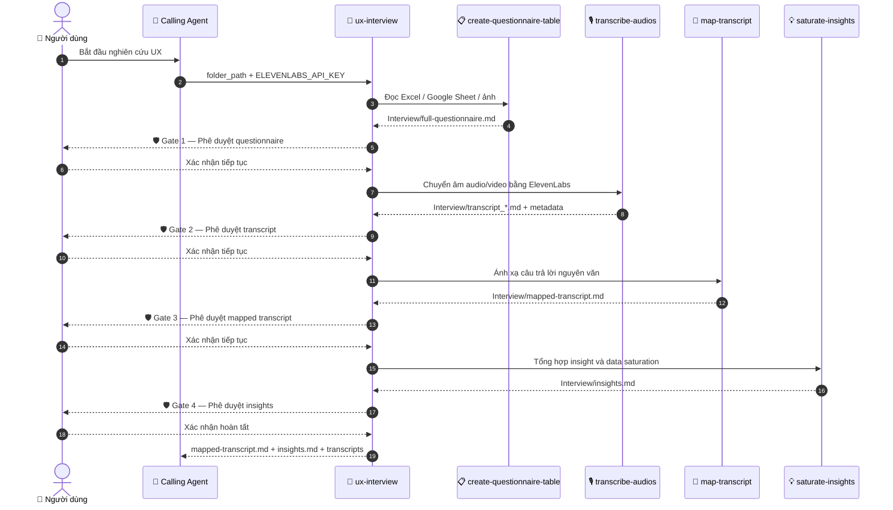
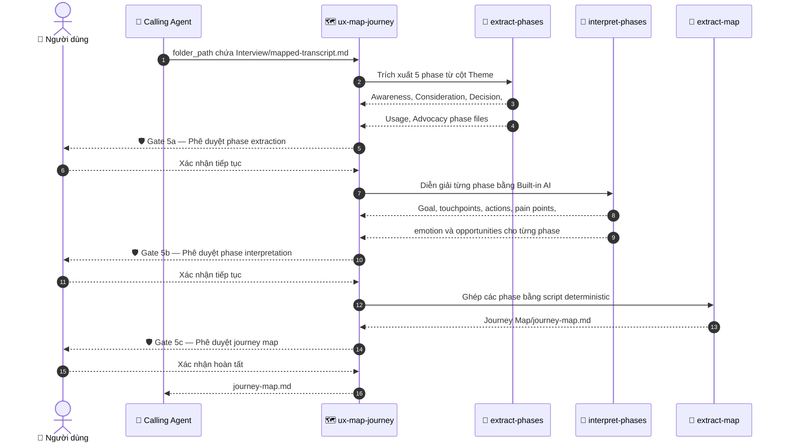
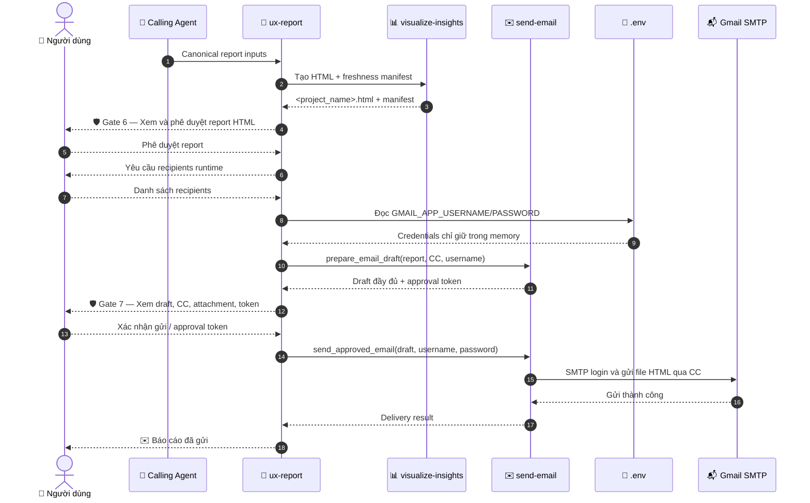

# 🚀 UX Agent

**UX Agent** là trợ lý AI thông minh giúp tự động hóa toàn bộ quy trình nghiên cứu UX: từ trích xuất bảng câu hỏi, chuyển âm & ánh xạ bài phỏng vấn, tổng hợp Insight có bằng chứng, xây dựng Bản đồ hành trình khách hàng (Customer Journey Map), đến xuất Báo cáo HTML tương tác và gửi qua Email.

---

## ⚡ Hướng dẫn nhanh cho người mới (Quick Start)

Chỉ với 3 bước đơn giản để thiết lập và khởi chạy dự án nghiên cứu UX:

### 1. Chuẩn bị (Inputs & Credentials)
Trước khi khởi chạy Agent, bạn cần chuẩn bị sẵn các tài nguyên sau:
* 🎙️ **File ghi âm / video phỏng vấn**: File định dạng `.mp3`, `.m4a`, `.qta` đặt trong thư mục dự án.
* 📋 **Bảng câu hỏi phỏng vấn**: Tạo bản sao từ [Template Google Sheet Mẫu](https://docs.google.com/spreadsheets/d/11QyWQvgy6893QFv7ZFgdDlL-YQ5YNS-E00YFsvJkNBA/edit?gid=335610114#gid=335610114) (chế độ public) hoặc file Excel (`.xlsx`).
* 🔑 **API Key chuyển âm** (bắt buộc):
  * `ELEVENLABS_API_KEY`: Lấy tại [ElevenLabs](https://elevenlabs.io) → *Profile* → *API Keys*.
* 📧 **Gmail App Credentials** (tùy chọn, dùng để gửi báo cáo email qua SMTP):
  * `GMAIL_APP_USERNAME`: Địa chỉ Gmail dùng để gửi.
  * `GMAIL_APP_PASSWORD`: Mật khẩu ứng dụng 16 ký tự tạo tại [Google App Passwords](https://myaccount.google.com/apppasswords) (cần bật 2FA).

### 2. Cài đặt Agent (Setup & .env)

Nhập prompt sau vào AI IDE (Google Antigravity, Claude Code, Cursor...):

```text
Hãy clone dự án từ https://github.com/nguyenlamhai89/UX-Agent.git, kiểm tra các thư viện phụ thuộc, tạo file .env giúp tôi với GMAIL_APP_USERNAME=myemail@gmail.com và GMAIL_APP_PASSWORD=abcd1234efgh5678, sau đó lập một bảng tóm tắt ngắn gọn về cách các workflow hoạt động (bao gồm các skill bên trong, input và output của từng skill).
```

### 3. Kích hoạt Agent (Run Workflow)

Ba workflow hoạt động độc lập và được gọi theo thứ tự khi chạy toàn bộ quy
trình. `ux-interview` nhận `ELEVENLABS_API_KEY` từ caller; chỉ `ux-report` đọc
hai Gmail credentials từ `.env`.

```text
ux-interview <đường_dẫn_thư_mục_dự_án>
ux-map-journey <đường_dẫn_thư_mục_dự_án>/Interview
ux-report <input report dạng JSON>
```

* 💡 **Ví dụ 1 (Chạy phỏng vấn với file Excel `.xlsx`):**

  ```text
  ux-interview /Users/madebynham/Desktop/Chuyển tiền quốc tế
  ```

* 💡 **Ví dụ 2 (Dùng link Google Sheet thay cho file Excel):**

  ```text
  ux-interview /Users/madebynham/Desktop/Chuyển tiền quốc tế https://docs.google.com/spreadsheets/d/11QyWQvgy6893QFv7ZFgdDlL-YQ5YNS-E00YFsvJkNBA/edit?gid=335610114#gid=335610114
  ```
  *(Hoặc dán link Google Sheet khi Agent yêu cầu ở bước trích xuất bảng câu hỏi.)*

* 💡 **Ví dụ 3 (Tạo report sau khi có insights, mapped transcript và journey map):**

  ```text
  ux-report /Users/madebynham/Desktop/Chuyển tiền quốc tế
  ```

  `ux-report` tạo HTML, hỏi người nhận ở mỗi lần chạy, luôn dùng CC, rồi mới
  tạo draft email để bạn phê duyệt.

---

## 🏗️ Kiến trúc hệ thống (System Architecture)

UX Agent được tổ chức theo mô hình **Orchestrator → Skills**, gồm 3 workflow
orchestrator và 10 skill chuyên biệt:

```
.agents/
├── scripts/
│   └── check_libraries.py          # Kiểm tra & cài đặt dependencies
├── skills/
│   ├── analyze-skill/               # Phân tích hiệu năng skill (global)
│   └── clean-data-xlsx/             # 🧹 Làm sạch & chuẩn hóa dữ liệu Excel (XLSX) deterministic
├── workflows/
│   ├── ux-report/                    # 📄 Tạo report HTML & gửi Gmail
│   │   ├── ORCHESTRATOR.md
│   │   ├── skills/                    # Skills thuộc workflow ux-report
│   │   │   ├── visualize-insights/    # 📊 Tạo báo cáo HTML tương tác
│   │   │   └── send-email/            # ✉️ Gửi email qua Gmail SMTP
│   │   └── tests/
│   ├── ux-interview/                 # 🎤 Orchestrator phỏng vấn
│   │   ├── ORCHESTRATOR.md
│   │   └── skills/
│   │       ├── create-questionnaire-table/  # 📋 Trích xuất bảng câu hỏi
│   │       ├── transcribe-audios/           # 🎙️ Chuyển âm (ElevenLabs)
│   │       ├── map-transcript/              # 🎯 Ánh xạ câu trả lời
│   │       └── saturate-insights/           # 💡 Tổng hợp Insight & bão hòa
│   ├── ux-map-journey/              # 🗺️ Orchestrator hành trình khách hàng
│   │   ├── ORCHESTRATOR.md
│   │   └── skills/
│   │       ├── extract-phases/       # Trích xuất 5 giai đoạn
│   │       ├── interpret-phases/     # Diễn giải từng giai đoạn bằng AI
│   │       └── extract-map/          # Ghép hành trình (không dùng AI)
└── template/                         # Template mẫu cho skill & orchestrator
```

### Chuỗi ủy quyền API Key

`ux-interview` không đọc `.env`; caller phải truyền ElevenLabs key vào input.
`ux-report` là workflow duy nhất được phép đọc Gmail credentials từ `.env` và
chỉ giữ chúng trong bộ nhớ để gọi `send-email`.

| Key | Đường truyền |
| --- | --- |
| `ELEVENLABS_API_KEY` | Caller → `ux-interview` → `transcribe-audios` |
| `GMAIL_APP_USERNAME` | `.env` → `ux-report` → draft + SMTP call của `send-email` |
| `GMAIL_APP_PASSWORD` | `.env` → `ux-report` → SMTP call của `send-email` sau approval |

---

## 🔄 Quy trình làm việc (Workflow Pipeline)

Khi chạy toàn bộ nghiên cứu, caller gọi ba workflow theo thứ tự:
`ux-interview` → `ux-map-journey` → `ux-report`. Mỗi workflow có pipeline và
cổng phê duyệt riêng, được mô tả chi tiết bên dưới.

### 1. Workflow `ux-interview`

Workflow này tạo questionnaire, chuyển âm, ánh xạ transcript và tổng hợp
insights. Sau mỗi artifact quan trọng, workflow dừng để người dùng phê duyệt.



### 2. Workflow `ux-map-journey`

Workflow này nhận `mapped-transcript.md`, tạo dữ liệu theo 5 phase, diễn giải
từng phase và ghép thành customer journey map. Mỗi skill chạy tuần tự và có
approval gate trước khi chuyển sang skill tiếp theo.



### 3. Workflow `ux-report`

Workflow này nhận các artifact chuẩn, tạo report HTML trước, rồi mới hỏi
recipients và gửi email. Có hai cổng phê duyệt độc lập: phê duyệt report và
phê duyệt email draft.



---

## 📦 Các tính năng cốt lõi (Core Features)

| # | Thành phần | Mô tả |
| --- | --- | --- |
| 1 | 🎤 **ux-interview** (workflow) | Tạo questionnaire, transcript, mapped transcript và insights từ dữ liệu phỏng vấn. |
| 2 | 🗺️ **ux-map-journey** (workflow) | Tạo `Journey Map/journey-map.md` từ mapped transcript. |
| 3 | 📄 **ux-report** (workflow) | Tạo report HTML, hỏi người nhận CC và gửi email sau approval. |
| 4 | 📋 **create-questionnaire-table** | Chuyển Excel (`.xlsx` tab `"2. Questionnaire"`), Google Sheet công khai hoặc ảnh thành `full-questionnaire.md`. |
| 5 | 🎙️ **transcribe-audios** | Chuyển âm phỏng vấn bằng ElevenLabs, có diarization và timestamp. |
| 6 | 🎯 **map-transcript** | Ánh xạ nguyên văn câu trả lời kèm timestamp vào bảng câu hỏi. |
| 7 | 💡 **saturate-insights** | Tổng hợp insight có bằng chứng và ma trận bão hòa dữ liệu. |
| 8 | 🗺️ **extract-phases** | Trích xuất dữ liệu theo 5 giai đoạn customer journey. |
| 9 | 🗺️ **interpret-phases** | Diễn giải mục tiêu, touchpoint, hành động, pain point, cảm xúc và cơ hội của từng giai đoạn. |
| 10 | 🗺️ **extract-map** | Ghép các phase thành `journey-map.md` bằng script deterministic. |
| 11 | 📊 **visualize-insights** | Tạo report HTML tương tác gồm Overview, Insights, Persona, Transcript và Journey Map. |
| 12 | ✉️ **send-email** | Tạo draft CC và gửi đúng file HTML qua Gmail SMTP sau approval. |

### Công cụ hỗ trợ

| Công cụ | Mô tả |
| --- | --- |
| 🔍 **analyze-skill** | Phân tích hiệu năng skill theo 5 hạng mục (20 tiêu chí), tạo báo cáo chấm điểm và giải pháp cải thiện. |
| 🧹 **clean-data-xlsx** | Làm sạch & chuẩn hóa workbook Excel (`.xlsx`) an toàn bằng Python deterministic: hiển thị bảng xác nhận header/kiểu dữ liệu trước khi xử lý, không tự động điền ô trống, loại bỏ dòng trùng lặp, giữ nguyên công thức & định danh (ID/chuỗi), tạo báo cáo chất lượng & script replay. |
| 📦 **check_libraries.py** | Kiểm tra phiên bản dependencies, cảnh báo nếu thiếu hoặc lỗi thời, đề xuất cài đặt/cập nhật. |

---

## 🛡️ Cổng phê duyệt (Approval Gates)

UX Agent luôn đảm bảo an toàn và tính chính xác bằng cách **hỏi ý kiến bạn trước mỗi bước quan trọng**:

1. **Gate 1**: Phê duyệt bảng câu hỏi (`full-questionnaire.md`).
2. **Gate 2**: Phê duyệt bản chuyển âm (`transcript-*.md`).
3. **Gate 3**: Phê duyệt bảng ánh xạ chuẩn (`mapped-transcript.md`).
4. **Gate 4**: Phê duyệt insight (`insights.md`).
5. **Gate 5**: `ux-map-journey` dừng sau mỗi bước trích xuất, diễn giải và ghép journey map để nhận phê duyệt.
6. **Gate 6**: Phê duyệt report HTML do `ux-report` tạo.
7. **Gate 7**: Cung cấp người nhận CC, xem draft đầy đủ và phê duyệt gửi email.

---

## 🔐 Bảo mật (Security)

- **API Key cách ly**: `ux-interview` nhận `ELEVENLABS_API_KEY` từ caller và không đọc `.env`. Chỉ `ux-report` đọc `GMAIL_APP_USERNAME` và `GMAIL_APP_PASSWORD` từ `.env`.
- **Gmail credentials**: `ux-report` chỉ giữ credentials trong bộ nhớ, truyền username vào draft và chỉ truyền password vào bước SMTP sau approval. `send-email` không tự đọc `.env`.
- **Người nhận email**: Chỉ sau khi người dùng phê duyệt report HTML, `ux-report` mới hỏi người nhận ở mỗi lần chạy; mọi địa chỉ chỉ nằm trong CC, To và BCC luôn rỗng.
- **Token phê duyệt email**: Email chỉ được gửi khi người dùng xác nhận bằng từ khóa phê duyệt hợp lệ (ví dụ: `ok`, `yes`, `gửi`, `approved`) hoặc cung cấp đúng token bảo mật (content-bound SHA-256).
- **Atomic writes**: Tất cả file output quan trọng được ghi qua file tạm rồi thay thế nguyên tử (atomic replace), tránh hỏng dữ liệu khi gián đoạn.
- **Kiểm thử tự động**: Mỗi skill có unit test riêng, mỗi workflow có E2E test kiểm tra toàn bộ pipeline.

---

## 📋 Yêu cầu hệ thống (Requirements)

- **Python**: 3.9+
- **AI IDE**: Google Antigravity, Claude Code, Cursor, hoặc tương tự
- **API keys**:
  - `ELEVENLABS_API_KEY` — Caller truyền vào `ux-interview` để chuyển âm
  - `GMAIL_APP_USERNAME` + `GMAIL_APP_PASSWORD` — `ux-report` đọc từ `.env` khi gửi email (tùy chọn)
- **Dependencies** (tự động kiểm tra bởi `check_libraries.py`):
  - `elevenlabs` — SDK chuyển âm ElevenLabs
  - `matplotlib` — Biểu đồ bão hòa
  - `pytest` — Kiểm thử tự động
  - `ffprobe` — Tùy chọn, dùng để tính thời lượng media trong report
