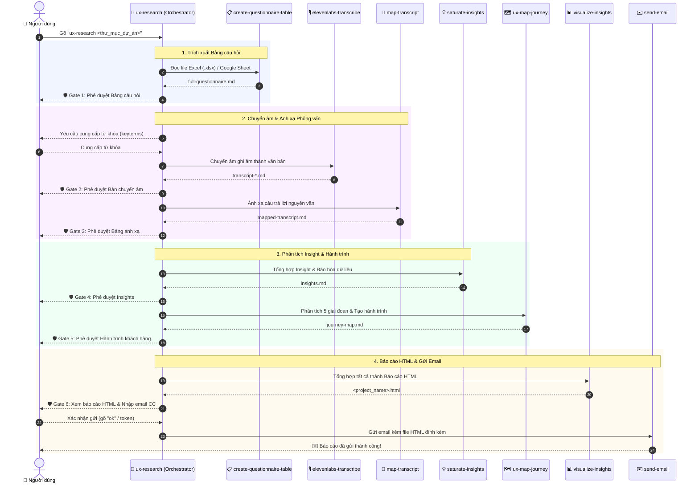

# 🚀 UX Agent

**UX Agent** là trợ lý AI thông minh giúp tự động hóa toàn bộ quy trình nghiên cứu UX: từ trích xuất bảng câu hỏi, chuyển âm & ánh xạ bài phỏng vấn, tổng hợp Insight có bằng chứng, xây dựng Bản đồ hành trình khách hàng (Customer Journey Map), đến xuất Báo cáo HTML tương tác và gửi qua Email.

---

## ⚡ Hướng dẫn nhanh cho người mới (Quick Start)

Chỉ với 3 bước đơn giản để bắt đầu một dự án nghiên cứu UX:

### 1. Cài đặt môi trường
- Copy đường link Git của dự án: `https://github.com/nguyenlamhai89/UX-Agent.git`
- Dán vào khung chat của AI IDE (ví dụ: Google Antigravity, Claude Code, Cursor, Codex,...) và nhờ AI tự động cài đặt.
- Tạo file `.env` tại thư mục gốc với các API key:
  ```env
  ELEVENLABS_API_KEY=your_key_here
  GMAIL_APP_USERNAME=your_gmail@gmail.com
  GMAIL_APP_PASSWORD=your_gmail_app_password
  ```

### 2. Chuẩn bị tài liệu đầu vào
Tạo 1 thư mục dự án (Ví dụ: `Chuyển tiền quốc tế`) và cho các file sau vào:
- 🎧 **File ghi âm / video phỏng vấn** (`.m4a`, `.mp3`, `.wav`, `.mp4`).
- 📋 **File bảng câu hỏi**: File Excel mẫu (`.xlsx` chứa tab `"2. Questionnaire"`) **HOẶC** link Google Sheet công khai.

### 3. Kích hoạt Agent
Trong khung chat với AI Agent, gõ câu lệnh:
```text
ux-research <đường_dẫn_thư_mục_dự_án>
```
*Ví dụ thực tế:*
```text
ux-research /Users/madebynham/Desktop/Chuyển tiền quốc tế
```

---

## 🔄 Quy trình làm việc (Workflow Pipeline)

Quy trình tự động hóa tương tác giữa các Skills được thể hiện qua sơ đồ trình tự (Sequence Diagram) bên dưới:



### Các tính năng cốt lõi:
- 📋 **Chuyển đổi Bảng câu hỏi**: Tự động chuyển file Excel / Google Sheet / ảnh bảng câu hỏi thành bảng chuẩn hóa `full-questionnaire.md`.
- 🎙️ **Chuyển âm Phỏng vấn**: Sử dụng ElevenLabs Speech-to-Text để chuyển ghi âm thành văn bản Markdown.
- 🎯 **Ánh xạ & Tổng hợp Insight**: Ánh xạ chính xác câu trả lời nguyên văn của người dùng và tạo ma trận bão hòa Insight.
- 🗺️ **Bản đồ Hành trình Khách hàng**: Phân tích theo 5 giai đoạn: *Awareness, Consideration, Decision Making, Usage, Advocacy*.
- 📊 **Báo cáo HTML Tương tác**: Tạo file báo cáo `.html` hiển thị trực quan, hiện đại.
- ✉️ **Gửi Email Tự động**: Gửi báo cáo kèm file HTML đính kèm qua Gmail SMTP sau khi người dùng phê duyệt.

---

## 🛡️ Cổng phê duyệt (Approval Gates)

UX Agent luôn đảm bảo an toàn và tính chính xác bằng cách **hỏi ý kiến bạn trước mỗi bước quan trọng**:

1. **Gate 1**: Phê duyệt Bảng câu hỏi (`full-questionnaire.md`).
2. **Gate 2**: Cung cấp từ khóa & Phê duyệt Bản chuyển âm phỏng vấn.
3. **Gate 3**: Phê duyệt Bảng ánh xạ câu trả lời (`mapped-transcript.md`).
4. **Gate 4**: Phê duyệt Kết quả Insight (`insights.md`).
5. **Gate 5**: Phê duyệt Bản đồ hành trình khách hàng (`journey-map.md`).
6. **Gate 6**: Xem lại Báo cáo HTML & Phê duyệt gửi Email.
