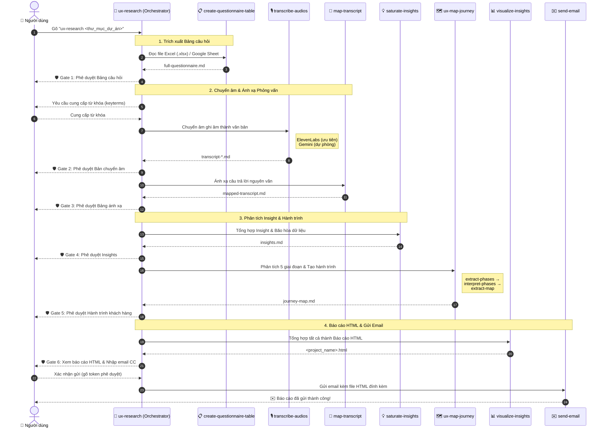

# 🚀 UX Agent

**UX Agent** là trợ lý AI thông minh giúp tự động hóa toàn bộ quy trình nghiên cứu UX: từ trích xuất bảng câu hỏi, chuyển âm & ánh xạ bài phỏng vấn, tổng hợp Insight có bằng chứng, xây dựng Bản đồ hành trình khách hàng (Customer Journey Map), đến xuất Báo cáo HTML tương tác và gửi qua Email.

---

## ⚡ Hướng dẫn nhanh cho người mới (Quick Start)

Chỉ với 3 bước đơn giản để thiết lập và khởi chạy dự án nghiên cứu UX:

### 1. Chuẩn bị (Inputs & Credentials)
Trước khi khởi chạy Agent, bạn cần chuẩn bị sẵn các tài nguyên sau:
* 🎙️ **File ghi âm / video phỏng vấn**: File định dạng `.mp3`, `.m4a`, `.qta` đặt trong thư mục dự án.
* 📋 **Bảng câu hỏi phỏng vấn**: Tạo bản sao từ [Template Google Sheet Mẫu](https://docs.google.com/spreadsheets/d/11QyWQvgy6893QFv7ZFgdDlL-YQ5YNS-E00YFsvJkNBA/edit?gid=335610114#gid=335610114) (chế độ public) hoặc file Excel (`.xlsx`).
* 🔑 **API Key chuyển âm** (bắt buộc ít nhất 1 trong 2):
  * `GEMINI_API_KEY` (miễn phí): Lấy tại [Google AI Studio](https://aistudio.google.com) → *Get API key*.
  * `ELEVENLABS_API_KEY` (trả phí, ưu tiên): Lấy tại [ElevenLabs](https://elevenlabs.io) → *Profile* → *API Keys*.
* 📧 **Gmail App Credentials** (tùy chọn, dùng để gửi báo cáo email qua SMTP):
  * `GMAIL_APP_USERNAME`: Địa chỉ Gmail dùng để gửi.
  * `GMAIL_APP_PASSWORD`: Mật khẩu ứng dụng 16 ký tự tạo tại [Google App Passwords](https://myaccount.google.com/apppasswords) (cần bật 2FA).

### 2. Cài đặt Agent (Setup & .env)
Nhập prompt sau vào AI IDE (Google Antigravity, Claude Code, Cursor...):

```text
Hãy clone dự án từ `https://github.com/nguyenlamhai89/UX-Agent.git`, kiểm tra các thư viện phụ thuộc và tạo file `.env` giúp tôi với `GEMINI_API_KEY=AIzaSy...` và `GMAIL_APP_USERNAME=myemail@gmail.com`, `GMAIL_APP_PASSWORD=abcd1234efgh5678`
```

### 3. Kích hoạt Agent (Run Workflow)
Trong khung chat với AI Agent, gõ câu lệnh:
```text
ux-research <đường_dẫn_thư_mục_dự_án>
```

* 💡 **Ví dụ 1 (Đã có sẵn file Excel `.xlsx` trong thư mục dự án):**
  ```text
  ux-research /Users/madebynham/Desktop/Chuyển tiền quốc tế
  ```

* 💡 **Ví dụ 2 (Dùng link Google Sheet thay cho file Excel):**
  ```text
  ux-research /Users/madebynham/Desktop/Chuyển tiền quốc tế https://docs.google.com/spreadsheets/d/11QyWQvgy6893QFv7ZFgdDlL-YQ5YNS-E00YFsvJkNBA/edit?gid=335610114#gid=335610114
  ```
  *(Hoặc bạn có thể dán link Google Sheet vào khung chat khi Agent yêu cầu ở bước trích xuất Bảng câu hỏi).*

---

## 🏗️ Kiến trúc hệ thống (System Architecture)

UX Agent được tổ chức theo mô hình **Orchestrator → Skills**, gồm 3 orchestrator lồng nhau và 9 skills chuyên biệt:

```
.agents/
├── scripts/
│   └── check_libraries.py          # Kiểm tra & cài đặt dependencies
├── skills/
│   └── analyze-skill/               # Phân tích hiệu năng skill (global)
├── workflows/
│   ├── ux-research/                  # 🎯 Orchestrator gốc (đọc .env)
│   │   ├── ORCHESTRATOR.md
│   │   └── skills/
│   │       ├── visualize-insights/   # 📊 Tạo báo cáo HTML tương tác
│   │       └── send-email/           # ✉️ Gửi email qua Gmail SMTP
│   ├── ux-interview/                 # 🎤 Orchestrator phỏng vấn
│   │   ├── ORCHESTRATOR.md
│   │   └── skills/
│   │       ├── create-questionnaire-table/  # 📋 Trích xuất bảng câu hỏi
│   │       ├── transcribe-audios/           # 🎙️ Chuyển âm (ElevenLabs / Gemini)
│   │       ├── map-transcript/              # 🎯 Ánh xạ câu trả lời
│   │       └── saturate-insights/           # 💡 Tổng hợp Insight & bão hòa
│   └── ux-map-journey/              # 🗺️ Orchestrator hành trình khách hàng
│       ├── ORCHESTRATOR.md
│       └── skills/
│           ├── extract-phases/       # Trích xuất 5 giai đoạn
│           ├── interpret-phases/     # Diễn giải từng giai đoạn bằng AI
│           └── extract-map/          # Ghép hành trình (không dùng AI)
└── template/                         # Template mẫu cho skill & orchestrator
```

### Chuỗi ủy quyền API Key

Chỉ orchestrator gốc `ux-research` được đọc file `.env`. Các key được truyền xuống theo chuỗi:

| Key | Đường truyền |
| --- | --- |
| `ELEVENLABS_API_KEY` | `.env` → `ux-research` → `ux-interview` → `transcribe-audios` |
| `GEMINI_API_KEY` | `.env` → `ux-research` → `ux-interview` → `transcribe-audios` |
| `GMAIL_APP_USERNAME` | `.env` → `ux-research` → `send-email` |
| `GMAIL_APP_PASSWORD` | `.env` → `ux-research` → `send-email` |

---

## 🔄 Quy trình làm việc (Workflow Pipeline)

Quy trình tự động hóa tương tác giữa các Skills được thể hiện qua sơ đồ trình tự (Sequence Diagram) bên dưới:



---

## 📦 Các tính năng cốt lõi (Core Features)

| # | Skill | Mô tả |
| --- | --- | --- |
| 1 | 📋 **create-questionnaire-table** | Tự động chuyển file Excel (`.xlsx` tab `"2. Questionnaire"`), Google Sheet công khai, hoặc ảnh bảng câu hỏi thành `full-questionnaire.md`. |
| 2 | 🎙️ **transcribe-audios** | Chuyển âm ghi âm phỏng vấn thành Markdown với nhận diện người nói (diarization) và timestamp. Hỗ trợ **ElevenLabs** (ưu tiên) và **Gemini** (dự phòng). |
| 3 | 🎯 **map-transcript** | Ánh xạ chính xác câu trả lời **nguyên văn** của từng người phỏng vấn vào cấu trúc bảng câu hỏi. |
| 4 | 💡 **saturate-insights** | Tổng hợp Insight có bằng chứng và tạo ma trận bão hòa dữ liệu (saturation matrix). |
| 5 | 🗺️ **extract-phases** | Trích xuất dữ liệu theo 5 giai đoạn hành trình: *Awareness, Consideration, Decision Making, Usage, Advocacy*. |
| 6 | 🗺️ **interpret-phases** | Diễn giải từng giai đoạn thành bảng chi tiết: mục tiêu, touchpoint, hành động, pain point, cảm xúc, cơ hội. |
| 7 | 🗺️ **extract-map** | Ghép các giai đoạn thành `journey-map.md` hoàn chỉnh bằng script Python (không dùng AI, đảm bảo 100% chính xác). |
| 8 | 📊 **visualize-insights** | Tạo báo cáo HTML tương tác, hiện đại với Overview, Insights, và Customer Journey Map. |
| 9 | ✉️ **send-email** | Gửi báo cáo HTML đính kèm qua Gmail SMTP sau khi người dùng phê duyệt bằng token bảo mật. |

### Công cụ hỗ trợ

| Công cụ | Mô tả |
| --- | --- |
| 🔍 **analyze-skill** | Phân tích hiệu năng skill theo 5 hạng mục (20 tiêu chí), tạo báo cáo chấm điểm và giải pháp cải thiện. |
| 📦 **check_libraries.py** | Kiểm tra phiên bản dependencies, cảnh báo nếu thiếu hoặc lỗi thời, đề xuất cài đặt/cập nhật. |

---

## 🛡️ Cổng phê duyệt (Approval Gates)

UX Agent luôn đảm bảo an toàn và tính chính xác bằng cách **hỏi ý kiến bạn trước mỗi bước quan trọng**:

1. **Gate 1**: Phê duyệt Bảng câu hỏi (`full-questionnaire.md`).
2. **Gate 2**: Cung cấp từ khóa & Phê duyệt Bản chuyển âm phỏng vấn.
3. **Gate 3**: Phê duyệt Bảng ánh xạ câu trả lời (`mapped-transcript.md`).
4. **Gate 4**: Phê duyệt Kết quả Insight (`insights.md`).
5. **Gate 5**: Phê duyệt Bản đồ hành trình khách hàng (`journey-map.md`).
6. **Gate 6**: Xem lại Báo cáo HTML & Phê duyệt gửi Email.

---

## 🔐 Bảo mật (Security)

- **API Key cách ly**: Chỉ orchestrator gốc `ux-research` được đọc `.env`. Tất cả key được truyền qua chuỗi ủy quyền, không bao giờ hardcode, log, hoặc ghi vào file output.
- **Token phê duyệt email**: Email chỉ được gửi khi người dùng xác nhận bằng từ khóa phê duyệt hợp lệ (ví dụ: `ok`, `yes`, `gửi`, `approved`) hoặc cung cấp đúng token bảo mật (content-bound SHA-256).
- **Atomic writes**: Tất cả file output quan trọng được ghi qua file tạm rồi thay thế nguyên tử (atomic replace), tránh hỏng dữ liệu khi gián đoạn.
- **Kiểm thử tự động**: Mỗi skill có unit test riêng, mỗi workflow có E2E test kiểm tra toàn bộ pipeline.

---

## 📋 Yêu cầu hệ thống (Requirements)

- **Python**: 3.10+
- **AI IDE**: Google Antigravity, Claude Code, Cursor, hoặc tương tự
- **API keys** (ít nhất 1 key chuyển âm):
  - `ELEVENLABS_API_KEY` — ElevenLabs Speech-to-Text
  - `GEMINI_API_KEY` — Google Gemini (dự phòng)
  - `GMAIL_APP_USERNAME` + `GMAIL_APP_PASSWORD` — Gửi email (tùy chọn)
- **Dependencies** (tự động kiểm tra bởi `check_libraries.py`):
  - `elevenlabs` — SDK chuyển âm ElevenLabs
  - `google-genai` — SDK Google Gemini
  - `matplotlib` — Biểu đồ bão hòa
  - `pytest` — Kiểm thử tự động
