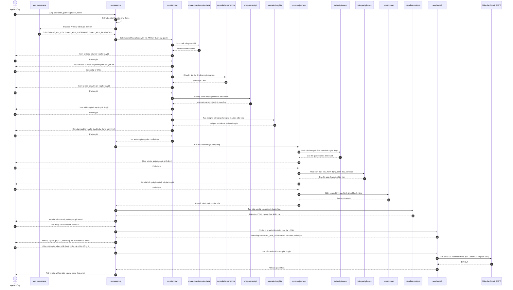

# UX Agent

UX Agent là không gian làm việc đa Agent (Agentic Workspace) giúp chuyển đổi tài liệu phỏng vấn UX thành báo cáo nghiên cứu có thể truy xuất nguồn gốc. Hệ thống tự động trích xuất bảng câu hỏi, chuyển âm (transcribe) và ánh xạ bài phỏng vấn, tổng hợp insights có bằng chứng, xây dựng hành trình khách hàng (Customer Journey Map), và tạo báo cáo HTML tương tác có thể gửi qua Gmail SMTP sau khi được người dùng phê duyệt rõ ràng.

Quy trình ưu tiên các kết quả chuẩn hóa (canonical artifacts), kiểm tra định tính chính xác (deterministic validation), và các cổng phê duyệt do người dùng kiểm soát. Một tệp chỉ đơn thuần tồn tại sẽ không được coi là bằng chứng cho thấy nó đã cập nhật.

## Quy trình End-to-end

[`ux-research`](.agents/workflows/ux-research/ORCHESTRATOR.md) là quy trình cha (parent workflow):

```text
ux-interview → ux-map-journey → visualize-insights → send-email
```



Quy trình cha duy trì các cổng phê duyệt nghiêm ngặt giữa các giai đoạn chính. Một bảng ánh xạ chưa hoàn tất, một artifact cũ hỏng hoặc kết quả chuyển giao không hợp lệ sẽ làm dừng quy trình thay vì tạo ra báo cáo từ dữ liệu thiếu sót.

## Quy trình làm việc & Kỹ năng (Workflows & Skills)

### Phỏng vấn UX (UX Interview)

[`ux-interview`](.agents/workflows/ux-interview/ORCHESTRATOR.md) chuẩn bị các bằng chứng nghiên cứu bên trong `<folder_path>/Interview/`.

- [`create-questionnaire-table`](.agents/workflows/ux-interview/skills/create-questionnaire-table/SKILL.md)
  chuyển đổi file Excel (.xlsx), Google Sheet hoặc hình ảnh bảng câu hỏi thành `full-questionnaire.md`.
- [`elevenlabs-transcribe`](.agents/workflows/ux-interview/skills/elevenlabs-transcribe/SKILL.md)
  chuyển âm file ghi âm thành bản ghi Markdown sử dụng ElevenLabs Speech-to-Text API.
- [`map-transcript`](.agents/workflows/ux-interview/skills/map-transcript/SKILL.md)
  ánh xạ chính xác từng câu trả lời nguyên văn vào các hàng câu hỏi và xuất bản file chuẩn hóa `mapped-transcript.md` sau khi xác thực.
- [`saturate-insights`](.agents/workflows/ux-interview/skills/saturate-insights/SKILL.md)
  tạo file `insights.md` dựa trên bằng chứng, ma trận bão hòa và các manifest có thể kiểm toán.

### Bản đồ hành trình UX (UX Map Journey)

[`ux-map-journey`](.agents/workflows/ux-map-journey/ORCHESTRATOR.md) sử dụng bản ánh xạ chuẩn hóa và ghi kết quả vào `<folder_path>/Journey Map/journey-map.md`.

- [`extract-phases`](.agents/workflows/ux-map-journey/skills/extract-phases/SKILL.md)
  phân loại dữ liệu thành 5 giai đoạn: Nhận thức (Awareness), Cân nhắc (Consideration), Quyết định (Decision Making), Sử dụng (Usage), và Đồng hành (Advocacy).
- [`interpret-phases`](.agents/workflows/ux-map-journey/skills/interpret-phases/SKILL.md)
  phân tích từng giai đoạn thành mục tiêu, điểm chạm, hành động, điểm đau, cảm xúc và cơ hội.
- [`extract-map`](.agents/workflows/ux-map-journey/skills/extract-map/SKILL.md)
  tổng hợp các file giai đoạn thành `journey-map.md` một cách chính xác và nhất quán.

### Báo cáo & Gửi Email nghiên cứu UX (UX Research Report & Delivery)

[`ux-research`](.agents/workflows/ux-research/ORCHESTRATOR.md) điều phối toàn bộ quy trình end-to-end và quản lý các skill giao nhận cuối cùng.

- [`visualize-insights`](.agents/workflows/ux-research/skills/visualize-insights/SKILL.md)
  tổng hợp insights, bản ánh xạ, tất cả bản ghi phỏng vấn và bản đồ hành trình thành một báo cáo HTML tương tác. Skill tạo file `<project_name>.html` và manifest kiểm tra tại `<folder_path>/Interview/Research Report/`.
- [`send-email`](.agents/workflows/ux-research/skills/send-email/SKILL.md)
  tạo bản nháp email tiếng Việt trang trọng (dạng CC), đính kèm chính xác file HTML `output_file` do `visualize-insights` tạo ra, và gửi qua Gmail SMTP (`smtp.gmail.com:587`) chỉ sau khi người dùng cung cấp token phê duyệt hoặc xác nhận đồng ý. Email người gửi và Gmail App Password được cấu hình trong `.env` (`GMAIL_APP_USERNAME` và `GMAIL_APP_PASSWORD`).

### Kỹ năng toàn cục (Global Skill)

[`analyze-skill`](.agents/skills/analyze-skill/SKILL.md) là skill toàn cục duy nhất. Nó đánh giá hiệu suất của các skill khác và xuất báo cáo phân tích chất lượng.

## Cấu trúc Workspace

```text
.agents/
├── scripts/
│   └── check_libraries.py
├── skills/
│   └── analyze-skill/                     # Skill phân tích chất lượng toàn cục
└── workflows/
    ├── ux-interview/
    │   ├── ORCHESTRATOR.md
    │   ├── skills/
    │   │   ├── create-questionnaire-table/
    │   │   ├── elevenlabs-transcribe/
    │   │   ├── map-transcript/
    │   │   └── saturate-insights/
    │   └── tests/
    ├── ux-map-journey/
    │   ├── ORCHESTRATOR.md
    │   ├── skills/
    │   │   ├── extract-phases/
    │   │   ├── interpret-phases/
    │   │   └── extract-map/
    │   └── tests/
    └── ux-research/
        ├── ORCHESTRATOR.md
        ├── skills/
        │   ├── visualize-insights/
        │   │   ├── scripts/
        │   │   ├── template/
        │   │   └── tests/
        │   └── send-email/
        │       ├── scripts/
        │       └── tests/
        └── tests/
```

Các skill thuộc quy trình nào sẽ ở yên trong quy trình đó. Không copy chúng vào `.agents/skills/`; chỉ những tính năng dùng chung giữa các quy trình mới thuộc về thư mục đó.

## Yêu cầu môi trường chạy (Runtime Requirements)

- Python 3
- `elevenlabs`, `matplotlib`, và `pytest`
- `ffprobe` (tùy chọn; dùng để thống kê thời lượng media trong báo cáo)
- API Key `ELEVENLABS_API_KEY` trong file `.env` của workspace khi sử dụng tính năng chuyển âm
- Thẻ thông tin Gmail (`GMAIL_APP_USERNAME` và `GMAIL_APP_PASSWORD`) trong `.env` để gửi email qua Gmail SMTP (`smtp.gmail.com:587`)

Kiểm tra các thư viện đã cài đặt trước khi chạy quy trình:

```bash
python3 .agents/scripts/check_libraries.py
```

Cấu hình API key và thông tin đăng nhập trong file `.env`:

```env
ELEVENLABS_API_KEY=your_key_here
GMAIL_APP_USERNAME=your_gmail_address@gmail.com
GMAIL_APP_PASSWORD=your_gmail_app_password
```

Chỉ có orchestrator cha `ux-research` được quyền đọc `.env`. Nó chỉ truyền cho từng orchestrator con hoặc skill các key cần thiết cho bước đó. `ux-interview` sau đó chỉ truyền `ELEVENLABS_API_KEY` cho `elevenlabs-transcribe`; các orchestrator con và skill không bao giờ đọc trực tiếp từ `.env`.

## Bắt đầu sử dụng (How to Get Started)

Thực hiện theo các bước đơn giản sau để bắt đầu chạy agent cho một dự án nghiên cứu mới:

- **Bước 1: Tạo thư mục dự án (Project Folder)**
  - Tạo một thư mục riêng đặt tên theo dự án của bạn (Ví dụ: `Chuyển tiền quốc tế` hoặc `/Users/madebynham/Desktop/Chuyển tiền quốc tế`).

- **Bước 2: Chuẩn bị tài liệu đầu vào**
  - **File âm thanh / video phỏng vấn**: Cho tất cả các file ghi âm phỏng vấn (`.m4a`, `.mp3`, `.wav`, `.mp4`) trực tiếp vào thư mục dự án.
  - **File bảng câu hỏi**:
    - File Excel được tải từ template mẫu (`.xlsx` chứa tab `"2. Questionnaire"`), **HOẶC**
    - Đường link Google Sheet công khai (Public Google Sheet URL).

- **Bước 3: Kích hoạt Agent**
  - Trong ô chat với AI Agent, gõ câu lệnh kích hoạt quy trình:
    ```text
    ux-research <đường_dẫn_thư_mục_dự_án>
    ```
  - *Ví dụ:*
    ```text
    ux-research /Users/madebynham/Desktop/Chuyển tiền quốc tế
    ```

---

## Hướng dẫn chi tiết sử dụng UX Agent

Thực hiện theo các bước sau để thiết lập và chạy quy trình nghiên cứu đầy đủ:

- **1. Cài đặt & Cấu hình môi trường**:
  - Copy đường link Git của dự án: `https://github.com/nguyenlamhai89/UX-Agent.git`
  - Dán đường link vào khung chat của AI IDE (ví dụ: Antigravity, Claude Code, Codex, Cursor,...) và nhờ AI tự động clone & cài đặt môi trường cho bạn.
  - Tạo file `.env` tại thư mục gốc của dự án chứa các API key & tài khoản cần thiết:
    ```env
    ELEVENLABS_API_KEY=your_elevenlabs_api_key
    GMAIL_APP_USERNAME=your_gmail_address@gmail.com
    GMAIL_APP_PASSWORD=your_gmail_app_password
    ```

- **2. Chuẩn bị tài liệu nghiên cứu**:
  - Tạo thư mục dự án (Ví dụ: `/path/to/my-project`).
  - Đặt file template bảng câu hỏi (`.xlsx`) hoặc link Google Sheet công khai, cùng các file âm thanh/media phỏng vấn vào thư mục dự án.

- **3. Thực thi quy trình End-to-End**:
  - Yêu cầu AI Assistant chạy quy trình cha [`ux-research`](.agents/workflows/ux-research/ORCHESTRATOR.md) bằng cách cung cấp đường dẫn tuyệt đối `folder_path` và tên dự án `project_name`.
  - Hoặc kích hoạt độc lập từng quy trình con:
    - [`ux-interview`](.agents/workflows/ux-interview/ORCHESTRATOR.md): Trích xuất bảng câu hỏi, chuyển âm, ánh xạ và tổng hợp insights.
    - [`ux-map-journey`](.agents/workflows/ux-map-journey/ORCHESTRATOR.md): Tổng hợp bản đồ hành trình khách hàng qua 5 giai đoạn.
    - [`visualize-insights`](.agents/workflows/ux-research/skills/visualize-insights/SKILL.md): Tạo báo cáo dashboard HTML tương tác.
    - [`send-email`](.agents/workflows/ux-research/skills/send-email/SKILL.md): Soạn bản nháp email tiếng Việt và gửi qua SMTP.

- **4. Phê duyệt qua các cổng kiểm soát (Approval Gates)**:
  - Xem lại và phê duyệt kết quả của từng giai đoạn khi được AI Assistant hỏi:
    - **Cổng 1**: Trích xuất bảng câu hỏi (`full-questionnaire.md`).
    - **Cổng 2**: Bản chuyển âm ghi âm (`transcript-*.md`).
    - **Cổng 3**: Ánh xạ câu trả lời nguyên văn (`mapped-transcript.md`).
    - **Cổng 4**: Insights có bằng chứng & độ bão hòa (`insights.md`).
    - **Cổng 5**: Bản đồ hành trình khách hàng (`journey-map.md`).
    - **Cổng 6**: Báo cáo trực quan HTML tương tác (`<project_name>.html`).

- **5. Xem lại & Gửi báo cáo qua Email**:
  - Cung cấp địa chỉ email nhận (CC) khi được yêu cầu.
  - Xem lại toàn bộ nội dung bản nháp (Địa chỉ gửi, danh sách CC, nội dung thư tiếng Việt, và file báo cáo HTML đính kèm).
  - Xác nhận gửi bằng cách gõ từ khóa đồng ý (`ok`, `yes`, `gửi`, `approved`) hoặc gõ lại token phê duyệt (`APPROVE-SEND-EMAIL:<sha256>`).
  - Người nhận có thể tải file báo cáo đính kèm và mở trên bất kỳ trình duyệt hiện đại nào (Chrome, Edge, Safari).

## Kiểm thử (Testing)

Chạy các bài kiểm thử unit test cho skill và workflow tương ứng sau khi thay đổi code:

```bash
python3 -m pytest .agents/workflows/ux-interview/tests/test_e2e_pipeline.py -q
python3 -m pytest .agents/workflows/ux-map-journey/tests/test_e2e_pipeline.py -q
python3 -m pytest .agents/workflows/ux-research/skills/send-email/tests -q
python3 -m pytest .agents/workflows/ux-research/tests/test_e2e_pipeline.py -q
python3 -m pytest .agents/workflows/ux-research/skills/visualize-insights/tests -q
```

Các test của `send-email` sử dụng giả lập Gmail SMTP (`smtplib.SMTP`); chúng không bao giờ gửi email thực tế.

## Quy ước Repository

- [`AGENTS.md`](AGENTS.md) quy định các quy tắc hành vi, an toàn, kiểm thử và đồng bộ Git cho workspace.
- Các bộ nhớ đệm tạo tự động như `.pytest_cache/`, `.ruff_cache/`, `__pycache__/`, và `.DS_Store` là tạm thời và bị Git bỏ qua.
- Toàn bộ code, workflow, template và các artifact phát triển thuộc về repository này để dự án luôn có tính di động cao.
