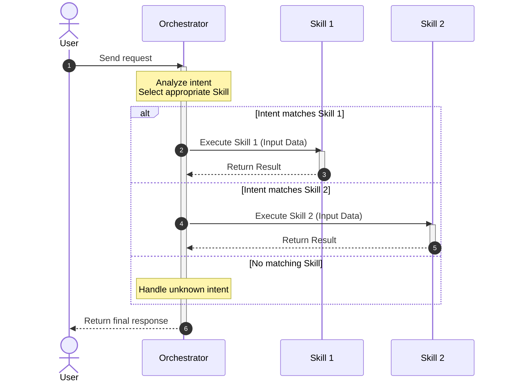

# Orchestrator Name

## Description

<!-- Replace with a detailed explanation covering: -->
<!-- 1. What this orchestrator does and its core purpose -->
<!-- 2. The overarching goal it achieves by coordinating various skills -->
<!-- 3. Any prerequisites or dependencies (e.g. specific environments, API keys for its own logic) -->

Provide a detailed explanation of what this orchestrator does, its core purpose, and how it fits into the broader system architecture.

## Routing Logic & Execution Flow

<!-- Describe the logic or algorithm the orchestrator uses to decide which skill to invoke. -->
<!-- Is it based on natural language intent classification? Keyword matching? Rule-based routing? -->

Explain how this orchestrator parses incoming user requests and routes them to the appropriate skills.

**Execution Rule:** When a skill in its flow completes its task and generates an output, the orchestrator MUST pause and ask the user for approval. If the user approves and no changes are needed, the orchestrator then executes the next skill in the sequence.

## Available Skills

<!-- List all the skills that this orchestrator has access to. Reference their respective SKILL.md files. -->
<!-- IMPORTANT: Use relative paths from this orchestrator's directory. Do NOT hardcode absolute URL paths. -->

This orchestrator manages and routes requests to the following skills:

- **[Skill Name 1](./skills/skill-name-1/SKILL.md)**: Brief description of when this skill is invoked.
- **[Skill Name 2](./skills/skill-name-2/SKILL.md)**: Brief description of when this skill is invoked.
- **[Skill Name 3](./skills/skill-name-3/SKILL.md)**: Brief description of when this skill is invoked.

## Input

- **Type**: `dict`
- **Format**: Describe the expected format of incoming requests to the orchestrator.
- **Location**: <!-- Pick one --> `query_param` | `request_body` | `command_line` — where the input is sourced from.
- **Examples**:

  **Example 1** — Standard user request:
  ```json
  {
    "user_id": "12345",
    "request": "Transcribe the audio files in this folder."
  }
  ```

## Output

- **Type**: `dict`
- **Format**: Describe the final response format the orchestrator returns to the user.
- **Location**: <!-- Pick one --> `response_body` | `console_output` | `file_path`
- **Examples**:

  **Example 1** — Successful orchestration:
  ```json
  {
    "status": "success",
    "message": "Your request has been processed successfully.",
    "data": {
      "skill_executed": "transcribe-audios",
      "result_path": "/path/to/result.md"
    }
  }
  ```

## Environment Access (.env)

<!-- Define whether this orchestrator is permitted to read the central .env file from the father-orchestrator. -->
- **Allowed to access `father-orchestrator/.env`**: `true` | `false`

<!-- Describe how the orchestrator handles API keys from the environment. -->
If allowed, the orchestrator is the **only** component allowed to read the `.env` file directly. It must retrieve any necessary API keys from the environment and explicitly pass them into the skills via their input payload.

| Key Name | Purpose | Passed to Skills |
| --- | --- | --- |
| `API_KEY_EXAMPLE` | Describe what this key is used for. | List the skills that receive this key. |

## Sequence Diagram

<!-- Draw a Mermaid Diagram to show the data flow of the orchestrator receiving a request, selecting a skill, and returning the result. -->



## Error Handling & Fallbacks

<!-- Describe how the orchestrator handles errors, such as unknown intents, or when a invoked skill fails. -->

| Error Scenario | Message | Fallback Behavior |
| --- | --- | --- |
| `UNKNOWN_INTENT` | Could not determine which skill to use. | Ask the user for clarification or provide a list of available capabilities. |
| `SKILL_FAILURE` | The invoked skill returned an error. | Catch the error, log it, and return a graceful failure message to the user, potentially suggesting a retry. |
| `INVALID_INPUT` | The incoming request is malformed. | Return a validation error specifying the required format. |
